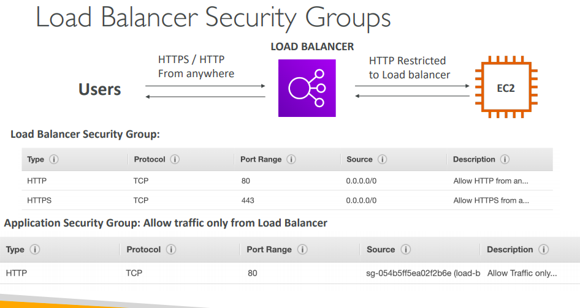

**1. I have an ASG and an ALB, and I setup my ASG to get health status of instances thanks to my ALB. One instance has just been reported unhealthy. What will happen?**

A. The ASG will keep the instance running and re-start the application
B. The ASG will detach the EC2 instance from the group, and leave it running
C. The ASG will terminate the EC2 Instance

ANS: C

**2. You would like to expose a **fixed static IP** to your end-users for compliance purposes, so they can write firewall rules that will be stable and approved by regulators. Which Load Balancer should you use?**

A. Application Load Balancer with Elastic IP attached to it
B. NLB
C. CLB

ANS: B
Note:
- Elastic IP is not feasible with ALB
- Network Load Balancers expose a public static IP, whereas an Application or Classic Load Balancer exposes a static DNS (URL)

**3. A web application hosted in EC2 is managed by an ASG. You are exposing this application through an Application Load Balancer. The ALB is deployed on the VPC with the following CIDR: 192.168.0.0/18. How do you configure the EC2 instance security group to ensure only the ALB can access the port 80?**

A. Open up the EC2 security group on port 80 to 0.0.0.0/0
B. Open up the EC2 security group on port 80 to 192.168.0.0/18
C. Open up the EC2 security on port 80 to the ALB's security group

ANS: C
- This is the most secure way of ensuring only the ALB can access the EC2 instances. Referencing by security groups in rules is an extremely powerful rule and many questions at the exam rely on it. Make sure you fully master the concepts behind it!

**4. Your application load balancer is hosting 3 target groups with hostnames being users.example.com, api.external.example.com, and checkout.example.com. You would like to expose HTTPS traffic for each of these hostnames. How do you configure your ALB SSL certificates to make this work?**

A. SNI
B. Use a wildcard SSL certificate
C. Use an HTTP to HTTPS rule

ANS: SNI
- SNI (Server Name Indication) is a feature allowing you to expose multiple SSL certs if the client supports it. Read more here: https://aws.amazon.com/blogs/aws/new-application-load-balancer-sni/

**5. You are running an application in 3 AZ, with an Auto Scaling Group and a Classic Load Balancer. It seems that the traffic is not evenly distributed amongst all the backend EC2 instances, with some AZ being overloaded. Which feature should help distribute the traffic across all the available EC2 instances?**

A. Stickiness
B. Cross Zone Load Balancing
C. Target Group Routing Rules.
D. HTTPS termination.

ANS: B

**6. An application is deployed with an Application Load Balancer and an Auto Scaling Group. Currently, the scaling of the Auto Scaling Group is done manually and you would like to define a scaling policy that will ensure the average number of connections to your EC2 instances is averaging at around 1000. Which scaling policy should you use?**

A. Simple Scaling Policy
B. Step Scaling Policy
C. Target Tracking
D. Scheduled Scaling

**7. An application is deployed with an Application Load Balancer and an Auto Scaling Group. Currently, the scaling of the Auto Scaling Group is done manually and you would like to define a scaling policy that will ensure the average number of connections to your EC2 instances is averaging at around 1000. Which scaling policy should you use?**

Target Tracking Scaling
Simple Scaling
Step Scaling
Scheduled Actions

ANS: A

------------------------------------

**8. You are running a high-performance database that requires an IOPS of 210,000 for its underlying filesystem. What do you recommend?**

A. Use an EBS gp2 drive
B. Use an EBS io1 drive
C. Use an EC2 Instance Store
D. Use EFS

ANS: C
Is running a DB on EC2 instance store possible? It is possible to run a database on EC2. It is also possible to use instance store, but there are some considerations to have. The data will be lost if the instance is stopped, but it can be restarted without problems. One can also set up a replication mechanism on another EC2 instance with instance store to have a standby copy. One can also have back-up mechanisms. It's all up to how you want to set up your architecture to validate your requirements. In this case, *it's around IOPS, and we build an architecture of replication and back up around it*
B: max of io1 is 64000 IOPS

--------------------------------------------------------
**9. My company would like to have a MySQL database that is going to be available even in case of a disaster in the AWS Cloud. I should setup**

A. Read replicas
B. Encryption
C. Multi AZ

ANS: C, Multi AZ = disaster

**10. Our RDS database struggles to keep up with the demand of the users from our website. Our million users mostly read news, and we don't post news very often. Which solution will NOT help fix this problem?**

A. ElastiCache
B. Read replica
C. Multi AZ

ANS: C

**11. Which RDS Classic (not Aurora) feature does not require us to change our SQL connection string?**

A. Read replica
B. Multi AZ

ANS: A
Read Replicas add new endpoints for databases to read from and therefore we must change our application to have the list of these endpoints in order to balance the read load and connect to the databases.

Multi AZ keeps the same connection string regardless of which database is up. Read Replicas imply we need to reference them individually in our application as each read replica will have its own DNS name

**12. You want to ensure your Redis cluster will always be available**

A. Read replica
B. Multi AZ

ANS: B

**13. You have a requirement to use TDE (Transparent Data Encryption) on top of KMS. Which database technology does NOT support TDE on RDS?**

A. PostgreSQL
B. MS SQL Server
C. Oracle

ANS: A

**14. Which RDS database technology does NOT support IAM authentication?**

A. Oracle
B. PostgresSQL
C. MySQL

ANS: A

**15.You would like to ensure you have a database available in another region if a disaster happens to your main region. Which database do you recommend?**

A. RDS with Read Replicas in another AZ
B. RDS with Multi AZ
C. Aurora Read Replicas in another AZ
D. Aurora Global Database

ANS: D
Global Databases allow you to have cross region replication

**16. You are serving web pages for a very dynamic website and you have a requirement to keep latency to a minimum for every single user when they do a read request. Writes can take longer to happen. Which caching strategy do you recommend?**

A. Cache aside
B. Write-through
C. TTL

ANS: B
A. cache miss read 3 -> fail
B. this has longer writes, but the reads are quick and the data is always updated in the cache

-------------
**17. You have set up an internet gateway in your VPC, but your EC2 instances still don't have access to the internet. Which of the following is NOT a possible issue?**

A. Route Tables are missing entries
B. The security group does not allow network in
C. The NACL does not allow network traffic out.

ANS: B
Security groups are stateful and if traffic can go out, then it can go back in
The reason why option #2 is the answer is because it mentions inbound traffic instead of outbound. That leaves the other 2 choices as a possibility.

What the explanation means is that AWS will allow traffic back to an EC2 instance due to its stateless nature and regardless of inbound rules that you give it. And in this scenario, that's unlikely to be the issue because we aren't able to get traffic to the Internet.

**18. Your EC2 instance in a private subnet must access the AWS APIs privately. You must keep all traffic within the AWS network. What do you recommend?**

A. NAT gateway
B. VPC endpoint
C. Direct Connect

ANS: B

------------------------------------

**19. The bucket policy allows our users to read/write files in the bucket, yet we were not able to perform a PutObject API call. What is your assessment?**

A. The bucket policy is wrong
B. The IAM user has an explicit DENY in the attached IAM policy
C. You need to contact AWS Support to lift this limit

ANS. B
Explicit DENY in an IAM policy will take precedence over a bucket policy permission.

**20. You have a website that loads files from another S3 bucket. When you try the URL of the files directly in your Chrome browser it works, but when the website you're visiting tries to load these files it doesn't. What's the problem?**

A. The bucket policy is wrong
B. The IAM policy is wrong
C. CORS is not enabled
D. Encryption is wrong

ANS: C

------------------------------------

**21. I have an on-premise personal server that I'd like to use to perform AWS API calls**

A. I should run `aws configure` and put my credentials there. Invalidate them when I'm done
B. I should attach an EC2 IAM Role to my personal server

ANS: A
you can't attach EC2 IAM roles to on premise servers

**22. The AWS CLI depends on which language?**

A. Java
B. Python
C. Golang
D. C#

ANS B

**23. I'd like to deploy an application to an on-premise server. The server needs to perform API calls to Amazon S3. Amongst the following options, the best security I can achieve is...**

A. run `aws configure` and insert my personal credentials
B. create an IAM user for the application and insert the credentials in the application's code
C. create an IAM user for the application and put the credentials into environment variables. Here, it's about creating a dedicated user for that application, as using your own personal credentials would blur the lines between actual users and applications.
D. attach an IAM Role to my on-premise server

ANS: C
or you could run `aws configure` on the machine

**24. When I run the CLI on my EC2 Instances, the CLI uses the ______ service to get _____ credentials thanks to the IAM Role that's attached.**

A. user data | temporary
B. user data | permanently
C. meta data | temporary
D. meta data | permanently

ANS: C

**25. Which API call should be used to get credentials before issuing API calls against an MFA-protected API?**

A. STS GetFederationToken
B. STS GetSessionToken
C. IAM GetMFAToke

ANS: B

**26. You suspect some of your employees to try to access files in S3 that they don't have access to. How can you verify this is indeed the case without them noticing?**

A. Restrict their IAM policies and look at CloudTrail logs
B. Enable S3 Access Logs and analyze them using Athena
C. Use a bucket policy

ANS: B
A will notify user.

**27. CloudFront is deploying in front of an HTTP origin. After updating your HTTP app, the users still see the old website. What should you do?**

A. Disable Caching
B. Invalidate Distribution
C. Recreate a Distribution

ANS: B

-------------------------

**28. Which ECS config must you enable in /etc/ecs/ecs.config to allow your ECS tasks to endorse IAM roles?**

A. ECS_CLUSTER
B. ECS_ENGINE_AUTH_DATA
C. ECS_AVAILABLE_LOGGING_DRIVERS
D. ECS_ENABLE_TASK_IAM_ROLE

ANS: D

**29. You are running a web application on ECS, the Docker image is stored on ECR, and trying to launch two containers of the same type on EC2. The first container starts, but the second one doesn't. You have checked and there's enough CPU and RAM available on the EC2 instance. What's the problem?**

A. The EC2 instances has permissions issues with ECR and you must fix the IAM policy
B. The host port is defined in the task definition
C. The container port is defined in the task definition
D. EC2 instances can only run one container instance for each image

ANS: B
To enable random host port, set host port = 0 (or empty), which allows multiple containers of the same type to launch on the same instance

**30. You have started an EC2 instance and it's not registered with the ECS cluster. What's NOT a reason for this issue?**

A. The ECS agent is not running
B. The AMI used isn't AWS ECS AMI
C. The EC2 instance is missing IAM permissions
D. The SG on EC2 instances is misconfigured

ANS: D
security groups do not matter when an instance registers with the ECS service

**31. You would like to run 4 ECS services on your ECS cluster, which need access to various services. What is the best practice?**

A. Create an EC2 instance role with 4 policies and attach it to the EC2 instances in the ECS cluster
B. Create 4 EC2 instance roles and attach them to the EC2 instances in the ECS cluster
C. Create 1 ECS task role with 4 policies and attach it to each ECS task definition
D. Create 4 ECS task roles and attach them to the relevant ECS task definition

ANS: D

-------------------

**32. I would like to customize the runtime of Elastic Beanstalk and include some of my company wide security software. I should**

A. Provide EC2 User Data Script
B. Provide a custom platform
C. Provide a docker image.

ANS: B

**33. My deployments on Elastic Beanstalk have been painfully slow, and after looking at the logs, I realize this is due to the fact that my dependencies are resolved on each EC2 machine at deployment time. How can I speed up my deployment with the minimal impact?**

A. Remove some dependencies in your code
B. Place the dependencies in Amazon S3
C. Resolve the dependencies beforehand and package them in the zip file uploaded to Elastic Beanstalk

ANS: C
ex. node_module is zip with src code.

-------------------------

**34. You want to send email alerts anytime pull requests are open or comments are added to commits in CodeCommit. You should use**

A. AWS SES
B. AWS SNS
C. AWS CloudWatch Events

ANS: C

**35. Your manager wants to receive emails when your CodePipeline fails in order to take action. How do you do it?**

ANS: Same above

**36. Which AWS Services allow you to track and audit API calls made to and from CodePipeline?**

A. CodeBuild
B. CloudTrail
C. IAM
D. Beanstalk

ANS: B

**37. You would like to improve the performance of your CodeBuild build. You realize that 15 minutes at each build is spent on pulling dependencies from remote repositories and that takes a while. What should you do to drastically speed up the build time?**

A. Commit dependencies in your code
B. Change `buildspec.yml` to enable dependencies caching in S3
C. Remove all dependencies

ANS: B

**38. You would like to deploy static web files to Amazon *S3* automatically, after generating the static websites from markdown files. Which services should you use for this?**

A. CodeCommit + CodePineline
B. CodePineline + CodeBuild
C. CodePineline + CodeDeploy
D. CodeDeploy

ANS: B
CodeDeploy only allows to deploy to EC2 instances!!
CodeBuild can run any commands, so you can use it to run commands including generating a static website and copy your static web files to Amazon S3.

--------------------

**39. The !Ref function can be used to reference the following except...**

A. Parameters
B. Resources
C. Conditions

ANS: C

----------------------

**40. We'd like to have CloudWatch Metrics for EC2 at a 1 minute rate. What should we do?**

A. Enable Custom Metrics
B. Enable High Resolution
C. Enable Basic Monitoring
D. Enable Detailed Monitoring

ANS: D

**41. CloudWatch logs automatically expire after 7 days by default**

A. True
B. False

ANS: B
They never expire by default

**42. You would like to index your XRay traces in order to search and filter through them efficiently. What should you use?**

A. Segments
B. Sampling
C. Annotations
D. Metadata

ANS: C

-------------------------

**43. You are preparing for the biggest day of sale of the year, where your traffic will increase by 100x. You have already setup SQS standard queue. What should you do?**

A. Open a support ticket
B. Enable auto scaling in SQS
C. Increase capacity of SQS queue
D. SQS scale automatically

ANS: D

**44. You want to send email notifications to your users. You should use**

A. SQS with lambda
B. SNS
C. Kinesis

ANS: B

**45. Which SQS FIFO message attribute allows two messages to be processed in order?**

A. MessageDeduplicationID
B. MessageGroupId
C. MessageHash
D. MessageOrderId

ANS: B

----------------------

**46. Your lambda function is invoked asynchronously and some events fail from being processed after 3 retries. You'd like to collect and analyze these events later on. What should do you?**

A. Add a logging statement for all events in your Lambda function and filter the CloudWatch logs
B. Enable synchronous processing of events from Lambda
C. Add a Dead Letter Queue to send messages to SNS
D. Add a Dead Letter Queue to send messages to SQS

ANS: D

C. DLQ can send to SNS, but the message has to be received right away by a subscriber or it is lost. This won't fit our use case of analyzing the message later
D. This is good as SQS will hold the message for some days so we have time to consume it

**47. You have enabled the Lambda and X-Ray integration but it doesn't work. Why is that?**

A. You need to run the X-Ray daemon as a dependency in your deployment package
B. Check IAM

ANS: B

**48. You'd like to have a long string of 8 KB loaded in your Lambda code**

A. Environment variable
B. Place it in zip file

ANS. B
Unfortunately there's a 4 KB limit for environment variables

**49. How do you declare a Lambda function with AWS CloudFormation?**

A. Upload all the code to CodeCommit and refer to the CodeCommit Repository in AWS::Lambda::Function block
B. Upload all the code to CodeDeploy and refer to the CodeDeploy application in AWS::Lambda::Function block
C. Upload all the code as a folder to S3 and refer the folder in AWS::Lambda::Function block
D. Upload all the code as a zip to S3 and refer the object in AWS::Lambda::Function block

ANS: D

**50. How can a Lambda function be integrated with an ALB?**

A. With an Event Source Mapping
B. With an asynchronous invocation
C. With a target group
D. With ÁSG

ANS: C