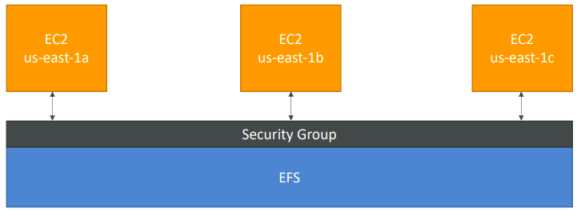
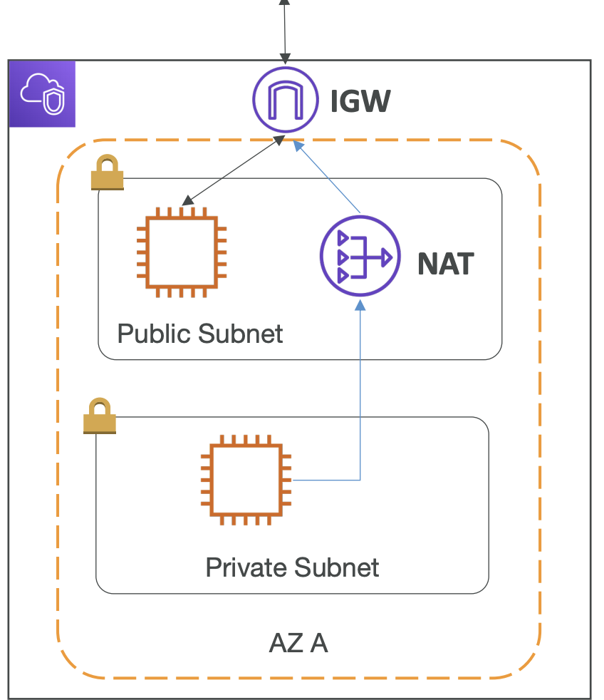
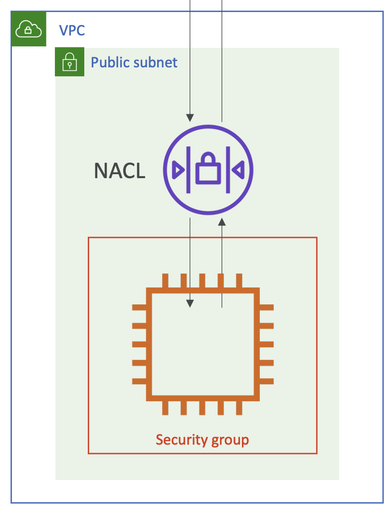
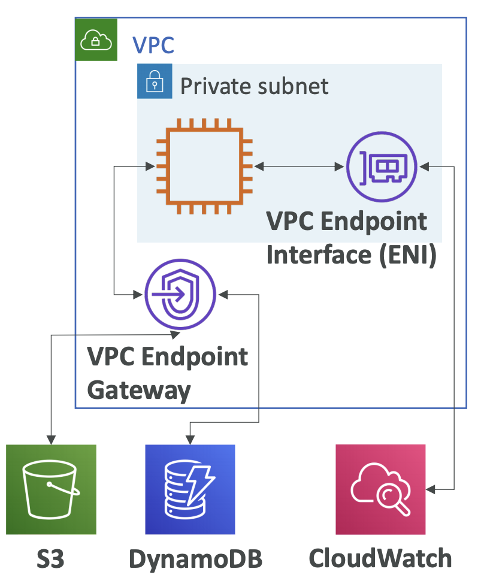
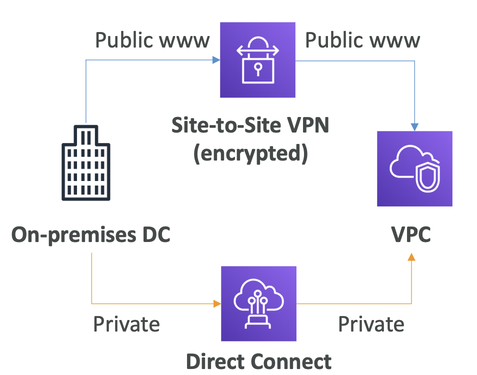
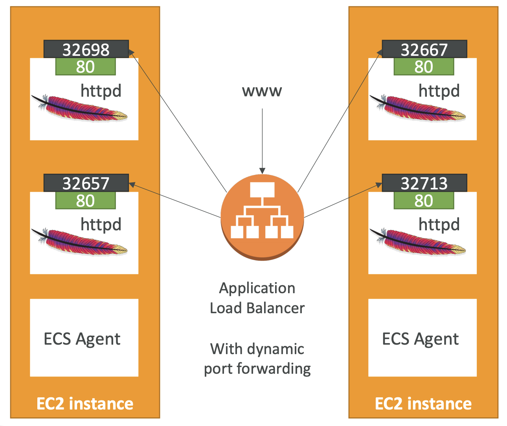
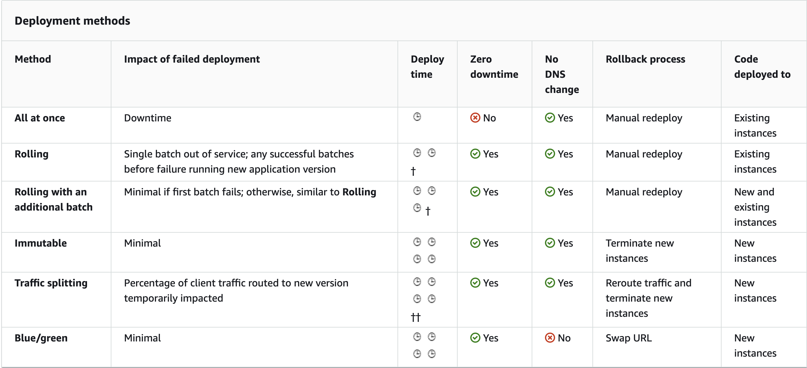

# Revision

## Section 3: IAM + EC2

- If your application is **not accessible (time out)**, then it's a **security group** issue.
- If your application give a **"connection refused" error**, then it's an **application error** or it's not launched.
- Overall, try to avoid using Elastic IP:
  - They often reflect poor architecture desicion.
  - Instead, use a random public IP and register a DNS name to it.
  - use Load balancer is a good option.

- EC2 Instance Launch Types
  - **On demand**: short workload, *highest price*
=> Recommended for short-term and un-interrupted workloads.

  - **Reserved**: long workload
    - Convertible reserved instances:
    - Scheduled reserved instances:
  - **Spot instance**: short workload, for cheap, lose instances(less reliable) if your max price is less than the current price.
=> Useful for workloads that are resilient to failure: batch jobs, data analysis, ...

  - **Dedicated Instances**: share instance with no one, may share hardware with other instances; no hardware control (instance placement)
  - **Dedicated Hosts**: book an entire physical server, control everything.
=> Recommended for software that have complicated licensing model (BYOL - Bring your own license); companies that have strong regulatory & compliance needs.

- Elastic Network Interface (ENI):
  - Logical component in a VPC that represent a virtual network card.
  - It have:
    - Primary private IPv4, one or more secondary IPv4
    - One Elastic IP per private IPv4
    - One public IP + MAC address
  - Create ENI and attach them on EC2 instances for failover.

- Other notes:
  - SSH into EC2 (remember to change .pem file permissions)
  - ...

---------------

## Section 4: ELB + ASG

### 4.1 Elastic Load Balancer

\* *Scalability:*

- **Vertical** scalability:
  - Increase size of the instance
  - Services that can scale vertically: **RDS**, **ElasticCache**.
- **Horizontal** scalability:
  - Increase the number of instances
  - Used in distributed system

\* *Why use a load balancer ?*

- Single point of access (DNS)
- Health check, SSL termination (HTTPS)
- Seperate public traffic from private traffic.

\* *Types of load balanceer:*

- **Classic Load Balancer**: HTTP, HTTPS, TCP
  - TCP (layer 4), HTTP (layer 7)
  - Fixed hostname
  - Can only have one SSL certificate.

- **Application Load Balancer**: HTTP, HTTPS, WebSocket
  - HTTP (layer 7)
  - Fixed hostname
  - Support HTTP/2 & WebSocket, redirect from HTTP to HTTPS
  - Routing table based on path, hostname, query string.
  - Great for micro services & container-based application
  - Has a ***port mapping feature*** to redirect to a dynamic port in ECS
  - **Targets** are:
    - EC2 instances
    - ECS tasks
    - Lambda function
    - IP addresses -> *Must be private IPs*

  - Support multiple listeners with multiple SSL Cert, Use SNI to make it work.

  - ***Note***: The application (ex: EC2 instance) don't see the IP of the client directly, the true IP is inserted in the header ***X-Forwarded-For***, any other information like Port, proto, etc.

- **Network Load Balancer**: TCP & UDP & TLS (secure TCP)
  - Forward TCP & UDP traffic to your instances.
  - Extremely high performance: milions of request
  - Low latency
  - NLB has *one static IP **per** AZ*, support assigning **Elastic IP** (**Only NLB have this.)**
  - Used for extreme performance, TCP & UDP trafic.
  - Support multiple listeners with multiple SSL Cert, Use SNI to make it work.

\* *Good to know about Load balancer:*

- LBs can be scale but not instanteneously.
  - Troubleshooting
    - 4xx: client induced errors.
    - 5xx: application induced errors.
    - 503: at capacity or no registerd target.

\* *Load balancer **Stickiness**:*

- be able that same client always redirected to the same instance.
- Only work for **CLB & ALB**
- Make sure the session data of user is saved.
- May bring imbalance to the load.

\* *Cross-zone Load Balancing*

- each load balancer instance *distribute evenly accross all instances* in all AZ.
- ALB: by default always on CZB, can't be disabled.
- CLB & NLB: disabled by default.

\* *SSL - Server Name Indication (SNI)*

- SNI solves the problem of **loading multiple SSL certificates onto one web server** (to serve multiple websites)
- requires the client to indicate the hostname of the target server then find & return correct SSL cert.
- Only work for new gen (ALB&NLB), CloudFront.

### 4.3 Auto Scaling Group

- ASGs use **Launch configurations** or **Launch Template** (newer)
- IAM roles attached to an ASG will get assigned to EC2 instances
- **Scaling Policies**
  - *Target Tracking Scaling*
    - Most simple and easy to setup
    - Example: I want the average ASG CPU to stay at around 40%
  - *Simple/Step Scaling*
    - When a CloudWatch alarm is triggered (example CPU > 70%), then add 2 units
    - When a CloudWatch alarm is triggered (example CPU < 30%), then remove 1
  - *Scheduled Actions*
    - Anticipate a scaling based on known usage patterns
    - Example: increase the min capacity to 10 at 5 pm on Fridays
- The cooldown period helps to ensure that your Auto Scaling group doesn't launch or terminate additional instances before the previous scaling activity takes effect

## 5.EC2 Storage Section

### 5.1 EBS Volumn

- It’s a network drive (i.e. not a physical drive)
- It can be detached from an EC2 instance and attached to another one quickly
- It’s **locked** to an Availability Zone (AZ)
  - *To move a volume across, you first need to snapshot it*
- EBS Volumes come in 4 types
  - **GP2** (SSD): General purpose SSD volume that balances price and performance for a wide variety of workloads
    - Recommended for most workload
    - System boot volumes
    - Virtual desktops
    - Low-latency
    - Development & test env.
  
  - **IO1** (SSD): Highest-performance SSD volume for mission-critical low-latency or high- throughput workloads
    - Critical business applications that require performance.
  - **ST1** (HDD): Low cost HDD volume designed for frequently accessed, throughput- intensive workloads
    - Streaming workloads requiring consistent, fast throughput at low price.
  - **SC1** (HDD): Lowest cost HDD volume designed for less frequently accessed workloads
    - data that is infrequent access.
    - scenarios where the lowest storage cost is important.
  - ***Only** GP2 and IO1 can be used as boot volumes*
- ***Note***: EBS can only be attached to only one EC2 instance.

### 5.2 EFS Elastic File System

- Managed NFS (Network File System) that can be mounted on **many EC2.**
- Work with EC2 instances in multi-AZ
- Highly available, *pay per use.*
- Encryption at rest using KMS


- Note:
  - EBS only mounted into a single EC2
  - EFS can be mounted to many
  - Need to add permission on EC2 instances to access EFS.

- Storage Tiers
  - **Standard**: for frequently accessed files
  - **Infrequent access (EFS-IA)**: cost to retrieve files, lower price to store
  - The idea is: after N days, if not use then move to EFS-IA to save cost.

|                          | EBS                                                                                                                                              | EFS                      |
| ------------------------ | ------------------------------------------------------------------------------------------------------------------------------------------------ | ------------------------ |
| Number of EC2  instances | 1                                                                                                                                                | n                        |
| Scope                    | AZ                                                                                                                                               | Global                   |
| Types                    | - GP2: General Purpose Volumes <br/>- IO1: Provisioned IOPS (expensive)<br/> - ST1: Optimized HDD<br/> - SC1: Cold HDD, Infrequent accessd data. | - Standard<br/> - EFS-1A |
| Notes                    | - Root EBS get terminated by default if  EC2 instance gets terminated.                                                                           | - Only work for  linux.  |

- Difference between: **EFS**(Multi-AZ), **EBS**(Single AZ) vs **Instance Store**(maximum of IO, ephemeral drive.)

## 6. AWS Fundamentals

### 6.1 RDS Overview

- Allow create DB that:
  - Postgres, MySQL, Oracle, Microsoft SQL Server
  - MariaDB
  - Aurora
- Continuous backups and restore to specific timestamp.
- Maintainance window for upgrades
- Read replica
- Multi AZ setup for disaster Recovery
- Scaling capability (*vertical & horizontal*)
- **BUT** you can't SSH into your instances.

- RDS Read Replica: 
  - within AZ-free, Cross AZ, Cross Region.
  - Replication is ASYNC, so reads are consistent
  - Application must **update the connection string** to leverage
  
- **RDS Multi AZ(Disaster Recovery)**
  - SYNC replication
  - One DNS name – automatic app failover to standby
  - Increase availability
  - Failover in case of loss of AZ, loss of network, instance or storage failure
  - Not used for scaling
  - Note:The Read Replicas be setup as Multi AZ for Disaster Recovery (DR). Overally, multi AZ simply use for backup, just stay there, no one read, no one write in case of failover.

- **RDS Encryption**
  - If the master is not encrypted, the read replica cannot be encrypted.
  - Transparent Data Encryption (TDE) only available for **Oracle & SQL Server.**

- **RDS Authentication**
• IAM database authentication works with **MySQL and PostgreSQL**
• You don’t need a password, just an authentication token obtained through IAM & RDS API calls
• Auth token has a lifetime of 15 minutes

### 6.2 Aurora

- Postgres & MySQL are both supported by Aurora
- Cloud optimized, performance improvement RDS
- 6 copies of your data accross 3 AZs.
- Support for **Cross Region Replication**
- Simply: Replication, Self-healing, Auto Expanding

- **Aurora Serverless:**
  - Automated database instantiation and auto scaling based on actual usage
  - Good for **infrequent**, intermittent or **unpredictable** workloads
  - No capacity planning needed
  - Pay per second, can be more cost effective

- **Global Aurora:**
  - Aurora Cross Region Read Replicas, Useful for disaster recovery
  - 1 Primary Region (read / write), Up to 5 secondary (read-only) regions.

### 6.3 ElastiCache

- Use cases: User session store.

| Redis                                                                                                                                                                        | Memcached (minify version)                                                                                                          |
| ---------------------------------------------------------------------------------------------------------------------------------------------------------------------------- | ----------------------------------------------------------------------------------------------------------------------------------- |
| • Multi AZ with Auto-Failover<br>• Read Replicas to scale reads<br>and have high availability<br>• Data Durability using AOF<br>persistence<br>• Backup and restore features | • Multi-node for partitioning of<br>data (sharding)<br>• Non persistent<br>• No backup and restore<br>• Multi-threaded architecture |

- Caching design patterns:

| Lazy Loading / Cache-Aside / Lazy Population                                                                                                                                                                                                                                                                                                         | Write-Through<br>add or update cache when database is updated.                                                                                                                                                                                                         |
| ---------------------------------------------------------------------------------------------------------------------------------------------------------------------------------------------------------------------------------------------------------------------------------------------------------------------------------------------------- | ---------------------------------------------------------------------------------------------------------------------------------------------------------------------------------------------------------------------------------------------------------------------- |
| Pros:<br>• Only requested data is cached (isn’t filled up with unused data)<br>• Node failures are not fatal <br>(just increased latency to warm the cache)<br>• Improve read performance<br><br>Cons:<br>• Cache miss penalty that results in **3 round trips**.<br>• **Stale data**: data can be updated in the database but outdated in the cache | Pros:<br>• Data in cache is **never stale**, reads are quick<br>• Write penalty vs Read penalty <br>(each write requires **2 calls**)<br><br>Cons:<br>• Missing Data until it is added / updated in the DB<br>• **Cache churn** – a lot of the data will never be read |

```py
# Lazy Loading/Cache-aside/Lazy Population
# Note: when get data from db.
def get_user(user_id):
    record = cache.get(user_id)
    if record is None:
        record = db.query("select * from ...")
        cache.set(user_id, record)
    
    return record
```

```py
# Write through
# Note: when database is updated
def save_user(id, values):
    record = db.query("update users ...")
    cache.set(id, record)
    return record
```

- Write through is usually combined with Lazy Loading
- Setting a TTL is usually not a bad idea, **except** when you’re using Write- through. Set it to a sensible value for your application


## 7. Route 53

- is a global service, is a Managed DNS
- The most commons records are:
  - **A** hostname to IPv4
  - **AAAA** IPv6
  - **CNAME** hostname to hostname
  - **Alias** hostname to AWS resource

- DNS Records **TTL**:
  - TTL is a way to cache response of a DNS query (IP) to not overload the DNS.
  - TTL is mandatory for each DNS record

- Remember:
  - Root domain: ex: mydomain.com
  - Non-root domain: ex blabal.mydomain.com
  
- **CNAME vs Alias**

| CNAME                                         | Alias                                                  |
| --------------------------------------------- | ------------------------------------------------------ |
| • Hostname to hostname<br>• ONLY FOR NON-ROOT | • Hostname to AWS resource<br>• ROOT & NON-ROOT domain |

- **Routing policies:**
  - **Simple** Routing policy:
    - hostname to hostname
    - can't attach health checks
    - if multiple values are returned, a random one is chosen by the client
  - **Weighted** Routing Policy:
    - Helpful to test 1% on new version
    - Split traffic between two regions
    - Can be associated with Health check
  - **Latency** Routing Policy:
    - Redirect to the server that has the least latency close to us
    - Helpful when latency is a priority
    - minimizing the response time from your servers to your users
    - Latency is evaluated in terms of user to designated AWS Region
  - **Failover** Routing Policy:
    - Have Primary & Secondary version
    - Health check is mandatory in Primary, but not required in secondary.
  - **Geo Location** Routing Policy
    - based on user location
    - Restrict access from some country for ex.
  - **Multi Value** Routing Policy
    - Use when routing traffic to multiple resources
    - Want to associate a Route 53 health checks with records
    - Multi Value is not a substitute for having an ELB, but do some kind of LB.

- Famous domain name registrar: GoDaddy, Google Domains, ... & Route53

### 8. VPC

- **VPC**: private network to deploy your resources (Regional resource)
- **Subnets**: Partion your network inside your VPC (AZ resource)
- **Route Tables**: to define access to the internet and **between subnets**
- **Internet Gateway**: helps our VPC instances connect with the internet
- **NAT Gateways** (AWS-managed) & **NAT Instances** (self-managed): allow **Private subnets** to access the internet.



- **NACL** (Network ACL)
  - A firewall which controls traffic from and to subnet
  - Can have ALLOW and DENY rules
  - Are attached at the Subnet level
  - Rules only include IP addresses

- **Security Groups**
  - A firewall that controls traffic to and from **an ENI / an EC2 Instance**
  - Can have only ALLOW rules
  - Rules include IP addresses and other security groups
  - Attached to EC2 instance

| Network ACL                | Security Group          |
| -------------------------- | ----------------------- |
| at *subnet* level          | at *instance* level     |
| Support ALLOW & DENY rules | Support ALLOW rule only |



- **VPC Peering**
  - Connect two VPCs privately
  - MUST not have overlapping CIDR (IP address range)

- **VPC endpoints**
  - Endpoints allow you to **connect to AWS Services** using a private network instead of the public www network.
  - enhanced security and lower latency to access AWS services
  - VPC Endpoint Gateway: S3 & DynamoDB
  - VPC Endpoint Interface (**ENI**): the rest
  - Only used within your VPC



- **Connect On-premise Data Center to VPC**

| Site to Site VPN                          | Direct Connect (DX)                                          |
| ----------------------------------------- | ------------------------------------------------------------ |
| Connect an on-premises VPN to AWS         | Establish a physical connection between on- premises and AWS |
| Goes over the public internet             | The connection is private, secure and fast                   |
| The connection is automatically encrypted | Takes at least a month to establish                          |

  - *Note*:
    - VPC Endpoint => Inside VPC
    - Site-to-site VPN & Direct Connect **CAN'T** access VPC endpoint.




## 9. Amazon S3

- S3: Global service
- Buckets must have a **global unique name**
- Buckets are defined at the region level
- **S3 Security:**: 4 methods of encrypting objects in S3
  - **SSE-S3**: encrypts S3 objects using keys handled & managed by AWS
    - Use key managed by S3
  - **SSE-KMS**: leverage AWS Key Management Service to manage encryption keys
    - Use key managed by KMS
    - Pro: User control + audit trail
  - **SSE-C**: when you want to manage your own encryption keys
    - Use key from user
    - S3 does not store the encryption key
    - **HTTPS must be used**
  - **Client Side Encryption**
    - Using library such as Amazon S3 Encryption Client
    - User encrypt before and then decrypt when received.

- **S3 Security 2:**
  - User based: using IAM Policies
  - Resource based
    - **Bucket Policies**: bucket wide rules from s3 account
    - Object Access Control List (ACL)
    - Bucket Access Control List (ACL)
  - ***Note: an IAM principal can access an S3 object if***
    - the user IAM permissions allow it **OR** the resource policy ALLOWS it
    - AND there’s no explicit DENY

- *S3 Bucket Policies:*
  - JSON based policies:
    - Principal: The account or user to apply the policy to
  - Use S3 bucket policies to:
    - Grant public access
    - FORCE objects to be encrypted at upload. => The new way is use "default encryption" option on S3
    - Grant access to other account.

- CORS:
  - Different origin: www.example.com vs other.example.com

- There's no way to request "Strong consistency"
  - Data may not be up to date, we have to wait a bit for new version.
  - Explicit DENY in an IAM policy will take precedence over a bucket policy permission

## 10. CLI, SDK and IAM Policies

### 10.1 AWS CLI

- To use the CLI, first setup credential in IAM service
- The RIGHT way to use CLI is through IAM role that attached to EC2 instance.

### 10.2 AWS SDK

- we have to use AWS SDK when coding against AWS Services like DynamoDB
- Exponential backoff:
  - Retry mechanism
  - whenever retry API call, double the amount of time to wait


| AWS CLI Credentials Provider Chain                                                                                                                                                                                                                        | AWS SDK Default Credentials                                                                                                                                                                                                                                               |
| --------------------------------------------------------------------------------------------------------------------------------------------------------------------------------------------------------------------------------------------------------- | ------------------------------------------------------------------------------------------------------------------------------------------------------------------------------------------------------------------------------------------------------------------------- |
| 1. Command line options<br>2. Environment variables<br>3. CLI credentials file –aws configure<br>4. CLI configuration file – aws configure<br>5. Container credentials – for ECS tasks<br>6. Instance profile credentials <br>– for EC2 Instance Profiles | 1. Environment variables<br>2. Java system properties<br>3. The default credential profiles file – ex at: ~/.aws/credentials, shared by<br>many SDK<br>4. Amazon ECS container credentials – for ECS containers<br>5. Instance profile credentials– used on EC2 instances |

## 11. Advanced S3

- **S3 MFA-delete**:
  - Must enable verioning on S3
  - to permanently delete an object version.

- **S3 Replication** CRR & SRR
  - Must be enable versioning in source and destination
  - CRR: to improve latency
  - SRR: log aggregation, mimic prod in test.

|                        | Characteristics                                                                                                                                                                                                                                                                      | Avaiability | Use case                                                    |
| ---------------------- | ------------------------------------------------------------------------------------------------------------------------------------------------------------------------------------------------------------------------------------------------------------------------------------ | ----------- | ----------------------------------------------------------- |
| S3 Standard            | - Sustain 2 concurrent facility failures<br>-> resilient to AZ disaster.                                                                                                                                                                                                             | 99.99 %     | Big data, application, content, ...                         |
| Infrequent Access (IA) | - less frequently accessed<br>but required RAPID access when needed.<br>- Sustain 2 concurrent facility failures<br>- Store in multiple AZ                                                                                                                                           | 99.9%       | Disaster recovery, backups                                  |
| S3 One Zone            | - Same as IA, but in single AZ<br>- Data lost when AZ destroy                                                                                                                                                                                                                        | 99.5%       | Secondary backup<br>Data that can be recreated ex.thumbnail |
| S3 Intelligent Tiering | - Automatically moves objects between 2<br>tiers (General & IA)<br>- Resilient to disaster.                                                                                                                                                                                          | 99.9%       |                                                             |
| Glacier                | - Low cost for achieving & backup<br>- Data is retained in longer term<br>- Each item: Achieve<br>- Achieves are store in Vaults<br>- 3 retrieval options:<br>   + Expedited (1-5 minutes)<br>   + Standard (3-5 hours)<br>   + Bulk (5-12h)<br>- Minimum storage duration: 90 days. | 99.99%      | achieving & backup<br>have option to retrieve faster.       |
| Glacier Deep Archive   | - 2 retrieval options:<br>   + Standard (12h)<br>   + Bulk (48h)<br>- Minimum storage duration: 180 days.                                                                                                                                                                            | 99.99%      | supper long term                                            |

- KMS limitation
  - if you use SSE-KMS, S3 may be impacted by KMS limit.
  - When upload, it call **GenerateDataKey**
  - When download, call **Decrypt** api.

- S3 Performance:
  - **Multi-part upload**
    - use for big file with parallelize upload, a must for 5GB.
  - **S3 Tranfer Acceleration**
    - Increase transfer speed by transfering file to AWS edge location
    - Compatible with multi-part upload.
    - It is fast because we minimized the amount of public internet that we go through and maximized private network

- S3 Select & Glacier Select
  - Retrieve less data by filter on server
  - Can filter by simple SQL state

- S3 Event Notification
  - 3 possible targets: SQS, SNS, Lambda

- **Athena**
  - perform analytics directly on S3 files.

## 12. CloudFront

- Content Delivery Network (CDN)
- Improves read performance, content is cached at the edge
- DDoS protection, integration with Shield, AWS Web Application Firewall
- CloudFront Origins:
  - **S3 bucket**
    - Origin Access Identity (OAI)
    - OAI as IAM Role for CloudFront
    - S3 Bucket policy: allow OAI to access S3 objects.
  - **Custom origin (HTTP)**
    - ALB, EC2 instance, S3 website, ...

| CloudFront                                                 | S3 Cross Region Replication                                              |
|------------------------------------------------------------|--------------------------------------------------------------------------|
| Global Edge network                                        | set up for desire region                                                 |
| File are cached for TTL                                    | File are updated in near real-time but read-only                         |
| Great for **STATIC** content that must be available everywhere | Great for **DYNAMIC** content that available with low-latency in few regions |

## 13. ECS Essentials

- Docker containers management platform:
  - ECS
  - Fargate: serverless platform
  - EKS: Amazon's managed kubernetes

- **ECS Clusters Overview:**
  - ECS Clusters are logical grouping of EC2 instances
  - EC2 instances run the ECS agent (Docker container), and have `escInstanceRole`
  - The ECS agents registers the instance to the ECS cluster
  - EC2 instances can run multiple containers on the same type
  - The EC2 instances run a special AMI, made specifically for ECS
  - EC2 instances must be created
  - We must configure `ecs.config` with the cluster name

- **ECS Task Definitions**:
  - Tasks definitions are metadata in JSON form to tell ECS how to run a Docker Container
  - need `taskRole` to have permissions (pull images, ...)

- **ECS Service**:
  -  define how many tasks should run and how they should be run

- **ECS Service with Load Balancer**
  - Use with ALB for dynamic port forwarding
  - No need to configure host port this time -> random (~host port = 0). ***If we specify it, only one container can be run in EC2 instance***
  - But container port is needed => ALB will handle this with dynamic port mapping.



- **ECR**
  - private docker image repository
  - AWS CLI v1 login command
`$(aws ecr get-login --no-include-email --region eu-west-1)`
  - AWS CLI v2 login command (using pipe)
`aws ecr get-login-password --region eu-west-1 | docker login --username AWS -- password-stdin 1234567890.dkr.ecr.eu-west-1.amazonaws.com`

- **Fargate**
  - Serverless service for ECS, just need to create task definition

- **EC2 Instance Profile**: 
  - Makes API calls to ECS service by ECS Agent
  - Send log, pull images

- **• ECS Task Role:**:
  - Use different roles for the different ECS Services you run
  - Task Role is defined in the task definition

- **ECS Task Placement Strategies**
  - **Binpack**: try to fill as much as possible
    - Places tasks based on the least available space of CPU
    - Minimize the number of instances (cost saving)
  - **Random**
  - **Spread**
    - Place the task evenly based on the specified value
    - Maximizing the high avaiability of ECS
  - You can mix them together

- *ECS - Service Auto Scaling* based on Target Tracking, Step Scaling, Scheduled Scaling
- Cluster Auto Scaling through Capacity Providers.

---------------

## 14. AWS Elastic Beanstalk

- Elastic Beanstalk is a **developer centric view** of deploying an application on AWS

\* *Three architecture models:*

- **Single Instance** deployment: good for dev
- **LB + ASG**: great for production or pre-production web applications
- **ASG only**: great for non-web apps in production (workers, etc..)

\* *Elastic Beanstalk has three components:*

- Application
- Application version: each deployment gets assigned a version
- Environment name (dev, test, prod…)

\* *If we have RDS inside Beanstalk:*

- Good for dev/test only
- Beanstalk delete --> RDS delete
- Consider to put RDS inside or outside Beanstalk
- In prod, create outside and using by connection string.

\* *Elastic Beanstalk Deployment Modes:*

|                                     | Availability                         | Deployment time | Additional cost              | Other                                                                         |
|-------------------------------------|--------------------------------------|-----------------|------------------------------|-------------------------------------------------------------------------------|
| **All at once**                         | Has downtime                         | Fastest         | No                           |                                                                               |
| **Rolling**                             | Running below capacity               | Long            | No                           | Run both versions simultaneously                                              |
| **Rolling with <br>additional batches** | Running at capacity                  | Longer          | Small                        | - run both versions simultaneously<br>- good for prod.                        |
| **Immutable**                           | Running at capacity<br>Zero downtime | Longest         | High cost<br>double capacity | - deployed to a temporary ASG<br>- quick rollback if fail<br>- great for prod |

From AWS:


\* *Elastic Beanstalk Deployment: Blue / Green* (~Immutable)

- Create a new “stage” environment and deploy v2 there
- The new environment (green) can be validated independently and roll back if issues
- **Route 53** can be setup using **weighted policies** to redirect a little bit of traffic to the stage environment
- Using **Beanstalk**, “*swap URLs*” when done with the environment test

\* ***Elastic Beanstalk Extensions***

- A zip file containing our code must be deployed to Elastic Beanstalk
- All the parameters set in the UI can be configured with code using files
- Requirements:
  - in the **.ebextensions/ directory** in the root of source code
  - YAML / JSON format
  - **.config** extensions (example: logging.config)
  - Able to modify some default settings using: option_settings
  - Ability to add resources such as RDS, ElastiCache, DynamoDB, etc (using CloudFormation)
  - You can define periodic tasks in a file **cron.yaml**

- Under the hood, Elastic Beanstalk relies on CloudFormation
- CloudFormation is used to provision other AWS services
- After creating an Elastic Beanstalk environment, you **cannot** change the Elastic Load Balancer type

\* *Elastic Beanstalk – Single Docker*

- Run your application as a single docker container
- **Dockerfile**: Elastic Beanstalk will build and run the Docker container
- **Dockerrun.aws.json** (v1): Describe where *already built* Docker image is
  - Image
  - Ports
  - Volumes
  - Logging
- Beanstalk in Single Docker Container does not use ECS
  
\* *Elastic Beanstalk – Multi Docker Container ~ ECS*

- Multi Docker helps run multiple containers per EC2 instance in EB
- This will create for you:
  - ECS Cluster
  - EC2 instances, configured to use the ECS Cluster
  - Load Balancer (in high availability mode)
  - Task definitions and execution
- Requires a config **Dockerrun.aws.json** (v2) at the root of source code, to generate the **ECS task definition**

\* *Elastic Beanstalk – **Custom Platform***

- They **allow to define from scratch**:
  - The Operating System (OS)
  - Additional Software
  - Scripts that Beanstalk runs on these platforms

- **Use case**: app language is incompatible with Beanstalk & doesn’t use Docker
- To create your own platform:
  - Define an AMI using **Platform.yaml** file
  - Build that platform using the Packer software (open source tool to create AMIs)
- Custom Platform vs Custom Image (AMI):
  - Custom Image is to tweak an existing Beanstalk Platform (Python, Node.js, Java…)
  - Custom Platform is to create an entirely new Beanstalk Platform