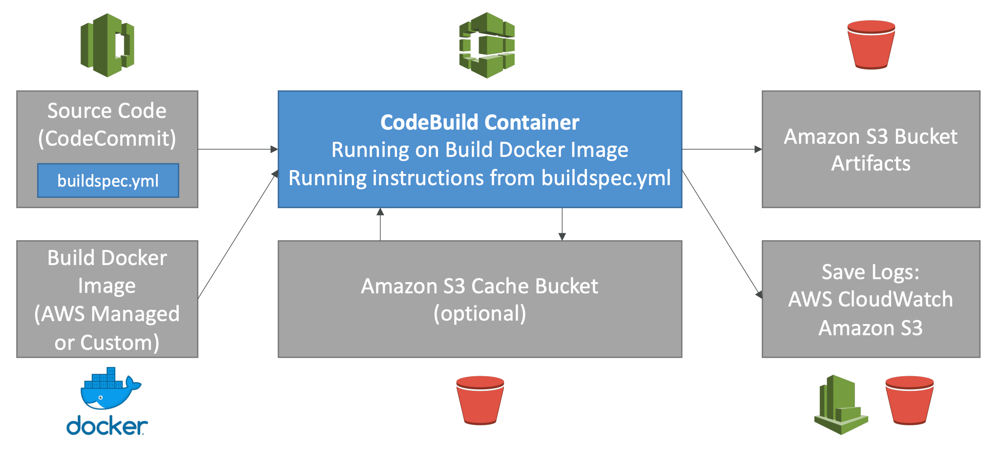
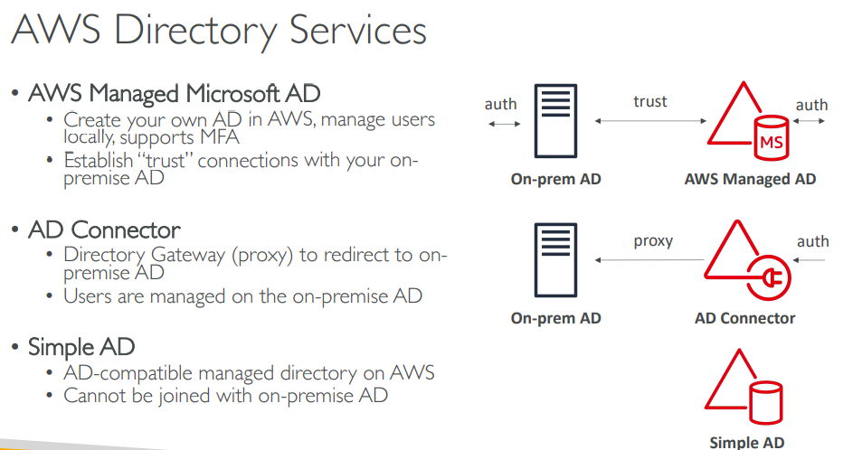

## Section 3: IAM + EC2

- If your application is **not accessible (time out)**, then it's a **security group** issue.
- If your application give a **"connection refused" error**, then it's an **application error** or it's not launched.
- Overall, try to avoid using Elastic IP:
  - They often reflect poor architecture desicion.
  - Instead, use a random public IP and register a DNS name to it.
  - use Load balancer is a good option.

- EC2 Instance Launch Types
  - **On demand**: short workload, *highest price*
=> Recommended for short-term and un-interrupted workloads.

  - **Reserved**: long workload
    - Convertible reserved instances:
    - Scheduled reserved instances:
  - **Spot instance**: short workload, for cheap, lose instances(less reliable) if your max price is less than the current price.
=> Useful for workloads that are resilient to failure: batch jobs, data analysis, ...

  - **Dedicated Instances**: share instance with no one, may share hardware with other instances; no hardware control (instance placement)
  - **Dedicated Hosts**: book an entire physical server, control everything.
=> Recommended for software that have complicated licensing model (BYOL - Bring your own license); companies that have strong regulatory & compliance needs.

- Elastic Network Interface (ENI):
  - Logical component in a VPC that represent a virtual network card.
  - It have:
    - Primary private IPv4, one or more secondary IPv4
    - One Elastic IP per private IPv4
    - One public IP + MAC address
  - Create ENI and attach them on EC2 instances for failover.

- Other notes:
  - SSH into EC2 (remember to change .pem file permissions)
  - ...

---------------

## Section 4: ELB + ASG

### 4.1 Elastic Load Balancer

\* *Scalability:*

- **Vertical** scalability:
  - Increase size of the instance
  - Services that can scale vertically: **RDS**, **ElasticCache**.
- **Horizontal** scalability:
  - Increase the number of instances
  - Used in distributed system

\* *Why use a load balancer ?*

- Single point of access (DNS)
- Health check, SSL termination (HTTPS)
- Seperate public traffic from private traffic.

\* *Types of load balanceer:*

- **Classic Load Balancer**: HTTP, HTTPS, TCP
  - TCP (layer 4), HTTP (layer 7)
  - Fixed hostname
  - Can only have one SSL certificate.

- **Application Load Balancer**: HTTP, HTTPS, WebSocket
  - HTTP (layer 7)
  - Fixed hostname
  - Support HTTP/2 & WebSocket, redirect from HTTP to HTTPS
  - Routing table based on path, hostname, query string.
  - Great for micro services & container-based application
  - Has a ***port mapping feature*** to redirect to a dynamic port in ECS
  - **Targets** are:
    - `EC2 instances`
    - `ECS tasks`
    - `Lambda function`
    - IP addresses -> *Must be private IPs*

  - Support multiple listeners with multiple SSL Cert, Use SNI to make it work.

  - ***Note***: The application (ex: EC2 instance) don't see the IP of the client directly, the true IP is inserted in the header ***X-Forwarded-For***, any other information like Port, proto, etc.

- **Network Load Balancer**: TCP & UDP & TLS (secure TCP)
  - Forward TCP & UDP traffic to your instances.
  - Extremely high performance: milions of request
  - Low latency
  - NLB has *one static IP **per** AZ*, support assigning **Elastic IP** (**Only NLB have this.)**
  - Used for extreme performance, TCP & UDP trafic.
  - Support multiple listeners with multiple SSL Cert, Use SNI to make it work.

\* *Good to know about Load balancer:*

- LBs can be scale but not instanteneously.
  - Troubleshooting
    - 4xx: client induced errors.
    - 5xx: application induced errors.
    - 503: at capacity or no registerd target.

\* *Load balancer **Stickiness**:*

- be able that same client always redirected to the same instance.
- Only work for **CLB & ALB**
- Make sure the session data of user is saved.
- May bring imbalance to the load.

\* *Cross-zone Load Balancing*

- each load balancer instance *distribute evenly accross all instances* in all AZ.
- ALB: by default always on CZB, can't be disabled.
- CLB & NLB: disabled by default.

\* *SSL - Server Name Indication (SNI)*

- SNI solves the problem of **loading multiple SSL certificates onto one web server** (to serve multiple websites)
- requires the client to indicate the hostname of the target server then find & return correct SSL cert.
- Only work for new gen (ALB&NLB), CloudFront.

### 4.3 Auto Scaling Group

- ASGs use **Launch configurations** or **Launch Template** (newer)
- IAM roles attached to an ASG will get assigned to EC2 instances
- **Scaling Policies**
  - *Target Tracking Scaling*
    - Most simple and easy to setup
    - Example: I want the average ASG CPU to stay at around 40%
  - *Simple/Step Scaling*
    - When a CloudWatch alarm is triggered (example CPU > 70%), then add 2 units
    - When a CloudWatch alarm is triggered (example CPU < 30%), then remove 1
  - *Scheduled Actions*
    - Anticipate a scaling based on known usage patterns
    - Example: increase the min capacity to 10 at 5 pm on Fridays
- The cooldown period helps to ensure that your Auto Scaling group doesn't launch or terminate additional instances before the previous scaling activity takes effect

## 5.EC2 Storage Section

### 5.1 EBS Volumn

- It’s a network drive (i.e. not a physical drive)
- It can be detached from an EC2 instance and attached to another one quickly
- It’s **locked** to an Availability Zone (AZ)
  - *To move a volume across, you first need to snapshot it*
- EBS Volumes come in 4 types
  - **GP2** (SSD): General purpose SSD volume that balances price and performance for a wide variety of workloads
    - Recommended for most workload
    - System boot volumes
    - Virtual desktops
    - Low-latency
    - Development & test env.
  
  - **IO1** (SSD): Highest-performance SSD volume for mission-critical low-latency or high- throughput workloads
    - Critical business applications that require performance.
  - **ST1** (HDD): Low cost HDD volume designed for frequently accessed, throughput- intensive workloads
    - Streaming workloads requiring consistent, fast throughput at low price.
  - **SC1** (HDD): Lowest cost HDD volume designed for less frequently accessed workloads
    - data that is infrequent access.
    - scenarios where the lowest storage cost is important.
  - ***Only** GP2 and IO1 can be used as boot volumes*
- ***Note***: EBS can only be attached to only one EC2 instance.

### 5.2 EFS Elastic File System

- Managed NFS (Network File System) that can be mounted on **many EC2.**
- Work with EC2 instances in multi-AZ
- Highly available, *pay per use.*
- Encryption at rest using KMS


- Note:
  - EBS only mounted into a single EC2
  - EFS can be mounted to many
  - Need to add permission on EC2 instances to access EFS.

- Storage Tiers
  - **Standard**: for frequently accessed files
  - **Infrequent access (EFS-IA)**: cost to retrieve files, lower price to store
  - The idea is: after N days, if not use then move to EFS-IA to save cost.

|                          | EBS                                                                                                                                              | EFS                      |
| ------------------------ | ------------------------------------------------------------------------------------------------------------------------------------------------ | ------------------------ |
| Number of EC2  instances | 1                                                                                                                                                | n                        |
| Scope                    | AZ                                                                                                                                               | Global                   |
| Types                    | - GP2: General Purpose Volumes <br/>- IO1: Provisioned IOPS (expensive)<br/> - ST1: Optimized HDD<br/> - SC1: Cold HDD, Infrequent accessd data. | - Standard<br/> - EFS-1A |
| Notes                    | - Root EBS get terminated by default if  EC2 instance gets terminated.                                                                           | - Only work for  linux.  |

- Difference between: **EFS**(Multi-AZ), **EBS**(Single AZ) vs **Instance Store**(maximum of IO, ephemeral drive.)

## 6. AWS Fundamentals

### 6.1 RDS Overview

- Allow create DB that:
  - Postgres, MySQL, Oracle, Microsoft SQL Server
  - MariaDB
  - Aurora
- Continuous backups and restore to specific timestamp.
- Maintainance window for upgrades
- Read replica
- Multi AZ setup for disaster Recovery
- Scaling capability (*vertical & horizontal*)
- **BUT** you can't SSH into your instances.

- RDS Read Replica: 
  - within AZ-free, Cross AZ, Cross Region.
  - Replication is ASYNC, so reads are consistent
  - Application must **update the connection string** to leverage
  
- **RDS Multi AZ(Disaster Recovery)**
  - SYNC replication
  - One DNS name – automatic app failover to standby
  - Increase availability
  - Failover in case of loss of AZ, loss of network, instance or storage failure
  - Not used for scaling
  - Note:The Read Replicas be setup as Multi AZ for Disaster Recovery (DR). Overally, multi AZ simply use for backup, just stay there, no one read, no one write in case of failover.

- **RDS Encryption**
  - If the master is not encrypted, the read replica cannot be encrypted.
  - Transparent Data Encryption (TDE) only available for **Oracle & SQL Server.**

- **RDS Authentication**
• IAM database authentication works with **MySQL and PostgreSQL**
• You don’t need a password, just an authentication token obtained through IAM & RDS API calls
• Auth token has a lifetime of 15 minutes

### 6.2 Aurora

- Postgres & MySQL are both supported by Aurora
- Cloud optimized, performance improvement RDS
- 6 copies of your data accross 3 AZs.
- Support for **Cross Region Replication**
- Simply: Replication, Self-healing, Auto Expanding

- **Aurora Serverless:**
  - Automated database instantiation and auto scaling based on actual usage
  - Good for **infrequent**, intermittent or **unpredictable** workloads
  - No capacity planning needed
  - Pay per second, can be more cost effective

- **Global Aurora:**
  - Aurora Cross Region Read Replicas, Useful for disaster recovery
  - 1 Primary Region (read / write), Up to 5 secondary (read-only) regions.

### 6.3 ElastiCache

- Use cases: User session store.

| Redis                                                                                                                                                                        | Memcached (minify version)                                                                                                          |
| ---------------------------------------------------------------------------------------------------------------------------------------------------------------------------- | ----------------------------------------------------------------------------------------------------------------------------------- |
| • Multi AZ with Auto-Failover<br>• Read Replicas to scale reads<br>and have high availability<br>• Data Durability using AOF<br>persistence<br>• Backup and restore features | • Multi-node for partitioning of<br>data (sharding)<br>• Non persistent<br>• No backup and restore<br>• Multi-threaded architecture |

- Caching design patterns:

| Lazy Loading / Cache-Aside / Lazy Population                                                                                                                                                                                                                                                                                                         | Write-Through<br>add or update cache when database is updated.                                                                                                                                                                                                         |
| ---------------------------------------------------------------------------------------------------------------------------------------------------------------------------------------------------------------------------------------------------------------------------------------------------------------------------------------------------- | ---------------------------------------------------------------------------------------------------------------------------------------------------------------------------------------------------------------------------------------------------------------------- |
| Pros:<br>• Only requested data is cached (isn’t filled up with unused data)<br>• Node failures are not fatal <br>(just increased latency to warm the cache)<br>• Improve read performance<br><br>Cons:<br>• Cache miss penalty that results in **3 round trips**.<br>• **Stale data**: data can be updated in the database but outdated in the cache | Pros:<br>• Data in cache is **never stale**, reads are quick<br>• Write penalty vs Read penalty <br>(each write requires **2 calls**)<br><br>Cons:<br>• Missing Data until it is added / updated in the DB<br>• **Cache churn** – a lot of the data will never be read |

```py
# Lazy Loading/Cache-aside/Lazy Population
# Note: when get data from db.
def get_user(user_id):
    record = cache.get(user_id)
    if record is None:
        record = db.query("select * from ...")
        cache.set(user_id, record)
    
    return record
```

```py
# Write through
# Note: when database is updated
def save_user(id, values):
    record = db.query("update users ...")
    cache.set(id, record)
    return record
```

- Write through is usually combined with Lazy Loading
- Setting a TTL is usually not a bad idea, **except** when you’re using Write- through. Set it to a sensible value for your application


## 7. Route 53

- is a global service, is a Managed DNS
- The most commons records are:
  - **A** hostname to IPv4
  - **AAAA** IPv6
  - **CNAME** hostname to hostname
  - **Alias** hostname to AWS resource

- DNS Records **TTL**:
  - TTL is a way to cache response of a DNS query (IP) to not overload the DNS.
  - TTL is mandatory for each DNS record

- Remember:
  - Root domain: ex: mydomain.com
  - Non-root domain: ex blabal.mydomain.com
  
- **CNAME vs Alias**

| CNAME                                         | Alias                                                  |
| --------------------------------------------- | ------------------------------------------------------ |
| • Hostname to hostname<br>• ONLY FOR NON-ROOT | • Hostname to AWS resource<br>• ROOT & NON-ROOT domain |

- **Routing policies:**
  - **Simple** Routing policy:
    - hostname to hostname
    - can't attach health checks
    - if multiple values are returned, a random one is chosen by the client
  - **Weighted** Routing Policy:
    - Helpful to test 1% on new version
    - Split traffic between two regions
    - Can be associated with Health check
  - **Latency** Routing Policy:
    - Redirect to the server that has the least latency close to us
    - Helpful when latency is a priority
    - minimizing the response time from your servers to your users
    - Latency is evaluated in terms of user to designated AWS Region
  - **Failover** Routing Policy:
    - Have Primary & Secondary version
    - Health check is mandatory in Primary, but not required in secondary.
  - **Geo Location** Routing Policy
    - based on user location
    - Restrict access from some country for ex.
  - **Multi Value** Routing Policy
    - Use when routing traffic to multiple resources
    - Want to associate a Route 53 health checks with records
    - Multi Value is not a substitute for having an ELB, but do some kind of LB.

- Famous domain name registrar: GoDaddy, Google Domains, ... & Route53

### 8. VPC

- **VPC**: private network to deploy your resources (Regional resource)
- **Subnets**: Partion your network inside your VPC (AZ resource)
- **Route Tables**: to define access to the internet and **between subnets**
- **Internet Gateway**: helps our VPC instances connect with the internet
- **NAT Gateways** (AWS-managed) & **NAT Instances** (self-managed): allow **Private subnets** to access the internet.


- **NACL** (Network ACL)
  - A firewall which controls traffic from and to subnet
  - Can have ALLOW and DENY rules
  - Are attached at the Subnet level
  - Rules only include IP addresses

- **Security Groups**
  - A firewall that controls traffic to and from **an ENI / an EC2 Instance**
  - Can have only ALLOW rules
  - Rules include IP addresses and other security groups
  - Attached to EC2 instance

| Network ACL                | Security Group          |
| -------------------------- | ----------------------- |
| at *subnet* level          | at *instance* level     |
| Support ALLOW & DENY rules | Support ALLOW rule only |


- **VPC Peering**
  - Connect two VPCs privately
  - MUST not have overlapping CIDR (IP address range)

- **VPC endpoints**
  - Endpoints allow you to **connect to AWS Services** using a private network instead of the public www network.
  - enhanced security and lower latency to access AWS services
  - VPC Endpoint Gateway: S3 & DynamoDB
  - VPC Endpoint Interface (**ENI**): the rest
  - Only used within your VPC


- **Connect On-premise Data Center to VPC**

| Site to Site VPN                          | Direct Connect (DX)                                          |
| ----------------------------------------- | ------------------------------------------------------------ |
| Connect an on-premises VPN to AWS         | Establish a physical connection between on- premises and AWS |
| Goes over the public internet             | The connection is private, secure and fast                   |
| The connection is automatically encrypted | Takes at least a month to establish                          |

  - *Note*:
    - VPC Endpoint => Inside VPC
    - Site-to-site VPN & Direct Connect **CAN'T** access VPC endpoint.


## 9. Amazon S3

- S3: Global service
- Buckets must have a **global unique name**
- Buckets are defined at the region level
- **S3 Security:**: 4 methods of encrypting objects in S3
  - **SSE-S3**: encrypts S3 objects using keys handled & managed by AWS
    - Use key managed by S3
  - **SSE-KMS**: leverage AWS Key Management Service to manage encryption keys
    - Use key managed by KMS
    - Pro: User control + audit trail
  - **SSE-C**: when you want to manage your own encryption keys
    - Use key from user
    - S3 does not store the encryption key
    - **HTTPS must be used**
  - **Client Side Encryption**
    - Using library such as Amazon S3 Encryption Client
    - User encrypt before and then decrypt when received.

- **S3 Security 2:**
  - User based: using IAM Policies
  - Resource based
    - **Bucket Policies**: bucket wide rules from s3 account
    - Object Access Control List (ACL)
    - Bucket Access Control List (ACL)
  - ***Note: an IAM principal can access an S3 object if***
    - the user IAM permissions allow it **OR** the resource policy ALLOWS it
    - AND there’s no explicit DENY

- *S3 Bucket Policies:*
  - JSON based policies:
    - Principal: The account or user to apply the policy to
  - Use S3 bucket policies to:
    - Grant public access
    - FORCE objects to be encrypted at upload. => The new way is use "default encryption" option on S3
    - Grant access to other account.

- CORS:
  - Different origin: www.example.com vs other.example.com

- There's no way to request "Strong consistency"
  - Data may not be up to date, we have to wait a bit for new version.
  - Explicit DENY in an IAM policy will take precedence over a bucket policy permission

## 10. CLI, SDK and IAM Policies

### 10.1 AWS CLI

- To use the CLI, first setup credential in IAM service
- The RIGHT way to use CLI is through IAM role that attached to EC2 instance.

### 10.2 AWS SDK

- we have to use AWS SDK when coding against AWS Services like DynamoDB
- Exponential backoff:
  - Retry mechanism
  - whenever retry API call, double the amount of time to wait


| AWS CLI Credentials Provider Chain                                                                                                                                                                                                                        | AWS SDK Default Credentials                                                                                                                                                                                                                                               |
| --------------------------------------------------------------------------------------------------------------------------------------------------------------------------------------------------------------------------------------------------------- | ------------------------------------------------------------------------------------------------------------------------------------------------------------------------------------------------------------------------------------------------------------------------- |
| 1. Command line options<br>2. Environment variables<br>3. CLI credentials file –aws configure<br>4. CLI configuration file – aws configure<br>5. Container credentials – for ECS tasks<br>6. Instance profile credentials <br>– for EC2 Instance Profiles | 1. Environment variables<br>2. Java system properties<br>3. The default credential profiles file – ex at: ~/.aws/credentials, shared by<br>many SDK<br>4. Amazon ECS container credentials – for ECS containers<br>5. Instance profile credentials– used on EC2 instances |

## 11. Advanced S3

- **S3 MFA-delete**:
  - Must enable verioning on S3
  - to permanently delete an object version.

- **S3 Replication** CRR & SRR
  - Must be enable versioning in source and destination
  - CRR: to improve latency
  - SRR: log aggregation, mimic prod in test.

|                        | Characteristics                                                                                                                                                                                                                                                                      | Avaiability | Use case                                                    |
| ---------------------- | ------------------------------------------------------------------------------------------------------------------------------------------------------------------------------------------------------------------------------------------------------------------------------------ | ----------- | ----------------------------------------------------------- |
| S3 Standard            | - Sustain 2 concurrent facility failures<br>-> resilient to AZ disaster.                                                                                                                                                                                                             | 99.99 %     | Big data, application, content, ...                         |
| Infrequent Access (IA) | - less frequently accessed<br>but required RAPID access when needed.<br>- Sustain 2 concurrent facility failures<br>- Store in multiple AZ                                                                                                                                           | 99.9%       | Disaster recovery, backups                                  |
| S3 One Zone            | - Same as IA, but in single AZ<br>- Data lost when AZ destroy                                                                                                                                                                                                                        | 99.5%       | Secondary backup<br>Data that can be recreated ex.thumbnail |
| S3 Intelligent Tiering | - Automatically moves objects between 2<br>tiers (General & IA)<br>- Resilient to disaster.                                                                                                                                                                                          | 99.9%       |                                                             |
| Glacier                | - Low cost for achieving & backup<br>- Data is retained in longer term<br>- Each item: Achieve<br>- Achieves are store in Vaults<br>- 3 retrieval options:<br>   + Expedited (1-5 minutes)<br>   + Standard (3-5 hours)<br>   + Bulk (5-12h)<br>- Minimum storage duration: 90 days. | 99.99%      | achieving & backup<br>have option to retrieve faster.       |
| Glacier Deep Archive   | - 2 retrieval options:<br>   + Standard (12h)<br>   + Bulk (48h)<br>- Minimum storage duration: 180 days.                                                                                                                                                                            | 99.99%      | supper long term                                            |

- KMS limitation
  - if you use SSE-KMS, S3 may be impacted by KMS limit.
  - When upload, it call **GenerateDataKey**
  - When download, call **Decrypt** api.

- S3 Performance:
  - **Multi-part upload**
    - use for big file with parallelize upload, a must for 5GB.
  - **S3 Tranfer Acceleration**
    - Increase transfer speed by transfering file to AWS edge location
    - Compatible with multi-part upload.
    - It is fast because we minimized the amount of public internet that we go through and maximized private network

- S3 Select & Glacier Select
  - Retrieve less data by filter on server
  - Can filter by simple SQL state

- S3 Event Notification
  - 3 possible targets: SQS, SNS, Lambda

- **Athena**
  - perform analytics directly on S3 files.

## 12. CloudFront

- Content Delivery Network (CDN)
- Improves read performance, content is cached at the edge
- DDoS protection, integration with Shield, AWS Web Application Firewall
- CloudFront Origins:
  - **S3 bucket**
    - Origin Access Identity (OAI)
    - OAI as IAM Role for CloudFront
    - S3 Bucket policy: allow OAI to access S3 objects.
  - **Custom origin (HTTP)**
    - ALB, EC2 instance, S3 website, ...

| CloudFront                                                 | S3 Cross Region Replication                                              |
|------------------------------------------------------------|--------------------------------------------------------------------------|
| Global Edge network                                        | set up for desire region                                                 |
| File are cached for TTL                                    | File are updated in near real-time but read-only                         |
| Great for **STATIC** content that must be available everywhere | Great for **DYNAMIC** content that available with low-latency in few regions |

## 13. ECS Essentials

- Docker containers management platform:
  - ECS
  - Fargate: serverless platform
  - EKS: Amazon's managed kubernetes

- **ECS Clusters Overview:**
  - ECS Clusters are logical grouping of EC2 instances
  - EC2 instances run the ECS agent (Docker container), and have `escInstanceRole`
  - The ECS agents registers the instance to the ECS cluster
  - EC2 instances can run multiple containers on the same type
  - *The EC2 instances run a special AMI, made specifically for ECS*
  - ***EC2 instances must be created***
  - *We must configure `ecs.config` with the cluster name*
    - ECS_ENABLE_TASK_IAM_ROLE: ECS tasks to endorse IAM roles
  - EC2 instances can run multiple containers on the same type:
    - You must not specify a host port (only container port)
    - You should use an Application Load Balancer with the dynamic port mapping
    - *The EC2 instance security group must allow traffic from the ALB on all ports*

- **ECS Task Definitions**:
  - Tasks definitions are metadata in JSON form to tell ECS how to run a Docker Container
  - need `taskRole` to have permissions (pull images, ...)

- **ECS Service**:
  -  define how many tasks should run and how they should be run

- **ECS Service with Load Balancer**
  - Use with ALB for dynamic port forwarding
  - No need to configure host port this time -> random (~host port = 0). ***If we specify it, only one container can be run in EC2 instance***
  - But container port is needed => ALB will handle this with dynamic port mapping.


- **ECR**
  - private docker image repository
  - AWS CLI v1 login command
`$(aws ecr get-login --no-include-email --region eu-west-1)`
  - AWS CLI v2 login command (using pipe)
`aws ecr get-login-password --region eu-west-1 | docker login --username AWS -- password-stdin 1234567890.dkr.ecr.eu-west-1.amazonaws.com`

- **Fargate**
  - Serverless service for ECS, just need to create task definition

- **EC2 Instance Profile**: 
  - Makes API calls to ECS service by ECS Agent
  - Send log, pull images

- **• ECS Task Role:**:
  - Use different roles for the different ECS Services you run
  - Task Role is defined in the task definition

- **ECS Task Placement Strategies**
  - **Binpack**: try to fill as much as possible
    - Places tasks based on the least available space of CPU
    - Minimize the number of instances (cost saving)
  - **Random**
  - **Spread**
    - Place the task evenly based on the specified value
    - Maximizing the high avaiability of ECS
  - You can mix them together
  - *Note: this is only for ECS with EC2, not for Fargate*

- ***Exam TIPS***:
- ECS does integrate with CloudWatch Logs:
  - You need to setup logging at the task definition level
  - Each container will have a different log stream
  - The EC2 Instance Profile needs to have the correct IAM permissions
- Use IAM Task Roles for your tasks
- Task Placement Strategies: binpack, random, spread
- Service Auto Scaling with target tracking, step scaling, or scheduled
- Cluster Auto Scaling through Capacity Providers

---------------

## 14. AWS Elastic Beanstalk

- Elastic Beanstalk is a **developer centric view** of deploying an application on AWS

\* *Three architecture models:*

- **Single Instance** deployment: good for dev
- **LB + ASG**: great for production or pre-production web applications
- **ASG only**: great for non-web apps in production (workers, etc..)

\* *Elastic Beanstalk has three components:*

- Application
- Application version: each deployment gets assigned a version
- Environment name (dev, test, prod…)

\* *If we have RDS inside Beanstalk:*

- Good for dev/test only
- Beanstalk delete --> RDS delete
- Consider to put RDS inside or outside Beanstalk
- In prod, create outside and using by connection string.

\* ***Elastic Beanstalk Deployment Modes:***

|                                     | Availability                         | Deployment time | Additional cost              | Other                                                                         |
|-------------------------------------|--------------------------------------|-----------------|------------------------------|-------------------------------------------------------------------------------|
| **All at once**                         | Has downtime                         | Fastest         | No                           |                                                                               |
| **Rolling**                             | Running below capacity               | Long            | No                           | Run both versions simultaneously                                              |
| **Rolling with <br>additional batches** | Running at capacity                  | Longer          | Small                        | - run both versions simultaneously<br>- good for prod.                        |
| **Immutable**                           | Running at capacity<br>Zero downtime | Longest         | High cost<br>double capacity | - deployed to a temporary ASG<br>- quick rollback if fail<br>- great for prod |

From AWS:


\* *Elastic Beanstalk Deployment: Blue / Green* (~Immutable)

- Create a new “stage” environment and deploy v2 there
- The new environment (green) can be validated independently and roll back if issues
- **Route 53** can be setup using **weighted policies** to redirect a little bit of traffic to the stage environment
- Using **Beanstalk**, “*swap URLs*” when done with the environment test

\* Elastic Beanstalk Deployment Process

- Describe dependencies (`requirements.txt` for Python, `package.json` for Node.js)
- **Package code as zip**, and describe dependencies
- *Elastic Beanstalk will deploy the zip on each EC2 instance, resolve dependencies and start the application*

\* *Elastic Beanstalk Cloning*

- Clone an environment with the exact same configuration
- Useful for deploying a “test” version of your application
- All resources and configuration are preserved:
  - Load Balancer type and configuration
  - RDS database type (but the data is not preserved)
  - Environment variables

\* *Elastic Beanstalk Migration: Load Balancer*

- After creating an Elastic Beanstalk environment, you cannot change the Elastic Load Balancer type
- To migrate:
  - 1. create a new environment with the same configuration except LB (can’t clone)
  - 2. deploy your application onto the new environment
  - 3. perform a CNAME swap or Route 53 update 

\* *Elastic Beanstalk Migration: Decouple RDS*

1. Create a snapshot of RDS DB (as a safeguard)
2. Go to the RDS console and protect the RDS database from deletion
3. Create a new Elastic Beanstalk environment, without RDS, point your application to existing RDS
4. perform a CNAME swap (blue/green) or Route 53 update, confirm working
5. Terminate the old environment (RDS won’t be deleted)
6. Delete CloudFormation stack (in DELETE_FAILED state)

\* ***Elastic Beanstalk Extensions***

- A zip file containing our code must be deployed to Elastic Beanstalk
- All the parameters set in the UI can be configured with code using files
- Requirements:
  - in the **.ebextensions/ directory** in the root of source code
  - YAML / JSON format
  - **.config** extensions (example: logging.config)
  - Able to modify some default settings using: option_settings
  - Ability to add resources such as RDS, ElastiCache, DynamoDB, etc (using `CloudFormation`)
  - ***You can define periodic tasks in a file*** **cron.yaml**

- Under the hood, Elastic Beanstalk relies on CloudFormation, to provision other AWS services
- After creating an Elastic Beanstalk environment, you **cannot** change the Elastic Load Balancer type

\*  *Beanstalk with HTTPS*

- Idea: Load the SSL certificate onto the Load Balancer
- Can be done from the Console (EB console, load balancer configuration)
- Can be done from the code: `.ebextensions/securelistener-alb.config`
- SSL Certificate can be provisioned using ACM (AWS Certificate Manager) or CLI
- Must configure a security group rule to allow incoming port 443 (HTTPS port)

\* *Elastic Beanstalk – Single Docker*

- Run your application as a single docker container
- **Dockerfile**: Elastic Beanstalk will build and run the Docker container
- **Dockerrun.aws.json** (v1): Describe where *already built* Docker image is
  - Image
  - Ports
  - Volumes
  - Logging
- Beanstalk in Single Docker Container does not use ECS
  
\* *Elastic Beanstalk – Multi Docker Container ~ ECS*

- Multi Docker helps run multiple containers per EC2 instance in EB
- This will create for you:
  - ECS Cluster
  - EC2 instances, configured to use the ECS Cluster
  - Load Balancer (in high availability mode)
  - Task definitions and execution
- Requires a config **Dockerrun.aws.json** (v2) at the root of source code, to generate the **ECS task definition**

\* *Elastic Beanstalk – **Custom Platform***

- They **allow to define from scratch**:
  - The Operating System (OS)
  - Additional Software
  - Scripts that Beanstalk runs on these platforms

- **Use case**: app language is incompatible with Beanstalk & doesn’t use Docker
- To create your own platform:
  - Define an AMI using **Platform.yaml** file
  - Build that platform using the Packer software (open source tool to create AMIs)
- Custom Platform vs Custom Image (AMI):
  - Custom Image is to tweak an existing Beanstalk Platform (Python, Node.js, Java…)
  - Custom Platform is to create an entirely new Beanstalk Platform

## 15. AWS CICD

- CICD: Continuous Integration & Continuous Delivery
- **CodeCommit**: storing our code (~Github, Bitbucket)
- **CodePipeline**: automating our pipeline from code to ElasticBeanstalk
- **CodeBuild**: building and testing our code
- **CodeDeploy**: deploying the code to EC2 fleets (not Beanstalk)


- **CodeCommit**:
  - **Authentication in Git**:
    - **SSH Keys**: AWS Users can configure SSH keys in their IAM Console
    - **HTTPS**: Done through the AWS CLI Authentication helper or Generating HTTPS credentials
    - **MFA** (multi factor authentication) can be enabled for extra safety
  - *You can trigger notifications in CodeCommit using*
    - AWS SNS / AWS Lambda
    - AWS CloudWatch Event Rules.
  - **Use case:**
    - ***AWS SNS / AWS Lambda*** :
      - Deletion of branches
      - Trigger for pushes that happens in master branch
      - Notify external Build System
      - *Trigger AWS Lambda function to perform codebase analysis* (maybe credentials got
    - **CloudWatch Event Rules**:
      - Trigger for pull request updates (created / updated / deleted / commented)
      - Commit comment events
      - CloudWatch Event Rules goes into an SNS topic committed in the code?)


- **CodePineline**
  - Each pipeline stage can create `artifacts`, are **passed stored in Amazon S3** and passed on to the next stage
  - CodePipeline state changes happen in ***AWS CloudWatch Events***, which can in return create SNS notifications.
    - Ex: you can create events for failed pipelines
    - Ex: you can create events for cancelled stages 

- **CodeBuild**:
  - Build instructions can be defined in code (`buildspec.yml` file)
    - Phrases: `Install`, `Pre Build`, `Build`, `Post Build`
    - Can enable dependencies cache in S3 in `buildspec.yml` to boost the process.
  - CodeBuild containers are deleted at the end of their execution (success or failed). You can't SSH into them, even while they're running
  - *Builds can be defined within CodePipeline or CodeBuild itself*
  - Java, Ruby, Python, Go, Nodejs, Android, .NET, PHP, **Docker** (extend any environment)
  - `buildspec.yml` file must be at the root of your code
  - CodeBuild run on docker
  - *You can run CodeBuild locally on your deskto*p (after installing Docker)


- **CodeDeploy**
  - *Each EC2 Machine (or On Premise machine) must be running the CodeDeploy Agent*
  - The agent is continuously polling AWS CodeDeploy for work to do
  - CodeDeploy sends `appspec.yml` file. *(Application Revision = Code + appspec)*
  - **EC2** will run the deployment instructions
  - CodeDeploy Agent will report of success / failure of deployment on the instance
  - EC2 instances are grouped by **deployment group** (dev / test / prod)
  - **Blue / Green only works with EC2 instances (not on premise)**


- **AWS CodeDeploy AppSpec**
  - *how to source and copy from S3 / GitHub to filesystem*
  - **CodeDeploy Hooks**: the order is
    - **ApplicationStop**
    - DownloadBundle
    - BeforeInstall
    - AfterInstall
    - **ApplicationStart**
    - **ValidateService**

- *CodeDeloy Deployment methods*:
  - **In Place Deployment** – Half at a time
  - **Blue Green Deployment**

- *AWS CodeDeploy Deployment Config*
  - **Failures**:
    - Instances stay in “failed state”
    - New deployments will first be deployed to “failed state” instances
    - To rollback: `redeploy old deployment` or enable `automated rollback` for failures.If a roll back happens, CodeDeploy redeploys the last known good revision as a **new deployment**.
- **CodeStar**
  - CodeStar is an integrated solution that regroups: GitHub, CodeCommit, CodeBuild, CodeDeploy, CloudFormation, CodePipeline, CloudWatch

## 16. AWS CloudFormation

- ***Templates have to be uploaded in S3*** and then referenced in CloudFormation
- To update a template, we can’t edit previous ones. We have to re-upload a new version of the template to AWS
- YAML and JSON are the languages you can use for CloudFormation.

- Templates components
  - 1. **Resources**: (MANDATORY)
  - 2. **Parameters**: the *dynamic* inputs
    - Use parameters when the values are really user specific
    - `Fn::Ref` function can be leveraged to reference *parameters & resource*
  - 3. **Mappings**: the *static* variables
    - Mappings are great when you know in advance all the values that can be taken and that they can be deduced from variables such as region, az, env, ...
    - `!FindInMap [ MapName, TopLevelKey, SecondLevelKey, ... ]` *not including mappings keyword*
  - 4. **Outputs**: reference to exported from other stack
    - You can’t delete a CloudFormation Stack if its outputs are being referenced by another CloudFormation stack
    - `!ImportValue [Name]` get exported value from other stack.
  - 5. **Conditionals**:
    - list of conditions to perform ***resource creation or output***
    - each condition can reference another condition, parameter value or mapping
  - 6. Metadata

- `Pseudo Parameters`: AccountId, NotificationARNs, NoValue, Region, StackId, StackName
- `!GetAtt resource.att` Get any attribute of a resource.

- **ChangeSet**: When you update a stack, you need to know what changes before it happens for greater confidence

\* *Nested stacks vs Cross Stacks*

- To update a nested stack, always update the parent (root stack)

| Cross stack                                        | Nested stack                            |
|----------------------------------------------------|-----------------------------------------|
|      | Nested stacks are stacks as part of other stacks |
| Helpful when stacks have different life cycles     | Helpful when components must be re-used |
| Use exported value by Fn::ImportValue              | ex: Re-use configuration of an ALB      |
| When you need to pass export values to many stacks | All about reusable, is recommended, best practice                   |

\* ***StackSets*** Create, update, or delete stacks across **multiple accounts and regions** with a single operation

## 17. AWS Monitoring, Troubleshooting & Audit

- AWS **CloudWatch**:
  - *Metrics*: Collect and track key metrics
    - With `detailed monitoring`, you get data `every 1 minute` (default is `5 minutes`)
  - *Logs*: Collect, monitor, analyze and store log files, **They never expire by default**
  - *Events*: Send notifications when certain events happen in your AWS
  - ***Alarms***: React in real-time to metrics / events
- AWS **X-Ray**:
  - Troubleshooting *application performance and errors*
  - Distributed tracing of microservices
- AWS **CloudTrail**:
  - Internal monitoring of *API calls* being made
  - Audit changes to AWS Resources by your users, history of events / API calls made within your AWS Account
  *- If a resource is deleted in AWS, look into CloudTrail first!*

\* *CloudWatch Custom **METRICS***

- Metric resolution (StorageResolution API parameter – two possible value):
  - **Standard**: 1 minute (`60s`)
  - **High Resolution**: `1s` – Higher cost
- Use API call `PutMetricData`
- Use exponential back off in case of throttle errors

\* AWS CloudWatch **ALARM**

- Alarm states:OK, INSUFFICIENT_DATA, ALARM
- ***High resolution** custom metrics*: 10sec or 30sec

\* *CloudWatch Logs for EC2*

- By default, no logs from your EC2 machine will go to CloudWatch
- You need to run a **CloudWatch agent** on EC2 to push the log files you want
- The CloudWatch log agent can be setup on-premises too

\* *CloudWatch Logs Agent & Unified Agent*

| CloudWatch Logs Agent                                            | CloudWatch Unified Agent                                                                                       |
|------------------------------------------------------------------|----------------------------------------------------------------------------------------------------------------|
| - Old version of the agent<br>- Can only send to CloudWatch Logs | - Collect additional metric (CPU, RAM, netstats, ...)<br>- Centralized configuration using SSM Parameter Store |

\* *CloudWatch Logs Metric Filter*

- Filters do not retroactively filter data. Filters only publish the metric data points for events that happen after the filter was created.


\* *Amazon EventBridge*

- EventBridge is the next evolution of CloudWatch Events
- **Default** event bus: generated by AWS services (CloudWatch Events)
- **Partner** event bus: receive events from SaaS service or applications (Zendesk, *DataDog*, Segment, Auth0…)
- **Custom** Event buses: for your own applications
- The Schema Registry allows you to generate code for your application, that will know in advance how data is structured in the event bus


\* ***AWS X-Ray***

- Debugging in Production
- Tracing is an end to end way to following a “request”
- **How to enable X-Ray**
  - Import X-Ray SDK in code
  - Install the X-Ray daemon or enable X-Ray AWS Integration
    - X-Ray daemon works as a low level UDP packet interceptor (Linux / Windows / Mac…)
    - *AWS Lambda / other AWS services already run the X-Ray daemon for you*

- **Enable on**:
  - **Lambda** make sure function import x-ray
  - **Beanstalk** config in file `.ebextensions/xray-daemon.config`


- X-Ray Concepts:
  - Segments: each application / service will send them
    - *Subsegments*: if you need more details in your segment
    - *Trace*: segments collected together to form an end-to-end trace
    - ***Sampling***: decrease the amount of requests sent to X-Ray, reduce cost
    - ***Annotations***: Key Value pairs used to index traces and use with filters
    - *Metadata*: Key Value pairs, not indexed, not used for searching

- Commons APIs:
  - Write APIs:
    - used by X-Ray daemon
    - `PutTraceSegments`, `PutTelemetryRecords`
    - `GetSamplingRule` to know what/when to send

## 17. AWS Integration & Messaging (SQS, SNS, Kinesis)

- Using **SQS**: queue model
- Using **SNS**: pub/sub model
- Using **Kinesis**: real-time streaming model

### 17.1 Amazon SQS

- ***Scale automatically.***
- **Default** retention of messages: `4 days`, maximum `14 days`
- Limitation of `256KB` per message sent
- Producing messages by:
  - Using the SDK (SendMessage API)
- Consuming Messages:
  - Consumers: EC2 instances, servers, AWS Lambda, ...
  - Poll SQL for messages (up to `10 message` at a time)
  - Delete the messages using `DeleteMessage` API

- **SQS Access Policies**
  - Similar to S3 bucket policies
  - Useful for cross-account access to SQS queue
  - Useful for allowing other services to write on queue

- **MessageVisibilityTimeout** 
  - After polling, message become "invisible" to others
  - **By defaul**t: `30s`, that means the message has 30s to processed
  - After that, it become `visible` to other again.
  - => *If message is not processed within visibility timeout, it will be processed **twice***
  - A consumer could call the **ChangeMessageVisibility** API to get more time
  - If timeout is `high` => crash, re-processing take time
  - If timeout is `low`  => may get duplicate

- **Dead Letter Queue**
  - Useful for debuging.
  - Good to set a retention of 14 days.

- **Delay Queue**
  - Delay a message up to **15m**
  - Default is 0s (available)
  - Can set a default at queue level
  - Can override the default by using `DelaySeconds` parameter.

- **Long Polling**
  - If queue empty, optionally `wait` for messages.
  - **Descrease the number of API calls**, increase the efficiency & latency of your application
  - From `1s` to `20s`
  - Long Polling is preferable to Short Polling
  - Can be enable at queue level with `WaitTimeSeconds`

- **SQS Extended Client**
  - Message size limit is `256KB`
  - With BIG file => `Extended Client`
  - The idea is: only send metadata to queue, and consumer using that metadata to retrieve from S3

- Must known APIS
  - `CreateQueue` (MessageRetentionPeriod), `DeleteQueue`
  - `PurgeQueue`: delete all the messages in queue
  - `SendMessage` (DelaySeconds), `ReceiveMessage`, `DeleteMessage`
  - **`ReceiveMessageWaitTimeSeconds`**: Long Polling
  - **`ChangeMessageVisibility`**: change the message timeout
  - Batch APIs for SendMessage, DeleteMessage, ChangeMessageVisibility helps decrease your costs

- **SQS FIFO Queue**:
  - **Exactly-once send capability** by removing duplicate
  - **De-duplication interval** is 5 minutes (no dup)
    - Content-base: do a hash on message body
    - Explicitly provide ID
  - Message Grouping
    - By using same value `**MessageGroupID**`
    - Each group may have different consumer
    - *Ordering is not guaranteed.*
    - Each group can be processed by different consumers.

### 17.2 Amazon SNS (Pub/Sub)

- `1-N` one SNS topic, many receivers (subscription)
- **Subcriber can be:**
  - SQS
  - HTTP/HTTPS
  - Lambda
  - Emails
  - SMS messages
  - Mobile Notifications

- **SNS + SQS**: Fan Out
  - Push once in SNS, receive in all SQS queues that are subscribers
  - Fully decoupled, no data loss
  - SQS allows for: data persistence, delayed processing and retries of work
  - Ability to add more SQS subscribers over time
  - *Make sure your SQS queue access policy allows for SNS to write*
  - **SNS cannot send messages to SQS FIFO queues** (AWS limitation)


### 17.3 Kinesis 

- Managed alternative to Apache Kafka
- Great for `real-time` big data
- Data is automatically replicated to 3 AZ

- **Kinesis Stream** low latency streaming 
- **Kinesis Analytics** real-time analytics on streaming using SQL
- **Kinesis Firehose** load streams to S3, RedShift, ElasticSearch...

\* **Kinesis Stream**

- Streams are devided in ordered `Shards/Partition`
  - `Records` are ordered per SHARD
- Data retention is `1 day` by default (max `7 days`)
- ***Ability to reprocess/replay data***
- Multiple applications can consume the same stream.
- Once data is inserted in Kinesis, `it can't be deleted`
- **Put records**
  - `Partition Key` get hashed to determine SHARD ID
  - Choose a key that highly distributed
- **ProvisionedThrougtputExceededExceptions**
  - when sending more data for any shard
  - try to avoid `hot shard` by choosing a better key.

\* **Kinesis KCL: Kinesis Client Library**

- KCL is a **Java** library that read record from Kinesis Stream
- **Rule**: *each shard is be read only once KCL instances*
- 4 shards = **max** 4 KCL instances
- Records are read in **order** at the • Records are read in order at the **shard level**
- **progress** is checkpointed into **DynamoDB**:
  - KCL uses DynamoDB to checkpoint offsets
  - KCL uses DynamoDB to track other workers and share the work amongst shards

### 17.4 Others

\* Ordering data into SQS

- For SQS standard, there is no ordering.
- For SQS FIFO, if you don’t use a Group ID, messages are consumed in the
order they are sent, **with only one consumer**
  - You want to scale the number of consumers, but you want messages to be `grouped` when they are related to each other => Then you use a Group ID (similar to Partition Key in Kinesis)

\* Kinesis vs SQS ordering

```
Let’s assume 100 trucks, 5 kinesis shards, 1 SQS FIFO
• Kinesis Data Streams:
  • On average you’ll have 20 trucks per shard
  • Trucks will have their data ordered within each shard
  • The maximum amount of consumers in parallel we can have is 5
  • Can receive up to 5 MB/s of data
• SQS FIFO
  • You only have one SQS FIFO queue
  • You will have 100 Group ID
  • You can have up to 100 Consumers (due to the 100 Group ID)
  • You have up to 300 messages per second (or 3000 if using batching)
```

| SQS                                                                                                                                                                     | SNS                                                                                                                            | Kinesis                                                                                                                                                       |
|-------------------------------------------------------------------------------------------------------------------------------------------------------------------------|--------------------------------------------------------------------------------------------------------------------------------|---------------------------------------------------------------------------------------------------------------------------------------------------------------|
| - Consumer pull data<br>- Data is deleted after consumed<br>- Can have many consumer as we want<br>- No ordering (except FIFO)<br>- Individual message delay capability | - Push data to many subcribers<br>- Many consumers<br>- Data is not persisted<br>- Pub/Sub<br>- Integrate with SQS for fan-out | - Consumer pull data<br>- Many consumers<br>- Possibility to replay data<br>- Real-time big data<br>- Ordering at shard level<br>- Must provision throughput. <br>-Once inserted, can't be deleted.|

## 18 AWS Lambda

- Short execution time (timeout 3s => 15m)
- **Synchronous** Invocations Service:
  - ELB (ALB)
  - API Gateway
  - CloudFront (Lambda@Edge)
  - S3 Batch
  - Cognito
  - Step Functions

- **Asynchronous Invocations** (3 tries)
  - S3, SNS, Events / EventBridge
  - The events are placed in **Event Queue**
  - Can define a DLQ (Dead letter queue) - SNS or SQS for failed process.

- ALB Multi-header values
  - enable multi-value headers
- Can by used with X-Ray by using SDK.
- Layer: to re-use dependencies & sp other platform.

- **Lambda@Edge**
  - Run global AWS lambda alongside CloudFront CDN
  - Request filtering before reaching your application.
  - Use lambda to change CloudFront requests & responses.
  - Stay in the middle of CloudFront & App (DB)
    - Transformation
    - User authentication, authorization, ...


\* *Lambda - Event Source Mapping*

- Applied for stream & queue:
  - Kinesis Data Stream
  - SQS queue
  - DynamoDB stream
- Lamba function is invoke synchronously.
- Using Long Polling
- Processed item aren't removed from the stream (other can read)
- By default, if return error, entire batch is reprocessed until the function succeed.
  - If failed => Lambda destination.
- Lambda delete item from the queue after processed successfully.
- Recommended: Set the queue visibility timeout to 6x the timeout of your lambda.

\* *Lambda - Destination*

- With asynchronous invocations can define destination for successful & failed event.
- It is recommended using Desitination rather than DLQ

\* ***Lambda in VPC***

- You must define the VPC ID, the Subnets and the Security Groups
- Lambda will create an **ENI** (Elastic Network Interface) in your subnets 
- AWSLambdaVPCAccessExecutionRole


\* **Lambda in VPC - Internet Access**


- Deploying a Lambda function in a public subnet does not give it internet access or a public IP (except EC2 instance)
- **2 ways for lambda to access internet/resources**
  - Using **NAT gateway** in public subnet (Private -> NAT -> IGW -> Others) : can access Internet & AWS services
  - Using **VPC Endpoints**: can access AWS services (not internet)


\* *Lambda /tmp space: Execution context*

- if your lambda function need to download big file to work or more disk space. 
- used as `transient cache`: can be used for multiple invocations
- for permanent cache => S3

\* *Lambda Concurrency and Throttling*

- Can set a `reserved concurrency` at the function level (=limit)
- Throttle behavior:
  - If synchronous invocation => return ThrottleError - 429
  - If asynchronous invocation => retry automatically and then go to DLQ

- If is function based not app or other based
  - Number of lambda invoke matter not which app

\* *Cold Starts & Provisioned Concurrency*

| Cold Start                                                                                                                                                                                                                                 | Provisioned Concurrency                                                                                                                                                                                                                |
|--------------------------------------------------------------------------------------------------------------------------------------------------------------------------------------------------------------------------------------------|----------------------------------------------------------------------------------------------------------------------------------------------------------------------------------------------------------------------------------------|
| - New instance => code is loaded and code outside the handler run (init)<br>- If the init is large (code, dependencies, SDK…) this process can take some time.<br>- First request served by new instances has higher latency than the rest | - Concurrency is allocated before the function is invoked (in advance)<br>- So the cold start never happens and all invocations have low latency<br>- Application Auto Scaling can manage concurrency (schedule or target utilization) |

\* *AWS Lambda Aliases*

- We can define a “dev”, ”test”, “prod” aliases and have them point at different lambda versions
- Aliases** enable Blue / Green deployment** by assigning weights to lambda functions
- Aliases have their own ARNs
- Aliases cannot reference aliases

\* *Lambda & CodeDeploy*

- CodeDeploy can help you automate traffic shift for Lambda aliases
- 3 appproaches:
  - **Linear** : grow traffic every N minutes until 100%
  - **Canary** : try X percent then 100%
  - **AllAtOnce**: immediate.

## 19. DynamoDB

- Support simple `ProjectionExpression`
- NoSQL databases do not support join, aggregations such as “SUM”
- All the data that is needed for a query is present in one row
- NoSQL databases scale horizontally (RDBMS vertically)
- Data types supported are:
  - Scalar Types: String, Number, Binary, Boolean, Null
  - Document Types: List, Map
  - Set Types: String Set, Number Set, Binary Set

- DynamoDB – Primary Keys:
  - **Partition key only (HASH)**
    - key must be unique, ex: user_id
  - **Partition key + Sort Key**
    - sort key == range key
    - users-games table
      - user_id for the partition key
      - keygame_id for the sort key 
    - **Only** partition key + sort key can be set @NotNull, others can't
  
- ***By default***: DynamoDB uses `Eventually Consistent Reads` (may have unexpected response), but GetItem, Query & Scan provide a `ConsistentRead` parameter you can set to True.
  
- **Provisioned Throughput**
  - RCU: Read Capacity Unit
  - WCU: Write Capacity Unit
  - Throughput can be exceeded temporarily using `burst credit`
  - If burst credit are empty, you’ll get a `ProvisionedThroughputException`.
  - It’s then advised to do an exponential back-off retry.

- **One WCU** = 1 write per second for an item up to 1 KB in size.
- **One RCU** = 
  - 1 strongly consistent read per second, for an item up to 4 KB in size.
  - 2 eventually consistent reads per second, for an item up to 4 KB in size.

- WCU and RCU are spread evenly between partitions

\* *Throttling*

- If we exceed our RCU or WCU, we get ProvisionedThroughputExceededExceptions
- **Reasons**:
  - Hot keys: one partition key is being read too many times (popular item for ex)
  - Hot partitions:
  - Very large items: remember RCU and WCU depends on size of items
- **Solutions**:
  - Exponential back-off when exception is encountered (already in SDK)
  - Distribute partition keys as much as possible
  - If RCU issue, we can use DynamoDB Accelerator (DAX)

\* *DynamoDB – Query*

- Query returns items based on:
  - PartitionKey value (must be = operator)
  - SortKey value (=, <, <=, >, >=, Between, Begin) – optional
  - FilterExpression to further filter (client side filtering)

\* *DynamoDB - Scan*

- Scan the entire table and then filter out data (inefficient)
- Can use a `ProjectionExpression` + `FilterExpression`

\* *LSI (Local Secondary Index)*

- Alternate range key for your table, local to the hash key (except: partition + range key)
- **LSI must be defined at table creation time**
- Uses the WCU and RCU of the main table (No special throttling considerations)

\* *GSI (Global Secondary Index)*

- To speed up queries on non-key attributes, use a Global Secondary Index
- GSI = partition key (***can be new***) + `optional` sort key
- Literally create a new `table` with:
  - Partition key + Optional Sort key
  - Others columns (INCLUDE or ALL)
- **Possibility to add / modify GSI (not LSI)**
- *If the writes are throttled on the GSI, then the main table will be throttled!*
  
\* *DynamoDB - DAX*

- Seamless cache for DynamoDB, no application re-write
- Writes go through DAX to DynamoDB 
- Solves the Hot Key problem (too many reads)
- 5 minutes TTL for cache by default
- Individual objects cache, Query / Scan cache (for aggregation => ElasticCache)


\* *DynamoDB Streams*

- Changes in DynamoDB (Create, Update, Delete) can end up in a DynamoDB Stream
- This stream can be read by **AWS Lambda** & **EC2 instances**

\* *DynamoDB Transactions*

- Consume 2x of WCU / RCU

\* *Session State Cache*

- Good options: ElastiCache, DynamoDB
- ElastiCache is in-memory, but DynamoDB is serverless

\* *DynamoDB – Write Types*

- Concurrent
- Atomic
- Conditional
- Batch

\* *DynamoDB Operations*

- **Copying a DynamoDB Table:**
  - Use AWS DataPipeline (uses EMR)
  - Create a backup and restore the backup into a new table name (can take sometime)


-----------

## 20. API Gateway

- AWS Lambda + API Gateway: No infrastructure to manage
- Support for the WebSocket Protocol
- Handle API versioning (v1, v2…)
- Handle different environments (dev, test, prod…)
- Handle security (Authentication and Authorization)
- Create API keys, handle request throttling
- Swagger / Open API import to quickly define APIs
- Transform and validate requests and responses
- Generate SDK and API specifications
- Cache API response
- Need re-deploy to make it effective.

\* *API Gateway – Integrations High Level*

- **Lambda Function**
- **HTTP**
  - ex: : internal HTTP API on premise, Application Load Balancer
  - Why? Add rate limiting, caching, user authentications, API keys, etc
- **AWS Service**
  - Example: start an AWS Step Function workflow, post a message to SQS
  - Why? Add authentication, deploy publicly, rate control… 

\* *Endpoint Types*

- **Edge-Optimized (default)**
  - Requests are routed through the CloudFront Edge locations (improves latency)
  - The API Gateway still lives in only one region
- **Regional**
- **Private**
  - Can only be accessed from your VPC using an interface VPC endpoint (ENI)

\* **API Gateway Stage Variables & Lambda Aliases**

- We create a stage variable to indicate the corresponding Lambda alias
- API gateway -> Stage variable -> Lambda alias -> Lambda version.

\* *Blue / green deployment with AWS Lambda & API Gateway*

- Possibility to enable **canary deployments** for any stage (usually prod), choose the %

\* **API Gateway - Integration Types**

- **MOCK** mock api
- ***HTTP / AWS (Lambda & AWS Services)***
  - you must configure both the integration request and integration response 
  - Setup data mapping using `mapping templates` for the request & response

- **AWS_PROXY (Lambda Proxy)**
  - No mapping template, headers, query string parameters… are passed as arguments
- **HTTP_PROXY**
  - No mapping template
  - The HTTP request is passed to the backend
  - The HTTP response from the backend is forwarded by API Gateway

\* ***Mapping Templates***

- modify request / responses: query string parameters, body content, Add headers
- JSON to XML with SOAP:
  - SOAP API are XML based, whereas REST API are JSON based


\* *Caching API responses*

- **Default TTL** (time to live) is `300 seconds` (min: 0s, max: `3600s - 60m`)
- **Caches are defined per stage**, possible to override cache settings per method
- API Gateway Cache Invalidation 
  - Clients can invalidate the cache with header: `Cache- Control: max-age=0`

\* *To configure a usage plan*

1. Create one or more APIs, configure the methods to require an API key
2. Generate or import API keys to distribute to application developers
3. Create the usage plan with the desired throttle and quota limits.
4. Associate API stages and API keys with the usage plan.
*• Callers of the API must supply an assigned API key in the `x-api-key header` in requests to the API.*

\* *API Gateway – CloudWatch Metrics*

- **IntegrationLatency**: The time between when API Gateway relays a request to the backend and when it receives a response from the backend.
- **Latency**: The time between when API Gateway receives a request from a client and when it returns a response to the client. 
- `Latency` = `IntegrationLatency` + Others (authenticate, checking cache, mapping template, ...)
- **API gateway timeout** is `**29s**` when `Latency` or `IntegrationLatency` >29s

\* *API Gateway Throttling*

- Can set **Stage limit** & **Method limits** to improve performance
- Or you can define **Usage Plans** to throttle per customer

\* **API Gateway – Security**

- **IAM permissions**:
  - Create an IAM policy authorization and attach to User / Role
  - ***Authentication = IAM | Authorization = IAM Policy***
  - Leverages `Sig v4` capability where IAM credential are in headers

- **Cognito User Pools**:
  - ***Authentication = Cognito User Pools | Authorization = API Gateway Methods***

  

- **Lambda Authorizer (formerly Custom Authorizers)**
  - Token-based authorizer (bearer token)
  - Lambda must return an IAM policy for the user, result policy is cached
  - ***Authentication = External | Authorization = Lambda function***


- **Summary**

  - **IAM**:
    - Great for users / roles already within your AWS account, + resource policy for cross account
    - Handle authentication + authorization
    - Leverages Signature v4
  - **Custom Authorizer**:
    - Great for `3rd party` tokens
    - Very flexible in terms of what IAM policy is returned
    - *Handle Authentication verification + Authorization in the Lambda function*
    - Pay per Lambda invocation, `results are cached`
  - **Cognito User Pool**:
    - You `manage your own user pool` (can be backed by Facebook, Google login etc…)
    - No need to write any custom code
    - `MUST implement authorization in the backend` 

\* *Last note:*

- HTTP API (simple version) vs REST API vs WebSocket API
- **REST APIs**- All features (except Native OpenID Connect / OAuth 2.0)
- **HTTP APIs**: • support OIDC - OpenID Connect and OAuth 2.0 authorization

-----------------------

## 21. Serverless Application Model (SAM)

- SAM is built on CloudFormation, is a shortcut of CloudFormation
- All the configuration is YAML code
- SAM requires the Transform and Resources sections
- Generate complex CloudFormation from simple SAM YAML file
- SAM is integrated with CodeDeploy to do deploy to Lambda aliases

- Recipe:
  - Transform Header indicates it’s SAM template `Transform: 'AWS::Serverless-2016-10-31'`
  - Write Code 
    - AWS::Serverless::Function => Lambda
    - AWS::Serverless::Api => API gateway
    - AWS::Serverless::SimpleTable => DynamoDb
  - Package & Deploy:
    - `sam build`  fetch dependencies and create local deployment artifacts
    - `aws cloudformation package` = `sam package`
    - `aws cloudformation deploy` = `sam deploy` deploy to CloudFormation

- SAM Policy Templates:
  - List of templates to apply permissions to your Lambda Functions

- **SAM and CodeDeploy**
  - SAM framework natively uses CodeDeploy to update Lambda functions


## 22. Cognito

- **Cognito User Pools:**
  - Sign in functionality for app users
  - Integrate with API Gateway & Application Load Balancer
- **Cognito Identity Pools** (Federated Identity):
  - Provide `AWS credentials` to users so they can access AWS resources directly
  - Integrate with Cognito User Pools as an identity provider
- **Cognito Sync**:
  - Synchronize data from device to Cognito.
  - Is deprecated and replaced by AppSync
  - Cognito vs IAM: `hundreds of users`, `mobile users`, `authenticate with SAML`

\* *Cognito User Pools*


- Create a serverless database of user for your web & mobile apps
- Login sends back a JSON Web Token (JWT)
- Simple login: Username (or email) / password
- CUP integrates with **API Gateway** and **Application Load Balancer**
- Hosted Authentication UI

\* *Cognito Identity Pools*

- Get identities for `users` so they obtain `temporary AWS credentials`

\* *Cognito Identity Pools – IAM Roles*

- Default IAM roles for authenticated and guest users
- Define rules to choose the role for each user based on the user’s ID
- You can partition your users’ access using `policy variables`

\* *Cognito Sync - AWS AppSync*

- Store preferences, configuration, state of app
- Cross device synchronization
- `Push Sync`: silently notify across all devices when identity data changes
- `Cognito Stream`: stream data from Cognito into Kinesis
- `Cognito Events`: execute Lambda functions in response to events


---------------------

## 23. Other serverless

\* *Step Functions*

- Build serverless visual workflow to orchestrate your `Lambda functions`
- `Standard` vs `Express` (cheaper, intended for large number & small duration.)

\* *AppSync*

- AppSync is a managed service that uses `GraphQL`
- GraphQL makes it easy for applications to get `exactly` the data they need
- Retrieve data in real-time with WebSocket or MQTT on WebSocket
- It all starts with uploading one `GraphQL schema`
- **Security**
  - API_KEY
  - AWS_IAM
  - OPENID_CONNECT
  - AMAZON_COGNITO_USER_POOLS

## 24. Advanced Identity Section

- Never ever ever store IAM key credentials on any machine but a personal computer or on-premise server
- If there’s an explicit DENY, end decision and DENY

\* *STS – Security Token Service*

- Allows to grant limited and temporary access to AWS resources *(15m to 1 hour)*.
- **AssumeRole**: Assume roles within your account or cross account
- **GetSessionToken**: for MFA, from a user or AWS account root user
- **GetFederationToken**: obtain temporary creds for a federated user
- **GetCallerIdentity** return details about the IAM user or role used in the API call (whoami)
- **DecodeAuthorizationMessage**: decode error message when an AWS API is denied

\* *STS with MFA*

- For ec2 instance.
- Use `GetSessionToken` from STS
- aws:MultiFactorAuthPresent:true

\* *Dynamic Policies with IAM*

- Leverage the special policy variable  `${aws:username}`
- Inline policy:
  - Strict one-to-one relationship between policy and principal 
  - Policy is deleted if you delete the IAM principal

\* *Granting a User Permissions to Pass a Role to an AWS Service*

- To configure many AWS services, you must pass an IAM role to the service
- The service will later assume the role and perform actions
- For this, you need the IAM permission `iam:PassRole`
- It often comes with `iam:GetRole` to view the role being passed
- *Can a role be passed to any service ?*
  - No: Roles can only be passed to what their trust allows
  - A trust policy for the role that allows the service to assume the role

\* *AWS Directory Service*




## 24. Sercurity

- KMS can only help in encrypting up to 4KB of data per call
  
- **Envelope Encryption**:
  - If you want to encrypt >4 KB, we need to use Envelope Encryption
  - Client side encryption
  - GenerateDataKey API


- To decrypt:
  - Send envelope (encrypted DEK, file) to KMS to receive plaintext data key
  - Decrypt big file at local

\* *S3 Bucket Policies*

- To force SSL, create an S3 bucket policy with a DENY on the condition `aws:SecureTransport = false`
- Force Encryption of SSE-KMS
  - Deny incorrect encryption header: make sure it includes aws:kms (== SSE-KMS)
  - Deny no encryption header to ensure objects are not uploaded un-encrypted


\* *AWS Secrets Manager*

- Newer service, meant for storing secrets
- Capability to force rotation of secrets every X days
- Automate generation of secrets on rotation (uses Lambda)
- Integration with Amazon RDS (MySQL, PostgreSQL, Aurora)
- Secrets are encrypted using KMS
- Mostly meant for RDS integration

| SSM Parameter Store                                                                                                                                                    | Secrets Manager                                                                                                                                                           |
|------------------------------------------------------------------------------------------------------------------------------------------------------------------------|---------------------------------------------------------------------------------------------------------------------------------------------------------------------------|
| • No secret rotation<br>• KMS encryption is optional<br>• Can integration with CloudFormation<br>• Can pull a Secrets Manager secret using the SSM Parameter Store API | • Automatic rotation of secrets with AWS Lambda<br>• Integration with RDS, Redshift, DocumentDB<br>• KMS encryption is mandatory<br>• Can integration with CloudFormation |

\* *AWS Certificate Manager (ACM)*


## Other Confuse Things

### Security Groups vs IAM Groups

- Security groups are like a firewall for your EC2 instances. They determine:
    - which computers can connect to your EC2 instance
    - on which ports other computers can connect

- The security groups say nothing about which **people** can connect to your EC2 instance.
