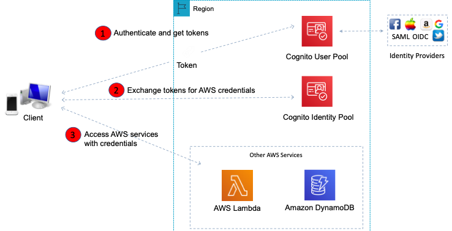

*A highly secured AWS environment has strict policies for granting access to Developers. A Developer requires the ability to use the API to call ec2:StartInstances and ec2:StopInstances. Which element of an IAM policy statement should be used to specify which APIs can be called?*
The Action element describes the specific action or actions that will be allowed or denied. Statements must include either an Action or NotAction element. Each AWS service has its own set of actions that describe tasks that you can perform with that service.
For this scenario, the Action element might include the following JSON”
"Action": [ "ec2:StartInstances", "ec2:StopInstances" ]
CORRECT: "Action" is the correct answer.
INCORRECT: "Effect" is incorrect. The Effect element is required and specifies whether the statement results in an allow or an explicit deny.
INCORRECT: "Resource" is incorrect. The Resource element specifies the object or objects that the statement covers.
INCORRECT: "Condition" is incorrect. The Condition element (or Condition block) lets you specify conditions for when a policy is in effect.

*An Amazon RDS database that stores product information for an online eCommerce marketplace is experiencing heavy demand. An increase in read requests is causing the database performance to be impacted and is affecting database writes.
What is the best way to offload the read traffic from the database with MINIMAL code changes and cost?*
Amazon RDS read replicas are used for offloading reads from the primary database instance. Read replicas provide a read-only copy of the database. In this scenario this represents the simplest way of achieving the required outcome. The application will need to be modified to point to the read replica for all read requests. This requires some code changes, but they are minimal.
CORRECT: "Create an RDS Read Replica and modify the application to send read requests to the replica" is the correct answer.
INCORRECT: "Change the RDS database instance type to an instance with more CPU/RAM" is incorrect as this is not a way of “offloading the read traffic from the database”. This is an example of scaling vertically, rather than scaling horizontally.
INCORRECT: "Create an RDS Multi AZ DB and modify the application to send read requests to the standby DB" is incorrect as we are trying to simply offload read traffic which is a use case for a read replica. However, it is possible for some database engines (MySQL and MariaDB) to combine multi-AZ and read replicas.
INCORRECT: "Create an ElastiCache Memcached cluster and modify the application to send read requests to the cluster" is incorrect as this would require more code changes and higher cost. For this use case an RDS read replica will be simpler and cheaper.

*A Development team has deployed several applications running on an Auto Scaling fleet of Amazon EC2 instances. The Operations team have asked for a display that shows a key performance metric for each application on a single screen for monitoring purposes.
What steps should a Developer take to deliver this capability using Amazon CloudWatch?*

A **namespace** is a container for CloudWatch metrics. Metrics in different namespaces are isolated from each other, so that metrics from different applications are not mistakenly aggregated into the same statistics.
Therefore, the Developer should create a custom namespace with a unique metric name for each application. This namespace will then allow the metrics for each individual application to be shown in a single view through CloudWatch.
CORRECT: "Create a custom namespace with a unique metric name for each application" is the correct answer.
INCORRECT: "Create a custom alarm with a unique metric name for each application" is incorrect as alarms are used to trigger actions when a threshold is reached, this is not relevant to organizing metrics for display.

*A company needs to provide additional security for their APIs deployed on Amazon API Gateway. They would like to be able to authenticate their customers with a token. What is the SAFEST way to do this?*
A Lambda authorizer (formerly known as a custom authorizer) is an API Gateway feature that uses a Lambda function to control access to your API.
A Lambda authorizer is useful if you want to implement a custom authorization scheme that uses a bearer token authentication strategy such as OAuth or SAML, or that uses request parameters to determine the caller's identity.
INCORRECT: "Setup usage plans and distribute API keys to the customers" is incorrect as this is not the most secure (safest) option. AWS recommend that you don't rely on API keys as your only means of authentication and authorization for your APIs.

*A development team is migrating data from various file shares to AWS from on-premises. The data will be migrated into a single Amazon S3 bucket. What is the SIMPLEST method to ensure the data is encrypted at rest in the S3 bucket?*
CORRECT: "Enable default encryption when creating the bucket" is the correct answer.
INCORRECT: "Use SSL to transmit the data over the Internet" is incorrect as this only deals with encrypting the data whilst it is being transmitted, it does not provide encryption at rest.
INCORRECT: "Ensure all requests use the x-amz-server-side​-encryption​-customer-key header" is incorrect as it is unnecessary to use customer-provided keys. This is used with client-side encryption which is more complex to manage and is not required in this scenario.
INCORRECT: "Ensure all requests use the x-amz-server-side-encryption header" is incorrect as though this has the required effect of ensuring all data is encrypted, it is not the simplest method. In this scenario there is a team migrating data from different file shares which increases the risk of human error where a team member may neglect to add the header to the API call. Using default encryption on the bucket is a simpler solution.

*A developer is creating an Auto Scaling group of Amazon EC2 instances. The developer needs to publish a custom metric to Amazon CloudWatch. Which method would be the MOST secure way to authenticate a CloudWatch PUT request?*
The most secure configuration to authenticate the request is to create an IAM role with a permissions policy that only provides the minimum permissions requires (least privilege). This IAM role should have a customer-managed permissions policy applied with the PutMetricData allowed.
The PutMetricData API publishes metric data points to Amazon CloudWatch. CloudWatch associates the data points with the specified metric. If the specified metric does not exist, CloudWatch creates the metric. When CloudWatch creates a metric, it can take up to fifteen minutes for the metric to appear in calls to ListMetrics.
CORRECT: "Create an IAM role with the PutMetricData permission and create a new Auto Scaling launch configuration to launch instances using that role" is the correct answer
INCORRECT: "Modify the CloudWatch metric policies to allow the PutMetricData permission to instances from the Auto Scaling group" is incorrect as this is not possible. You should instead grant the permissions through a permissions policy and attach that to a role that the EC2 instances can assume.
INCORRECT: "Create an IAM user with the PutMetricData permission and modify the Auto Scaling launch configuration to inject the user credentials into the instance user data" is incorrect. You cannot “inject user credentials” using a launch configuration. Instead, you can attach an IAM role which allows the instance to assume the role and take on the privileges allowed through any permissions policies that are associated with that role.
INCORRECT: "Create an IAM role with the PutMetricData permission and modify the Amazon EC2 instances to use that role" is incorrect as you should create a new launch configuration for the Auto Scaling group rather than updating the instances manually.

*A developer is building a web application that will be hosted on Amazon EC2 instances. The EC2 instances will store configuration data in an Amazon S3 bucket. What is the SAFEST way to allow the EC2 instances to access the S3 bucket?*
CORRECT: "Create an IAM Role with a customer-managed policy attached that has the necessary permissions and attach the role to the EC2 instances" is the correct answer.
INCORRECT: "Store an access key and secret ID that has the necessary permissions on the EC2 instances" is incorrect as storing access keys on the EC2 instances is insecure and cumbersome to manage.
INCORRECT: "Create an IAM Role with an AWS managed policy attached that has the necessary permissions and attach the role to the EC2 instances" is incorrect as the AWS managed policy would provide more privileges than required.

*A customer-facing web application runs on Amazon EC2 with an Application Load Balancer and an Amazon RDS database back end. Recently, the security team noticed some SQL injection attacks and cross-site scripting attacks targeting the web application.*
AWS WAF is a web application firewall that helps protect your web applications or APIs against common web exploits that may affect availability, compromise security, or consume excessive resources.
AWS WAF gives you control over how traffic reaches your applications by enabling you to create security rules that block common attack patterns, such as SQL injection or cross-site scripting, and rules that filter out specific traffic patterns you define.
CORRECT: "AWS WAF" is the correct answer.
INCORRECT: "AWS KMS" is incorrect as this service is used for creating and managing encryption keys.
INCORRECT: "Security Groups" is incorrect as they are an instance-level firewall. They do not have the ability to prevent SQL injection or cross-site scripting attacks.
INCORRECT: "Network ACLs" is incorrect as this is a subnet-level firewall. It doesn’t not have the ability to prevent SQL injection or cross-site scripting attacks.

*A Developer needs to create an instance profile for an Amazon EC2 instance using the AWS CLI. How can this be achieved? (Select THREE.)*

```
aws iam create-instance-profile --instance-profile-name EXAMPLEPROFILENAME
aws iam add-role-to-instance-profile --instance-profile-name EXAMPLEPROFILENAME --role-name EXAMPLEROLENAME
aws ec2 associate-iam-instance-profile --iam-instance-profile Name=EXAMPLEPROFILENAME 
--instance-id i-012345678910abcde
```
*An application is being deployed at a media company. The application will receive data from applications at many new outlets around the country. The application will ingest the data, process it with AWS Lambda and then store the data in an Amazon S3 bucket.*
Amazon Kinesis Data Firehose is the easiest way to reliably load streaming data into data lakes, data stores and analytics tools. It can capture, transform, and load streaming data into Amazon S3, Amazon Redshift, Amazon Elasticsearch Service, and Splunk, enabling near real-time analytics with existing business intelligence tools and dashboards you’re already using today.
You can configure Amazon Kinesis Data Firehose to prepare your streaming data before it is loaded to data stores. Simply select an AWS Lambda function from the Amazon Kinesis Data Firehose delivery stream configuration tab in the AWS Management console. Amazon Kinesis Data Firehose will automatically apply that function to every input data record and load the transformed data to destinations.
Therefore, the best solution for these requirements is to use Amazon Kinesis Firehose with AWS Lambda for the transformation/processing of data. Kinesis Firehose can then load the data to Amazon S3.

CORRECT: "Amazon Kinesis Firehose" is the correct answer.
INCORRECT: "Amazon CloudFront" is incorrect. CloudFront is a good solution for getting content closer to users for performance. However, in this use case we need a solution for ingesting streaming data and then loading it into a datastore with processing of the data happening as well. This is a good use case for Kinesis Firehose.
INCORRECT: "Amazon SQS" is incorrect as Amazon SQS is a message bus that is used for decoupling application components. Though you could have the applications place the data in an SQS queue and then have a consumer layer picking up those records and passing them to Lambda, there are conditions with SQS queues for message size that could complicate this solution. Also, Kinesis Firehose is ideal and designed specifically for this type of use case, so the better solution is to use Firehose instead.
INCORRECT: "Amazon SNS" is incorrect as the SNS service is involved with sending notifications not ingesting, processing and then loading data into a data store.

*A company is creating an application that will require users to access AWS services and allow them to reset their own passwords. Which of the following would allow the company to manage users and authorization while allowing users to reset their own passwords?*

There are two key requirements in this scenario. Firstly the company wants to manage user accounts using a system that allows users to reset their own passwords. The company also wants to authorize users to access AWS services.
The first requirement is provided by an Amazon Cognito User Pool. With a Cognito user pool you can add sign-up and sign-in to mobile and web apps and it also offers a user directory so user accounts can be created directly within the user pool. Users also have the ability to reset their passwords.
To access AWS services you need a Cognito Identity Pool. An identity pool can be used with a user pool and enables a user to obtain temporary limited-privilege credentials to access AWS services.



Therefore, the best answer is to use Amazon Cognito user pools and identity pools.
CORRECT: "Amazon Cognito user pools and identity pools" is the correct answer.
INCORRECT: "Amazon Cognito identity pools and AWS STS" is incorrect as there is no user directory in this solution. A Cognito user pool is required.
INCORRECT: "Amazon Cognito identity pools and AWS IAM" is incorrect as a Cognito user pool should be used as the directory source for creating and managing users. IAM is used for accounts that are used to administer AWS services, not for application user access.

*A Developer is creating a DynamoDB table for storing application logs. The table has 5 write capacity units (WCUs). The Developer needs to configure the read capacity units (RCUs) for the table. Which of the following configurations represents the most efficient use of throughput?*
In this scenario the Developer needs to maximize efficiency of RCUs. Therefore, the Developer will need to consider the item size and consistency model to determine the most efficient usage of RCUs.
Item size/consistency model: we know that both 1 KB items and 4 KB items consume the same number of RCUs as a read capacity unit represents one strongly consistent read per second, or two eventually consistent reads per second, for an item up to 4 KB in size.
The following bullets provide the read throughput for each configuration:
• Eventually consistent, 15 RCUs, 1 KB item = 30 items/s = 2 items per RCU
• Strongly consistent, 15 RCUs, 1 KB item = 15 items/s = 1 item per RCU
• Eventually consistent, 5 RCUs, 4 KB item = 10 items/s = 2 items per RCU
• Strongly consistent, 5 RCUs, 4 KB item = 5 items/s = 1 item per RCU

From the above we can see that 4 KB items with eventually consistent reads is the most efficient option. Therefore, the Developer should choose the option “Eventually consistent reads of 5 RCUs reading items that are 4 KB in size”. This will achieve 2x 4 KB items per RCU.

*A Developer needs to choose the best data store for a new application. The application requires a data store that supports key/value pairs and optimistic locking. Which of the following would provide the MOST suitable solution?*
Amazon DynamoDB is a key-value and document database that delivers single-digit millisecond performance at any scale. Optimistic locking is a strategy to ensure that the client-side item that you are updating (or deleting) is the same as the item in Amazon DynamoDB. If you use this strategy, your database writes are protected from being overwritten by the writes of others, and vice versa.
With optimistic locking, each item has an attribute that acts as a version number. If you retrieve an item from a table, the application records the version number of that item. You can update the item, but only if the version number on the server side has not changed. If there is a version mismatch, it means that someone else has modified the item before you did.
INCORRECT: "Amazon RDS" is incorrect as RDS is not a key/value database, nor does it support optimistic locking.
INCORRECT: "Amazon RedShift" is incorrect as RedShift is not a key/value database, nor does it support optimistic locking.
INCORRECT: "Amazon S3" is incorrect as though it does store objects as key/value pairs it does not support optimistic locking.

*An application has been instrumented to use the AWS X-Ray SDK to collect data about the requests the application serves. The Developer has set the user field on segments to a string that identifies the user who sent the request.
How can the Developer search for segments associated with specific users?*
A segment document conveys information about a segment to X-Ray. A segment document can be up to 64 kB and contain a whole segment with subsegments, a fragment of a segment that indicates that a request is in progress, or a single subsegment that is sent separately. You can send segment documents directly to X-Ray by using the PutTraceSegments API.
Example minimally complete segment:
```
{
"name" : "example.com",
"id" : "70de5b6f19ff9a0a",
"start_time" : 1.478293361271E9,
"trace_id" : "1-581cf771-a006649127e371903a2de979",
"end_time" : 1.478293361449E9
}
```
A subset of segment fields are indexed by X-Ray for use with filter expressions. For example, if you set the user field on a segment to a unique identifier, you can search for segments associated with specific users in the X-Ray console or by using the GetTraceSummaries API.
CORRECT: "By using the GetTraceSummaries API with a filter expression" is the correct answer.
INCORRECT: "By using the GetTraceGraph API with a filter expression" is incorrect as this API action retrieves a service graph for one or more specific trace IDs.
INCORRECT: "Use a filter expression to search for the user field in the segment metadata" is incorrect as the user field is not part of the segment metadata and metadata is not is not indexed for search.
INCORRECT: "Use a filter expression to search for the user field in the segment annotations" is incorrect as the user field is not part of the segment annotations.
*An application includes several producer services that send data to an Amazon SQS queue. The messages are then processed by a consumer component that must ensure that each producer’s messages are processed in the order they are received.
How can a Developer ensure the messages are processed in the correct order?*

The MessageDeduplicationId is available in an Amazon SQS FIFO queue. With a FIFO queue, the order in which messages are sent and received is strictly preserved and a message is delivered once and remains available until a consumer processes and deletes it.
Duplicates are not introduced into the queue. FIFO queues also support message groups that allow multiple ordered message groups within a single queue.
Deduplication with FIFO queues:
- Provide a MessageDeduplicationId with the message.
- The de-duplication interval is 5 minutes.
- Content based duplication – the MessageDeduplicationId is generated as the SHA-256 with the message body.

Sequencing with FIFO queues:
- To ensure strict ordering between messages, specify a MessageGroupId.
- Messages with a different Group ID may be received out of order.
- Messages with the same Group ID are delivered to one consumer at a time.

In this case, we need to ensure the messages from a specific producer are processed in order. Therefore, we need to configure each producer to send messages with a unique MessageGroupId.
CORRECT: "Configure each producer with a unique MessageGroupId" is the correct answer.
INCORRECT: "Configure each message with a unique MessageGroupId" is incorrect as the MessageGroupId should be applied to all messages that need to be ordered. You should not use a unique ID with each message.
INCORRECT: "Enable the MessageDeduplicationId on the SQS queue" is incorrect. The message deduplication ID is the token used for deduplication of sent messages. If a message with a particular message deduplication ID is sent successfully, any messages sent with the same message deduplication ID are accepted successfully but aren't delivered during the 5-minute deduplication interval.
INCORRECT: "Enable ContentBasedDeduplication on the SQS queue" is incorrect. When ContentBasedDeduplication is in effect, messages with identical content sent within the deduplication interval are treated as duplicates and only one copy of the message is delivered. This is not what we need to achieve here, we need to ensure the order of our messages not deduplicate them.

*Fault tolerance needs to be increased for a stateless application that runs on Amazon EC2 instances. The application runs in an Auto Scaling group of EC2 instances in a single subnet behind an Application Load Balancer.
How can the application be made more fault tolerant?*

The application currently resides in a single subnet and that is within a single availability zone. To increase fault tolerance the application instances should be split across subnets that are in different availability zones. This will protect against any faults that occur within a single AZ.
To do this, a subnet in another AZ can be added to both the ASG and the ALB. The ASG will automatically launch instances in the new subnet and try and balance the number of instances between these subnets. The ALB will distribute connections across both subnets/AZs.
CORRECT: "Add a subnet in another AZ to the ASG and add the same subnet to the ALB" is the correct answer.

Explanation
Amazon S3 provides read-after-write consistency for PUTS of new objects in your S3 bucket in all Regions with one caveat. The caveat is that if you make a HEAD or GET request to a key name before the object is created, then create the object shortly after that, a subsequent GET might not return the object due to eventual consistency.
Amazon S3 offers eventual consistency for overwrite PUTS and DELETES in all Regions. Therefore, the most likely explanation for this issue is that the old object version was retrieved due to Amazon’s eventual consistency model for overwrite PUTS.

Explanation
You can create one or more aliases for your AWS Lambda function. A Lambda alias is like a pointer to a specific Lambda function version. Users can access the function version using the alias ARN.
You can point an alias a multiple versions of your function code and then assign a weighting to direct certain amounts of traffic to each version. This enables a blue/green style of deployment and means it’s easy to roll back to the older version by simply updating the weighting if issues occur.