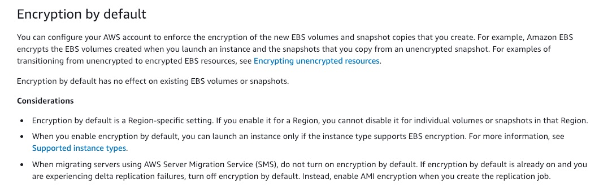

**Amazon S3 supports object locking for concurrent updates** - This is an incorrect statement. Amazon S3 does not currently support object locking for concurrent updates. Object locking is different from the S3 Object Lock feature. With S3 Object Lock, you can store objects using a write-once-read-many (WORM) model and prevent an object from being deleted or overwritten for a fixed amount of time or indefinitely.

S3 object locking:

**Amazon S3 does not support object locking for concurrent writers**. If two PUT requests are simultaneously made to the same key, the request with the latest timestamp wins. If this is an issue, you will need to build an object-locking mechanism into your application

Updates are key-based. There is no way to make atomic updates across keys. For example, you cannot make the update of one key dependent on the update of another key unless you design this functionality into your application.

**A process writes a new object to Amazon S3 and immediately lists keys within its bucket. Until the change is fully propagated, the object might not appear in the list **- This is a valid statement.

**A process deletes an existing object and immediately tries to read it. Until the deletion is fully propagated, Amazon S3 might return the deleted data** - This is a valid statement.

**A process deletes an existing object and immediately lists keys within its bucket. Until the deletion is fully propagated, Amazon S3 might list the deleted object** - This is a valid statement.

*A company uses microservices-based infrastructure to process the API calls from clients, perform request filtering and cache requests using the AWS API Gateway. Users report receiving 501 error code and you have been contacted to find out what is failing.*

**Use X-Ray service** - AWS X-Ray helps developers analyze and debug production, distributed applications, such as those built using a microservices architecture. With X-Ray, you can understand how your application and its underlying services are performing to identify and troubleshoot the root cause of performance issues and errors. X-Ray provides an end-to-end view of requests as they travel through your application, and shows a map of your application’s underlying components. You can use X-Ray to analyze both applications in development and in production, from simple three-tier applications to complex microservices applications consisting of thousands of services.

**Use CloudTrail service** - With CloudTrail, you can get a history of AWS API calls for your account - including API calls made via the AWS Management Console, AWS SDKs, command-line tools, and higher-level AWS services (such as AWS CloudFormation). **This is a very useful service for general monitoring and tracking. But, it will not give a detailed analysis of the outcome of microservices or drill into specific issues.** For the current use case, X-Ray offers a better solution.

*A company uses Amazon RDS as its database. For improved user experience, it has been decided that a highly reliable fully-managed caching layer has to be configured in front of RDS.*

**Implement Amazon ElastiCache Redis in Cluster-Mode**- One can leverage ElastiCache for Redis with cluster mode enabled to enhance reliability and availability with little change to your existing workload. Cluster mode comes with the primary benefit of horizontal scaling of your Redis cluster, with almost zero impact on the performance of the cluster.

When building production workloads, you should consider using a configuration with replication, unless you can easily recreate your data. Enabling Cluster-Mode provides a number of additional benefits in scaling your cluster. In short, it allows you to scale in or out the number of shards (horizontal scaling) versus scaling up or down the node type (vertical scaling). This means that Cluster-Mode can scale to very large amounts of storage (potentially 100s of terabytes) across up to 90 shards, whereas a single node can only store as much data in memory as the instance type has capacity for.

**Install Redis on an Amazon EC2 instance** - It is possible to install Redis directly onto Amazon EC2 instance. But, unlike ElastiCache for Redis, which is a managed service, you will need to maintain and manage your Redis installation.

**Implement Amazon ElastiCache Memcached** - Redis and Memcached are popular, open-source, in-memory data stores. Although they are both easy to use and offer high performance, there are important differences to consider when choosing an engine. Memcached is designed for simplicity while Redis offers a rich set of features that make it effective for a wide range of use cases. Redis offers snapshots facility, replication, and supports transactions, which Memcached cannot and hence ElastiCache Redis is the right choice for our use case.

**Migrate the database to Amazon Redshift** - Amazon Redshift belongs to "Big Data as a Service" cloud facility, while Redis can be primarily classified under "In-Memory Databases". "Data Warehousing" is the primary reason why developers consider Amazon Redshift over the competitors, whereas "Performance" is the key factor in picking Redis.

**Create a high-resolution custom metric and push the data using a script triggered every 10 seconds**

Using high-resolution custom metric, your applications can publish metrics to CloudWatch with 1-second resolution. You can watch the metrics scroll across your screen seconds after they are published and you can set up high-resolution CloudWatch Alarms that evaluate as frequently as every 10 seconds. You can alert with High-Resolution Alarms, as frequently as 10-second periods. High-Resolution Alarms allow you to react and take actions faster and support the same actions available today with standard 1-minute alarms.

**Enable EC2 detailed monitoring** - As part of basic monitoring, Amazon EC2 sends metric data to CloudWatch in 5-minute periods. To send metric data for your instance to CloudWatch in 1-minute periods, you can enable detailed monitoring on the instance, however, this comes at an additional cost.

**Simply get it from the CloudWatch Metrics** - You can get data from metrics. The basic monitoring data is available automatically in a 5-minute interval and detailed monitoring data is available in a 1-minute interval.

*The contract states that monthly database backups must be retained for the duration of the contract for compliance purposes*

**Create a cron event in CloudWatch, which triggers an AWS Lambda function that triggers the database snapshot** - There are multiple ways to run periodic jobs in AWS. CloudWatch Events with Lambda is the simplest of all solutions. To do this, create a CloudWatch Rule and select “Schedule” as the Event Source. You can either use a cron expression or provide a fixed rate (such as every 5 minutes). Next, select “Lambda Function” as the Target. Your Lambda will have the necessary code for snapshot functionality.

Incorrect options:

**Enable RDS automatic backups** - You can enable automatic backups but as of 2020, the retention period is 0 to 35 days.

**Enable RDS Read replicas** - Amazon RDS server's built-in replication functionality to create a special type of DB instance called a read replica from a source DB instance. Updates made to the source DB instance are asynchronously copied to the read replica. Read replicas are useful for heavy read-only data workloads. These are not suitable for the given use-case.

**Enable RDS Multi-AZ** - Multi-AZ allows you to create a highly available application with RDS. It does not directly help in database backups or retention periods.

*enable detailed monitoring of the Amazon EC2 instances your team uses. As a Developer working on AWS CLI,*

**aws ec2 monitor-instances --instance-ids i-1234567890abcdef0** - You can enable detailed monitoring on an instance as you launch it or after the instance is running or stopped. Otherwise, basic monitoring is enabled. Syntax to enable detailed monitoring for an existing instance

**aws ec2 run-instances --image-id ami-09092360 --monitoring Enabled=true** - This syntax is used to enable detailed monitoring when launching an instance from AWS CLI.

**Use Amazon Cognito for user-management and facilitating the log-in/sign-up process**

**Use Amazon Cognito to enable Multi-Factor Authentication (MFA) when users log-in**

Amazon Cognito lets you add user sign-up, sign-in, and access control to your web and mobile apps quickly and easily. Amazon Cognito scales to millions of users and supports sign-in with social identity providers, such as Facebook, Google, and Amazon, and enterprise identity providers via SAML 2.0.

A Cognito user pool is a user directory in Amazon Cognito. With a user pool, your users can sign in to your web or mobile app through Amazon Cognito, or federate through a third-party identity provider (IdP). Whether your users sign-in directly or through a third party, all members of the user pool have a directory profile that you can access through an SDK.

Cognito user pools provide support for sign-up and sign-in services as well as security features such as multi-factor authentication (MFA).

**Use Amazon SNS to send Multi-Factor Authentication (MFA) code via SMS to mobile app users**- Amazon SNS cannot be used to send MFA codes via SMS to the user's mobile devices as this functionality is only meant to be used for IAM users. An SMS (short message service) MFA device can be any mobile device with a phone number that can receive standard SMS text messages. AWS will soon end support for SMS multi-factor authentication (MFA).

*Can you help them understand what works for Amazon **EBS** encryption?*

**Encryption by default is a Region-specific setting. If you enable it for a Region, you cannot disable it for individual volumes or snapshots in that Region** - You can configure your AWS account to enforce the encryption of the new EBS volumes and snapshot copies that you create. Encryption by default is a Region-specific setting. If you enable it for a Region, you cannot disable it for individual volumes or snapshots in that Region.

**A volume restored from an encrypted snapshot, or a copy of an encrypted snapshot, is always encrypted **- By default, the CMK that you selected when creating a volume encrypts the snapshots that you make from the volume and the volumes that you restore from those encrypted snapshots. You cannot remove encryption from an encrypted volume or snapshot, which means that a volume restored from an encrypted snapshot, or a copy of an encrypted snapshot is always encrypted.

Incorrect options:

**You can encrypt an existing unencrypted volume or snapshot by using AWS Key Management Service (KMS) AWS SDKs** - This is an incorrect statement. There is no direct way to encrypt an existing unencrypted volume or snapshot. You can encrypt an unencrypted snapshot by copying and enabling encryption while copying the snapshot. To encrypt an EBS volume, you need to create a snapshot and then encrypt the snapshot as described earlier. From this new encrypted snapshot, you can then create an encrypted volume.

**A snapshot of an encrypted volume can be encrypted or unencrypted** - This is an incorrect statement. You cannot remove encryption from an encrypted volume or snapshot, which means that a volume restored from an encrypted snapshot, or a copy of an encrypted snapshot is always encrypted.

**Encryption by default is an AZ specific setting. If you enable it for an AZ, you cannot disable it for individual volumes or snapshots in that AZ** - This is an incorrect statement. Encryption by default is a Region-specific setting. If you enable it for a Region, you cannot disable it for individual volumes or snapshots in that Region.

*During a low utilization period, an entire Availability Zone went down and your application experienced downtime. What can you do to ensure that your application remains highly available?*

**Increase the minimum instance capacity of the Auto Scaling Group to 2 -**

You configure the size of your Auto Scaling group by setting the minimum, maximum, and desired capacity. The minimum and maximum capacity are required to create an Auto Scaling group, while the desired capacity is optional. If you do not define your desired capacity upfront, it defaults to your minimum capacity.

Since a minimum capacity of 1 was defined, an instance was launched in only one AZ. This AZ went down, taking the application with it. If the minimum capacity is set to 2. As per Auto Scale AZ configuration, it would have launched 2 instances- one in each AZ, making the architecture disaster-proof and hence highly available.

**Change the scaling metric of auto-scaling policy to network bytes** - With target tracking scaling policies, you select a scaling metric and set a target value. You can use predefined customized metrics. Setting the metric to network bytes will not help in this context since the instances have to be spread across different AZs for high availability. The optimized way of doing it, is by defining minimum and maximum instance capacities, as discussed above.

**Configure ASG fast failover** - This is a made-up option, given as a distractor.

**Enable RDS Multi-AZ** - This configuration will make your database highly available. But for the current scenario, you will need to have more than 1 instance in separate availability zones to keep the application highly available.

*You have a workflow process that pulls code from AWS CodeCommit and deploys to EC2 instances associated with tag group ProdBuilders. You would like to configure the instances to archive no more than two application revisions to conserve disk space.
Which of the following will allow you to implement this?*

**"CodeDeploy Agent"**

The CodeDeploy agent is a software package that, when installed and configured on an instance, makes it possible for that instance to be used in CodeDeploy deployments. The CodeDeploy agent archives revisions and log files on instances. The CodeDeploy agent cleans up these artifacts to conserve disk space. You can use the :max_revisions: option in the agent configuration file to specify the number of application revisions to the archive by entering any positive integer. CodeDeploy also archives the log files for those revisions. All others are deleted, except for the log file of the last successful deployment.

**AWS CloudWatch Log Agent** - The CloudWatch Logs agent provides an automated way to send log data to CloudWatch Logs from Amazon EC2 instances. This is an incorrect choice for the current use case.

**Integrate with AWS CodePipeline** - AWS CodePipeline is a fully managed continuous delivery service that helps you automate your release pipelines for fast and reliable application and infrastructure updates. CodeCommit and CodePipeline are already integrated services. CodePipeline cannot help in version control and management of archives on an EC2 instance.

**Have a load balancer in front of your instances** - Load Balancer helps balance incoming traffic across different EC2 instances. It is an incorrect choice for the current use case.

*What should you do to make the application tier stateless and outsource the session information?*

**Add an ElastiCache Cluster** - To provide a shared data storage for sessions that can be accessed from any individual web server, you can abstract the HTTP sessions from the web servers themselves. A common solution for this is to leverage an ElastiCache service offering which is an In-Memory Key/Value store such as Redis and Memcached.

Incorrect options:

**Use Elastic IP** - An Elastic IP is a way to give your server a static IP address but won't solve the issue with session data.

**Enable RDS read replicas** - Amazon RDS server's built-in replication functionality to create a special type of DB instance called a read replica from a source DB instance. A replica continually synchronizes with the master database and hence might add a bit of lag based on how occupied the master database is. It will also add inconsistencies in the current scenario.

**Enable Load Balancer stickiness** - Sticky sessions are a mechanism to route requests from the same client to the same target. Application Load Balancer supports sticky sessions using load balancer generated cookies. If you enable sticky sessions, the same target receives the request and can use the cookie to recover the session context. But, ElastiCache is much more scalable and better suited in the current scenario.

**Server-Side Encryption with Customer Master Keys (CMKs) Stored in AWS Key Management Service (SSE-KMS)**

You have the following options for protecting data at rest in Amazon S3:
Server-Side Encryption – Request Amazon S3 to encrypt your object before saving it on disks in its data centers and then decrypt it when you download the objects.
Client-Side Encryption – Encrypt data client-side and upload the encrypted data to Amazon S3. In this case, you manage the encryption process, the encryption keys, and related tools.
When you use server-side encryption with AWS KMS (SSE-KMS), you can use the default AWS managed CMK, or you can specify a customer-managed CMK that you have already created.
Creating your own customer-managed CMK gives you more flexibility and control over the CMK. For example, you can create, rotate, and disable customer-managed CMKs. You can also define access controls and audit the customer-managed CMKs that you use to protect your data.

**Server-Side Encryption with Secrets Manager** - AWS Secrets Manager helps you protect secrets needed to access your applications, services, and IT resources. The service enables you to easily rotate, manage, and retrieve database credentials, API keys, and other secrets throughout their lifecycle. You cannot combine Server-Side Encryption with Secrets Manager to create, rotate, or disable the encryption keys.

**Use Cognito User Pools** - As an alternative to using IAM roles and policies or Lambda authorizers, you can use an Amazon Cognito user pool to control who can access your API in Amazon API Gateway. To use an Amazon Cognito user pool with your API, you must first create an authorizer of the COGNITO_USER_POOLS type and then configure an API method to use that authorizer. After the API is deployed, the client must first sign the user into the user pool, obtain an identity or access token for the user, and then call the API method with one of the tokens, which are typically set to the request's Authorization header. The API call succeeds only if the required token is supplied and the supplied token is valid, otherwise, the client isn't authorized to make the call because the client did not have credentials that could be authorized.

Incorrect options:

**Use Lambda Authorizer**- A Lambda authorizer (formerly known as a custom authorizer) is an API Gateway feature that uses a Lambda function to control access to your API. A Lambda authorizer is useful if you want to implement a custom authorization scheme that uses a bearer token authentication strategy such as OAuth or SAML, or that uses request parameters to determine the caller's identity. This won't be a fully managed user management solution but it would allow you to check for access at the AWS API Gateway level.

**Use IAM permissions with sigv4** - Signature Version 4 is the process to add authentication information to AWS requests sent by HTTP. For security, most requests to AWS must be signed with an access key, which consists of an access key ID and secret access key. These two keys are commonly referred to as your security credentials. But, we cannot possibly create an IAM user for every visitor of the site, so this is where social identity providers come in to help.