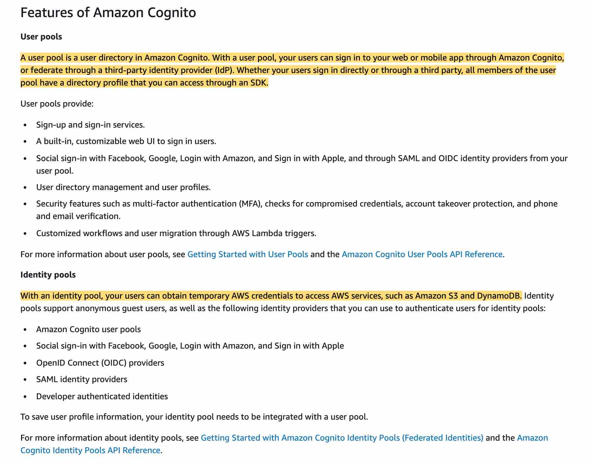

# Test review

## Course final test

A **security group** acts as a virtual firewall for your EC2 instances to control incoming and outgoing traffic. Inbound rules control the incoming traffic to your instance, and outbound rules control the outgoing traffic from your instance.

Check the security group rules of your EC2 instance. You need a security group rule that allows inbound traffic from your public IPv4 address on the proper port.

-----------

If you have created an organization in AWS Organizations, you can also create a trail that will log all events for all AWS accounts in that organization. This is referred to as an organization trail.

**By default, CloudTrail tracks only bucket-level actions. To track object-level actions, you need to enable Amazon S3 data events** - This is a correct statement. AWS CloudTrail supports Amazon S3 Data Events, apart from bucket Events. You can record all API actions on S3 Objects and receive detailed information such as the AWS account of the caller, IAM user role of the caller, time of the API call, IP address of the API, and other details. All events are delivered to an S3 bucket and CloudWatch Events, allowing you to take programmatic actions on the events.

**Member accounts will be able to see the organization trail, but cannot modify or delete it** - Organization trails must be created in the master account, and when specified as applying to an organization, are automatically applied to all member accounts in the organization. Member accounts will be able to see the organization trail, but cannot modify or delete it. By default, member accounts will not have access to the log files for the organization trail in the Amazon S3 bucket.

**Member accounts do not have access to the organization trail, neither do they have access to the Amazon S3 bucket that logs the files** - This statement is only partially correct. Member accounts will be able to see the organization trail, but cannot modify or delete it. By default, member accounts will not have access to the log files for the organization trail in the Amazon S3 bucket.

**By default, CloudTrail event log files are not encrypted**- This is an incorrect statement. By default, CloudTrail event log files are encrypted using Amazon S3 server-side encryption (SSE).

-----------

**The health check type of your instance's Auto Scaling group, must be changed from EC2 to ELB by using a configuration file** - By default, the health check configuration of your Auto Scaling group is set as an EC2 type that performs a status check of EC2 instances. To automate the replacement of unhealthy EC2 instances, you must change the health check type of your instance's Auto Scaling group from EC2 to ELB by using a configuration file.

**Auto Scaling group doesn't automatically replace the unhealthy instances marked by the load balancer. They have to be manually replaced from AWS Console** - Incorrect statement. As discussed above, if the health check type of ASG is changed from EC2 to ELB, Auto Scaling will be able to replace the unhealthy instance.

**The ping path field of the Load Balancer is configured incorrectly** - Ping path is a health check configuration field of Elastic Load Balancer. If the ping path is configured wrong, ELB will not be able to reach the instance and hence will consider the instance unhealthy. However, this would then apply to all instances, not just once instance. So it does not address the issue given in the use-case.

-----------

**If two writes are made to a single non-versioned object at the same time, it is possible that only a single event notification will be sent** - Amazon S3 event notifications are designed to be delivered at least once. Typically, event notifications are delivered in seconds but can sometimes take a minute or longer.

If two writes are made to a single non-versioned object at the same time, it is possible that only a single event notification will be sent. If you want to ensure that an event notification is sent for every successful write, you can enable versioning on your bucket. With versioning, every successful write will create a new version of your object and will also send event notification.

-----------

The development team at a retail organization wants to allow a Lambda function in its AWS Account A to access a DynamoDB table in another AWS Account B.

**Create an IAM role in account B with access to DynamoDB. Modify the trust policy of the role in Account B to allow the execution role of Lambda to assume this role. Update the Lambda function code to add the AssumeRole API call**

You can give a Lambda function created in one account ("account A") permissions to assume a role from another account ("account B") to access resources such as DynamoDB or S3 bucket. You need to create an execution role in Account A that gives the Lambda function permission to do its work. Then you need to create a role in account B that the Lambda function in account A assumes to gain access to the cross-account DynamoDB table. Make sure that you modify the trust policy of the role in Account B to allow the execution role of Lambda to assume this role. Finally, update the Lambda function code to add the AssumeRole API call.

**Add a resource policy to the DynamoDB table in AWS Account B to give access to the Lambda function in Account A** - You cannot attach a resource policy to a DynamoDB table, so this option is incorrect.

------------

Correct option:

**ApproximateNumberOfMessagesVisible** - This is a CloudWatch Amazon SQS queue metric. The number of messages in a queue might not change proportionally to the size of the Auto Scaling group that processes messages from the queue. Hence, this metric does not work for target tracking.

Incorrect options:

With target tracking scaling policies, you select a scaling metric and set a target value. Amazon EC2 Auto Scaling creates and manages the CloudWatch alarms that trigger the scaling policy and calculates the scaling adjustment based on the metric and the target value.

It is important to note that a target tracking scaling policy assumes that it should scale out your Auto Scaling group when the specified metric is above the target value. You cannot use a target tracking scaling policy to scale out your Auto Scaling group when the specified metric is below the target value.

**ASGAverageCPUUtilization** - This is a predefined metric for target tracking scaling policy. This represents the Average CPU utilization of the Auto Scaling group.

**ASGAverageNetworkOut** - This is a predefined metric for target tracking scaling policy. This represents the Average number of bytes sent out on all network interfaces by the Auto Scaling group.

**ALBRequestCountPerTarget** - This is a predefined metric for target tracking scaling policy. This represents the Number of requests completed per target in an Application Load Balancer target group.

-------------------------

**The cluster name Parameter has not been updated in the file /etc/ecs/ecs.config during bootstrap** - In the ecs.config file you have to configure the parameter ECS_CLUSTER='your_cluster_name' to register the container instance with a cluster named 'your_cluster_name'.

-------------

**ALB + ECS**  Amazon Elastic Container Service (ECS) is a highly scalable, high-performance container management service that supports Docker containers and allows you to easily run applications on a managed cluster of Amazon EC2 instances.

Elastic Load Balancing automatically distributes incoming application traffic across multiple targets, such as Amazon EC2 instances, containers, IP addresses, and Lambda functions. It can handle the varying load of your application traffic in a single Availability Zone or across multiple Availability Zones.

When you use ECS with a load balancer such as ALB deployed across multiple Availability Zones, it helps provide a scalable and highly available REST API.

-------------

**CodeDeploy Deployment Groups**

You can specify one or more deployment groups for a CodeDeploy application. The deployment group contains settings and configurations used during the deployment. Most deployment group settings depend on the compute platform used by your application. Some settings, such as rollbacks, triggers, and alarms can be configured for deployment groups for any compute platform.

In an EC2/On-Premises deployment, a deployment group is a set of individual instances targeted for deployment. A deployment group contains individually tagged instances, Amazon EC2 instances in Amazon EC2 Auto Scaling groups, or both.

**CodeDeploy Agent** - The CodeDeploy agent is a software package that, when installed and configured on an instance, makes it possible for that instance to be used in CodeDeploy deployments. The agent connects the EC2 instances to the CodeDeploy service.

**CodeDeploy Hooks** - Hooks are found in the AppSec file used by AWS CodeDeploy to manage deployment. Hooks correspond to lifecycle events such as ApplicationStart, ApplicationStop, etc. to which you can assign a script.

**Define multiple CodeDeploy Applications **- This option has been added as a distractor. Instead, you want to use deployment groups to use the same deployment and maybe separate the times when a group of instances receives the software updates.

---------------------

**Query the metadata at http://169.254.169.254/latest/meta-data** - Because your instance metadata is available from your running instance, you do not need to use the Amazon EC2 console or the AWS CLI. This can be helpful when you're writing scripts to run from your instance. For example, you can access the local IP address of your instance from instance metadata to manage a connection to an external application. To view all categories of instance metadata from within a running instance, use the following URI - http://169.254.169.254/latest/meta-data/. The IP address 169.254.169.254 is a link-local address and is valid only from the instance. All instance metadata is returned as text (HTTP content type text/plain

----------------------

**Amazon Elastic Container Service** (Amazon ECS) is a highly scalable, fast, container management service that makes it easy to run, stop, and manage Docker containers on a cluster. You can host your cluster on a **serverless infrastructure** that is managed by Amazon ECS by launching your services or tasks using the Fargate launch type. **For more control over your infrastructure**, you can host your tasks on a cluster of Amazon Elastic Compute Cloud (Amazon EC2) instances that you manage by using the EC2 launch type.

As the development team is looking for a serverless data store service, therefore the two containers should be launched into a single task definition using a Fargate Launch Type. Using a single task definition allows the two containers to share memory.

------------------

An Application load balancer distributes incoming application traffic across multiple targets, such as EC2 instances, in multiple Availability Zones. A listener checks for connection requests from clients, using the protocol and port that you configure. The rules that you define for a listener determine how the load balancer routes requests to its registered targets. Each rule consists of a priority, one or more actions, and one or more conditions.

To use an HTTPS listener, you must deploy at least one SSL/TLS server certificate on your load balancer. You can create an HTTPS listener, which uses encrypted connections (also known as SSL offload). This feature enables traffic encryption between your load balancer and the clients that initiate SSL or TLS sessions. As the EC2 instances are under heavy CPU load, the load balancer will use the server certificate to terminate the front-end connection and then decrypt requests from clients before sending them to the EC2 instances.

-------------

Amazon Elastic Container Service (Amazon ECS) is a highly scalable, fast, container management service that makes it easy to run, stop, and manage Docker containers on a cluster. You can host your cluster on a serverless infrastructure that is managed by Amazon ECS by launching your services or tasks using the Fargate launch type. For more control over your infrastructure, you can host your tasks on a cluster of Amazon Elastic Compute Cloud (Amazon EC2) instances that you manage by using the EC2 launch type.

An Application load balancer distributes incoming application traffic across multiple targets, such as EC2 instances, in multiple Availability Zones. A listener checks for connection requests from clients, using the protocol and port that you configure. The rules that you define for a listener determine how the load balancer routes requests to its registered targets. Each rule consists of a priority, one or more actions, and one or more conditions.

When you deploy your services using Amazon Elastic Container Service (Amazon ECS), you can use dynamic port mapping to support multiple tasks from a single service on the same container instance. Amazon ECS manages updates to your services by automatically registering and deregistering containers with your target group using the instance ID and port for each container.

---------------------
Code deploy: one is the flexibility that allows for incremental deployment of your new application versions and replaces existing versions in the EC2 instances. The other option is a strategy in which an Auto Scaling group is used to perform a deployment.

**In-place Deployment**

The application on each instance in the deployment group is stopped, the latest application revision is installed, and the new version of the application is started and validated. You can use a load balancer so that each instance is deregistered during its deployment and then restored to service after the deployment is complete.

**Blue/green Deployment**

With a blue/green deployment, you provision a new set of instances on which CodeDeploy installs the latest version of your application. CodeDeploy then re-routes load balancer traffic from an existing set of instances running the previous version of your application to the new set of instances running the latest version. After traffic is re-routed to the new instances, the existing instances can be terminated.

-----------------

**Enable SQS KMS encryption**

Server-side encryption (SSE) lets you transmit sensitive data in encrypted queues. SSE protects the contents of messages in queues using keys managed in AWS Key Management Service (AWS KMS).

AWS KMS combines secure, highly available hardware and software to provide a key management system scaled for the cloud. When you use Amazon SQS with AWS KMS, the data keys that encrypt your message data are also encrypted and stored with the data they protect.

You can choose to have SQS encrypt messages stored in both Standard and FIFO queues using an encryption key provided by AWS Key Management Service (KMS).

**Use the SSL endpoint** - The given use-case needs encryption at rest. When using SSL, the data is encrypted during transit, but the data needs to be encrypted at rest as well, so this option is incorrect.

**Use Client-side encryption** - For additional security, you can build your application to encrypt messages before they are placed in a message queue but will require a code change, so this option is incorrect.

*Use Secrets Manager* - AWS Secrets Manager enables you to easily rotate, manage, and retrieve database credentials, API keys, and other secrets throughout their lifecycle. Users and applications retrieve secrets with a call to Secrets Manager APIs, eliminating the need to hardcode sensitive information in plain text. Secrets Manager offers secret rotation with built-in integration for Amazon RDS, Amazon Redshift, and Amazon DocumentDB. Secrets Manager cannot be used for encrypting data at rest.

---------------------

Clone Beanstalk

**Create a saved configuration in Team A's account and download it to your local machine. Make the account-specific parameter changes and upload to the S3 bucket in Team B's account. From Elastic Beanstalk console, create an application from 'Saved Configurations** - You must use saved configurations to migrate an Elastic Beanstalk environment between AWS accounts. You can save your environment's configuration as an object in Amazon Simple Storage Service (Amazon S3) that can be applied to other environments during environment creation, or applied to a running environment. Saved configurations are YAML formatted templates that define an environment's platform version, tier, configuration option settings, and tags.

Download the saved configuration to your local machine. Change your account-specific parameters in the downloaded configuration file, and then save the changes. For example, change the key pair name, subnet ID, or application name (such as application-b-name). Upload the saved configuration from your local machine to an S3 bucket in Team B's account. From this account, create a new Beanstalk application by choosing 'Saved Configurations' from the navigation panel.

--------------------

For web distributions, you can configure CloudFront to require that viewers use HTTPS to request your objects, so connections are encrypted when CloudFront communicates with viewers.

You also can configure CloudFront to use HTTPS to get objects from your origin, so connections are encrypted when CloudFront communicates with your origin.

----------------

**AWS Kinesis Data Streams**

Amazon Kinesis Data Streams (KDS) is a massively scalable and durable real-time data streaming service. KDS can continuously capture gigabytes of data per second from hundreds of thousands of sources such as website clickstreams, database event streams, financial transactions, social media feeds, IT logs, and location-tracking events. The data collected is available in milliseconds to enable real-time analytics use cases such as real-time dashboards, real-time anomaly detection, dynamic pricing, and more.

Amazon Kinesis Data Streams enables real-time processing of streaming big data. It provides ordering of records, as well as the ability to read and/or replay records in the same order to multiple Amazon Kinesis Applications. The Amazon Kinesis Client Library (KCL) delivers all records for a given partition key to the same record processor, making it easier to build multiple applications reading from the same Amazon Kinesis data stream (for example, to perform counting, aggregation, and filtering). Amazon Kinesis Data Streams is recommended when you need the ability for multiple applications to consume the same stream concurrently. For example, you have one application that updates a real-time dashboard and another application that archives data to Amazon Redshift. You want both applications to consume data from the same stream concurrently and independently.

**AWS Kinesis Data Firehose**- Amazon Kinesis Data Firehose is the easiest way to load streaming data into data stores and analytics tools. It can capture, transform, and load streaming data into Amazon S3, Amazon Redshift, Amazon Elasticsearch Service, and Splunk, enabling near real-time analytics with existing business intelligence tools and dashboards you’re already using today. It is a fully managed service that automatically scales to match the throughput of your data and requires no ongoing administration. It can also batch, compress, and encrypt the data before loading it, minimizing the amount of storage used at the destination and increasing security. As Kinesis Data Firehose is used to load streaming data into data stores, therefore this option is incorrect.

**AWS Kinesis Data Analytics** - Amazon Kinesis Data Analytics is the easiest way to analyze streaming data in real-time. You can quickly build SQL queries and sophisticated Java applications using built-in templates and operators for common processing functions to organize, transform, aggregate, and analyze data at any scale. Kinesis Data Analytics enables you to easily and quickly build queries and sophisticated streaming applications in three simple steps: setup your streaming data sources, write your queries or streaming applications and set up your destination for processed data. As Kinesis Data Analytics is ***used to build SQL queries and sophisticated Java applications,*** therefore this option is incorrect.
**
Amazon SQS - Amazon Simple Queue Service (SQS**) is a fully managed message queuing service that enables you to decouple and scale microservices, distributed systems, and serverless applications. SQS offers two types of message queues. Standard queues offer maximum throughput, best-effort ordering, and at-least-once delivery. SQS FIFO queues are designed to guarantee that messages are processed exactly once, in the exact order that they are sent. For SQS, you cannot have the same message being consumed by multiple consumers at the same time, therefore this option is incorrect.

Exam alert:

- Please remember that Kinesis Data Firehose is used to load streaming data into data stores (Amazon S3, Amazon Redshift, Amazon Elasticsearch Service, and Splunk)
- Kinesis Data Streams provides support for real-time processing of streaming data. It provides ordering of records, as well as the ability to read and/or replay records in the same order to multiple downstream Amazon Kinesis Applications.

------------------

**User Data** is generally used to perform common automated configuration tasks and even run scripts after the instance starts. When you launch an instance in Amazon EC2, you can pass two types of user data - shell scripts and cloud-init directives. You can also pass this data into the launch wizard as plain text or as a file.

**By default, scripts entered as user data are executed with root user privileges** - Scripts entered as user data are executed as the root user, hence do not need the sudo command in the script. Any files you create will be owned by root; if you need non-root users to have file access, you should modify the permissions accordingly in the script.

**By default, user data runs only during the boot cycle when you first launch an instance** - By default, user data scripts and cloud-init directives run only during the boot cycle when you first launch an instance. You can update your configuration to ensure that your user data scripts and cloud-init directives run every time you restart your instance.

------------------------------

 A key requirement is to facilitate consistent updates to the product prices and product description, so that the cache never goes out of sync with the backend.

 Amazon ElastiCache allows you to seamlessly set up, run, and scale popular open-Source compatible in-memory data stores in the cloud. Build data-intensive apps or boost the performance of your existing databases by retrieving data from high throughput and low latency in-memory data stores. Amazon ElastiCache is a popular choice for real-time use cases like Caching, Session Stores, Gaming, Geospatial Services, Real-Time Analytics, and Queuing.

Broadly, you can set up two types of caching strategies:

Lazy Loading
Write-Through

**Use a caching strategy to write to the backend first and then invalidate the cache**

This option is similar to the write-through strategy wherein the application writes to the backend first and then invalidate the cache. As the cache gets invalidated, the caching engine would then fetch the latest value from the backend, thereby making sure that the product prices and product description stay consistent with the backend.

---------------------

SQS: The minimum message size is 1 byte (1 character). The maximum is 262,144 bytes (256 KB)

Amazon EBS works with AWS KMS to encrypt and decrypt your EBS volume. You can encrypt both the boot and data volumes of an EC2 instance. When you create an encrypted EBS volume and attach it to a supported instance type, the following types of data are encrypted:
Data at rest inside the volume
All data moving between the volume and the instance
All snapshots created from the volume
All volumes created from those snapshots
EBS volumes support both in-flight encryption and encryption at rest using KMS - This is a correct statement. Encryption operations occur on the servers that host EC2 instances, ensuring the security of both data-at-rest and data-in-transit between an instance and its attached EBS storage.

-------------------

**You terminated the container instance while it was in STOPPED state, that lead to this synchronization issues **- If you terminate a container instance while it is in the STOPPED state, that container instance isn't automatically removed from the cluster. You will need to deregister your container instance in the STOPPED state by using the Amazon ECS console or AWS Command Line Interface. Once deregistered, the container instance will no longer appear as a resource in your Amazon ECS cluster.

You terminated the container instance while it was in RUNNING state, that lead to this synchronization issues - This is an incorrect statement. If you terminate a container instance in the RUNNING state, that container instance is automatically removed, or deregistered, from the cluster.

---------------------

**Configure Lambda to connect to VPC with private subnet and Security Group needed to access RDS**- You can configure a Lambda function to connect to private subnets in a virtual private cloud (VPC) in your account. Use Amazon Virtual Private Cloud (Amazon VPC) to create a private network for resources such as databases, cache instances, or internal services. Connect your lambda function to the VPC to access private resources during execution. When you connect a function to a VPC, Lambda creates an elastic network interface for each combination of the security group and subnet in your function's VPC configuration. This is the right way of giving RDS access to Lambda.

---------------

Specify a KMS key to use

AWS Key Management Service (KMS) makes it easy for you to create and manage cryptographic keys and control their use across a wide range of AWS services and in your applications.

For AWS CodeBuild to encrypt its build output artifacts, it needs access to an AWS KMS customer master key (CMK). By default, AWS CodeBuild uses the AWS-managed CMK for Amazon S3 in your AWS account. The following environment variable provides these details:

CODEBUILD_KMS_KEY_ID: The identifier of the AWS KMS key that CodeBuild is using to encrypt the build output artifact (for example, arn:aws:kms:region-ID:account-ID:key/key-ID or alias/key-alias).

------------------

> Target: Simple

Store the secret as SecureString in SSM Parameter Store

**With AWS Systems Manager Parameter Store, you can create SecureString parameters,** which are parameters that have a plaintext parameter name and an encrypted parameter value. Parameter Store uses AWS KMS to encrypt and decrypt the parameter values of Secure String parameters. Also, if you are using customer-managed CMKs, you can use IAM policies and key policies to manage to encrypt and decrypt permissions. To retrieve the decrypted value you only need to do one API call.

**Encrypt first with KMS then store in SSM Parameter store** - This could work but will require two API calls to get the decrypted value instead of one. So this is not the right option.

-----------------

**Sticky sessions are enabled for the load balancer** - This can be the reason for potential unequal traffic routing by the load balancer. Sticky sessions are a mechanism to route requests to the same target in a target group. This is useful for servers that maintain state information in order to provide a continuous experience to clients. To use sticky sessions, the clients must support cookies.

When a load balancer first receives a request from a client, it routes the request to a target, generates a cookie named AWSALB that encodes information about the selected target, encrypts the cookie, and includes the cookie in the response to the client. The client should include the cookie that it receives in subsequent requests to the load balancer. When the load balancer receives a request from a client that contains the cookie, if sticky sessions are enabled for the target group and the request goes to the same target group, the load balancer detects the cookie and routes the request to the same target.

If you use duration-based session stickiness, configure an appropriate cookie expiration time for your specific use case. If you set session stickiness from individual applications, use session cookies instead of persistent cookies where possible.

**Instances of a specific capacity type aren’t equally distributed across Availability Zones**- A Classic Load Balancer with HTTP or HTTPS listeners might route more traffic to higher-capacity instance types. This distribution aims to prevent lower-capacity instance types from having too many outstanding requests. It’s a best practice to use similar instance types and configurations to reduce the likelihood of capacity gaps and traffic imbalances.

A traffic imbalance might also occur if you have instances of similar capacities running on different Amazon Machine Images (AMIs). In this scenario, the imbalance of the traffic in favor of higher-capacity instance types is desirable.

**There could be short-lived TCP connections between clients and instances** - This is an incorrect statement. Long-lived TCP connections between clients and instances can potentially lead to unequal distribution of traffic by the load balancer. Long-lived TCP connections between clients and instances cause uneven traffic load distribution by design. As a result, new instances take longer to reach connection equilibrium. Be sure to check your metrics for long-lived TCP connections that might be causing routing issues in the load balancer.

**For Application Load Balancers, cross-zone load balancing is disabled by default**- This is an incorrect statement. With Application Load Balancers, cross-zone load balancing is always enabled.

After you disable an Availability Zone, the targets in that Availability Zone remain registered with the load balancer, thereby receiving random bursts of traffic - This is an incorrect statement. After you disable an Availability Zone, the targets in that Availability Zone remain registered with the load balancer. However, even though they remain registered, the load balancer does not route traffic to them.

---------------

**Use a FilterExpression** - If you need to further refine the Query results, you can optionally provide a filter expression. A filter expression determines which items within the Query results should be returned to you. All of the other results are discarded. A filter expression is applied after Query finishes, but before the results are returned. Therefore, a Query consumes the same amount of read capacity, regardless of whether a filter expression is present. A Query operation can retrieve a maximum of 1 MB of data. This limit applies before the filter expression is evaluated.

**Use the --query parameter**- The Query operation in Amazon DynamoDB finds items based on primary key values. You must provide the name of the partition key attribute and a single value for that attribute. The Query returns all items with that partition key value. Optionally, you can provide a sort key attribute and use a comparison operator to refine the search results.

**Use a Scan** - A Scan operation in Amazon DynamoDB reads every item in a table or a secondary index. By default, a Scan operation returns all of the data attributes for every item in the table or index. You can also use the ProjectionExpression parameter so that Scan only returns some of the attributes, rather than all of them.

-------------

**Set up reserved concurrency** for the Lambda function B so that it throttles if it goes above a certain concurrency limit

Concurrency is the number of requests that a Lambda function is serving at any given time. If a Lambda function is invoked again while a request is still being processed, another instance is allocated, which increases the function's concurrency.

To ensure that a function can always reach a certain level of concurrency, you can configure the function with reserved concurrency. When a function has reserved concurrency, no other function can use that concurrency. More importantly, reserved concurrency also limits the maximum concurrency for the function, and applies to the function as a whole, including versions and aliases.

**Set up provisioned concurrency** for the Lambda function B so that it throttles if it goes above a certain concurrency limit - You should use provisioned concurrency to enable your function to scale without fluctuations in latency. By allocating provisioned concurrency before an increase in invocations, you can ensure that all requests are served by initialized instances with very low latency. Provisioned concurrency is not used to limit the maximum concurrency for a given Lambda function, so this option is incorrect.

--------------

Amazon Simple Queue Service (SQS) is a fully managed message queuing service that enables you to decouple and scale microservices, distributed systems, and serverless applications. SQS offers two types of message queues. Standard queues offer maximum throughput, best-effort ordering, and at-least-once delivery. SQS FIFO queues are designed to guarantee that messages are processed exactly once, in the exact order that they are sent.

SNS and SQS can be used to create a fanout messaging scenario in which messages are "pushed" to multiple subscribers, which eliminates the need to periodically check or poll for updates and enables parallel asynchronous processing of the message by the subscribers. SQS can allow for later re-processing and dead letter queues. This is called the fan-out pattern.

--------------

**Resources** - Resources section describes the resources that you want to provision in your AWS CloudFormation stacks. You can associate conditions with the resources that you want to conditionally create.

**Conditions** - You actually define conditions in this section of the CloudFormation template

**Outputs** - The optional Outputs section declares output values that you can import into other stacks (to create cross-stack references), return in response (to describe stack calls), or view on the AWS CloudFormation console. For example, you can output the S3 bucket name for a stack to make the bucket easier to find. You can associate conditions with the outputs that you want to conditionally create.

--------------

The **X-Forwarded-For** request header helps you identify the IP address of a client when you use an HTTP or HTTPS load balancer. Because load balancers intercept traffic between clients and servers, your server access logs contain only the IP address of the load balancer. To see the IP address of the client, use the X-Forwarded-For request header. Elastic Load Balancing stores the IP address of the client in the X-Forwarded-For request header and passes the header to your server.

-------------

**Consider using Global tables** if your application is accessed by globally distributed users - If you have globally dispersed users, consider using global tables. With global tables, you can specify the AWS Regions where you want the table to be available. This can significantly reduce latency for your users. So, reducing the distance between the client and the DynamoDB endpoint is an important performance fix to be considered.

-------------

If you upload a local template file, AWS CloudFormation uploads it to an Amazon Simple Storage Service (Amazon S3) bucket in your AWS account. If you don't already have an S3 bucket that was created by AWS CloudFormation, it creates a unique bucket for each region in which you upload a template file. If you already have an S3 bucket that was created by AWS CloudFormation in your AWS account, AWS CloudFormation adds the template to that bucket.

-------------

**A Network Load Balancer** functions at the fourth layer of the Open Systems Interconnection (OSI) model. It can handle millions of requests per second. After the load balancer receives a connection request, it selects a target from the target group for the default rule. It attempts to open a TCP connection to the selected target on the port specified in the listener configuration. Incoming connections remain unmodified, so application software need not support X-Forwarded-For.

**Application Load Balancer** - An Application Load Balancer functions at the application layer, the seventh layer of the Open Systems Interconnection (OSI) model. After the load balancer receives a request, it evaluates the listener rules in priority order to determine which rule to apply and then selects a target from the target group for the rule action.

One of many benefits of the Application Load Balancer is its support for path-based routing. You can configure rules for your listener that forward requests based on the URL in the request. This enables you to structure your application as smaller services, and route requests to the correct service based on the content of the URL. For needs relating to network traffic go with Network Load Balancer.

Application Load Balancer can be used to securely authenticate users for accessing your applications. This enables you to offload the work of authenticating users to your load balancer so that your applications can focus on their business logic. You can use Cognito User Pools to authenticate users through well-known social IdPs, such as Amazon, Facebook, or Google, through the user pools supported by Amazon Cognito or through corporate identities, using SAML, LDAP, or Microsoft AD, through the user pools supported by Amazon Cognito.

----------

- User pool
  - authenticate user

- User Identity
  - obtain temporary AWS credentials to access AWS service (s3, dynamodb, ...)

----------

**Server-Side Encryption with Amazon S3-Managed Keys (SSE-S3)**

When you use Server-Side Encryption with Amazon S3-Managed Keys (SSE-S3), each object is encrypted with a unique key. As an additional safeguard, it encrypts the key itself with a master key that it **regularly rotates.** 

**Server-Side Encryption with Customer Master Keys (CMKs) Stored in AWS Key Management Service (SSE-KMS)**

Server-Side Encryption with Customer Master Keys (CMKs) Stored in AWS Key Management Service (SSE-KMS) is similar to SSE-S3, but with some *additional benefits* and charges for using this service. There are separate permissions for the use of a CMK that provides added protection against unauthorized access of your objects in Amazon S3. **SSE-KMS also provides you with an audit trail that shows when your CMK was used and by whom.**

**Server-Side Encryption with Customer-Provided Keys (SSE-C)**

With Server-Side Encryption with Customer-Provided Keys (SSE-C), you manage the encryption keys and Amazon S3 manages the encryption, as it writes to disks, and decryption, when you access your objects.

--------------

For example, you have a message with a visibility timeout of 5 minutes. After 3 minutes, you call **ChangeMessageVisibility** with a timeout of 10 minutes. You can continue to call ChangeMessageVisibility to extend the visibility timeout to the maximum allowed time. If you try to extend the visibility timeout beyond the maximum, your request is rejected. So, for the given use-case, the application can set the initial visibility timeout to 1 minute and then continue to update the ChangeMessageVisibility value if required.

**The default visibility timeout for a message is 30 seconds. The minimum is 0 seconds. The maximum is 12 hours.**

--------------

**Amazon EC2 Auto Scaling cannot add a volume to an existing instance if the existing volume is approaching capacity** - A volume is attached to a new instance when it is added. Amazon EC2 Auto Scaling doesn't automatically add a volume when the existing one is approaching capacity. You can use the EC2 API to add a volume to an existing instance.

**Amazon EC2 Auto Scaling works with both Application Load Balancers and Network Load Balancers**- Amazon EC2 Auto Scaling works with Application Load Balancers and Network Load Balancers including their health check feature.

**EC2 Auto Scaling groups are regional constructs. They span across Availability Zones and AWS regions** - This is an incorrect statement. EC2 Auto Scaling groups are regional constructs. They can span Availability Zones, but not AWS regions.

**Every time you create an Auto Scaling group from an existing instance, it creates a new AMI (Amazon Machine Image)**- This is an incorrect statement. When you create an Auto Scaling group from an existing instance, it does not create a new AMI.

-----------

**Define a dev environment with a single instance and a 'load test' environment that has settings close to production environment**

AWS Elastic Beanstalk makes it easy to create new environments for your application. You can create and manage separate environments for development, testing, and production use, and you can deploy any version of your application to any environment. Environments can be long-running or temporary. When you terminate an environment, you can save its configuration to recreate it later.

It is common practice to have many environments for the same application. You can deploy multiple environments when you need to run multiple versions of an application. So for the given use-case, you can set up 'dev' and 'load test' environment.

**Use only one Beanstalk environment and perform configuration changes using an Ansible script**- Ansible is an open-source deployment tool that integrates with AWS. It allows us to deploy the infrastructure. Elastic Beanstalk provisions the servers that you need for hosting the application and it also handles multiple environments, so Beanstalk is a better option.

**Create an Application Load Balancer to route based on hostname so you can pass on parameters to the development Elastic Beanstalk environment. Create a file in .ebextensions/ to know how to handle the traffic coming from the ALB** - This is not a good design if you need to load test because you will have two versions on the same instances and may not be able to access resources in the system due to the load testing.

----------

**Stage Variables**

Stage variables are name-value pairs that you can define as configuration attributes associated with a deployment stage of an API. They act like environment variables and can be used in your API setup and mapping templates. With deployment stages in API Gateway, you can manage multiple release stages for each API, such as alpha, beta, and production. Using stage variables you can configure an API deployment stage to interact with different backend endpoints.

For example, your API can pass a GET request as an HTTP proxy to the backend web host (for example, http://example.com). In this case, the backend web host is configured in a stage variable so that when developers call your production endpoint, API Gateway calls example.com. When you call your beta endpoint, API Gateway uses the value configured in the stage variable for the beta stage and calls a different web host (for example, beta.example.com).

**Lambda Aliases**

A Lambda alias is like a pointer to a specific Lambda function version. Users can access the function version using the alias ARN.

Lambda Aliases allow you to create a "mutable" Lambda version that points to whatever version you want in the backend. This allows you to have a "dev", "test", prod" Lambda alias that can remain stable over time.

----------

**Use IAM roles and resource-based policies delegate access across accounts within different partitions via programmatic access only** - IAM roles and resource-based policies delegate access across accounts only within a single partition. For example, assume that you have an account in US West (N. California) in the standard aws partition. You also have an account in China (Beijing) in the aws-cn partition. You can't use an Amazon S3 resource-based policy in your account in China (Beijing) to allow access for users in your standard AWS account.

**Use Resource-based policies and AWS Identity and Access Management (IAM) policies for programmatic-only access to S3 bucket objects**  - Use bucket policies to manage cross-account control and audit the S3 object's permissions.If you apply a bucket policy at the bucket level, you can define who can access (Principal element), which objects they can access (Resource element), and how they can access (Action element). Applying a bucket policy at the bucket level allows you to define granular access to different objects inside the bucket by using multiple policies to control access. You can also review the bucket policy to see who can access objects in an S3 bucket.

**Use Resource-based Access Control List (ACL) and IAM policies for programmatic-only access to S3 bucket objects**- Use object ACLs to manage permissions only for specific scenarios and only if ACLs meet your needs better than IAM and S3 bucket policies. Amazon S3 ACLs allow users to define only the following permissions sets: READ, WRITE, READ_ACP, WRITE_ACP, and FULL_CONTROL. You can use only an AWS account or one of the predefined Amazon S3 groups as a grantee for the Amazon S3 ACL.

**Use Cross-account IAM roles for programmatic and console access to S3 bucket objects** - Not all AWS services support resource-based policies. This means that you can use cross-account IAM roles to centralize permission management when providing cross-account access to multiple services. Using cross-account IAM roles simplifies provisioning cross-account access to S3 objects that are stored in multiple S3 buckets, removing the need to manage multiple policies for S3 buckets. This method allows cross-account access to objects that are owned or uploaded by another AWS account or AWS services. If you don't use cross-account IAM roles, the object ACL must be modified.
