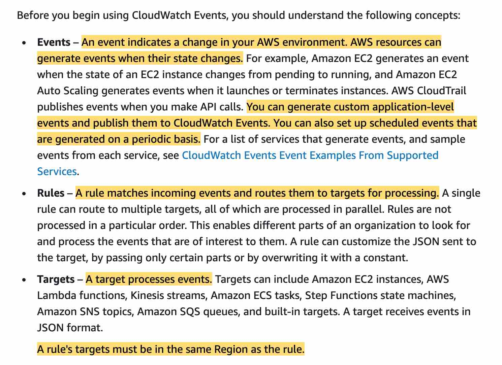
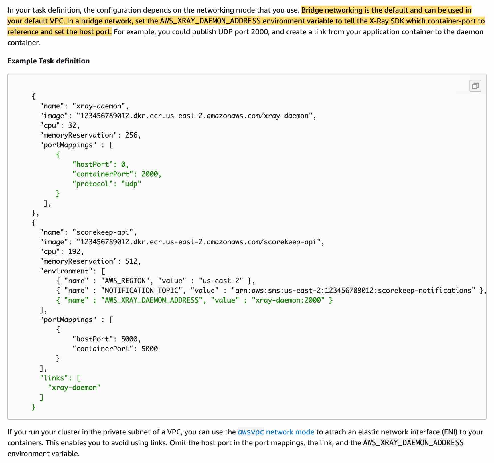
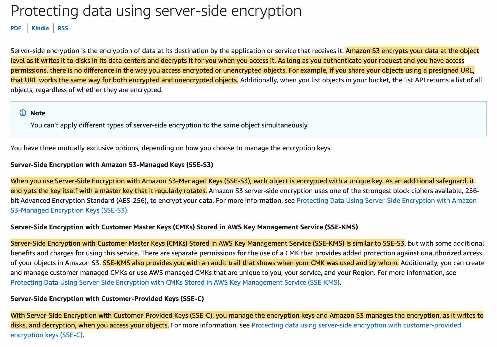

- AWS **CloudWatch**
  - ***Metrics***: Collect and track key metrics
    - With `detailed monitoring`, you get data `every 1 minute` (default is `5 minutes`)
  - ***Logs***: Collect, monitor, analyze and store log files, **They never expire by default**
  - ***Events***: Send notifications when certain events happen in your AWS
  - ***Alarms***: React in real-time to metrics / events

- **CloudWatch Event Rules**:
  - Trigger for pull request updates (created / updated / deleted / commented)
  - Commit comment events
  - CloudWatch Event Rules goes into an SNS topic committed in the code?)

**You can use Amazon CloudWatch Events to detect and react to changes in the state of a pipeline, stage, or action**. Then, based on rules you create, CloudWatch Events invokes one or more target actions when a pipeline, stage, or action enters the state you specify in a rule. For the given use-case, you can set up a rule that detects pipeline changes and invokes an AWS Lambda function.

- CodePipeline state changes happen in ***AWS CloudWatch Events***, which can in return create SNS notifications.
  - Ex: you can create events for failed pipelines
  - Ex: you can create events for cancelled stages 

**Use the Lambda console to configure a trigger that invokes the Lambda function with CodePipeline as the event source** - You cannot create a trigger with CodePipeline as the event source via the Lambda Console.
**Use the CodePipeline console to set up a trigger for the Lambda function** - CodePipeline console cannot be used to configure a trigger for a Lambda function.

*Your company is new to cloud computing and would like to host a static HTML5 website on the cloud and be able to access it via domain www.mycompany.com. You have created a bucket in (S3), enabled website hosting, and set the index.html as the default page. Finally, you create an Alias record in Amazon Route 53 that points to the S3 website endpoint of your S3 bucket.
When you test the domain www.mycompany.com you get the following error: 'HTTP response code 403 (Access Denied)'. What can you do to resolve this error?*

**Create a bucket policy**
Bucket policy is an access policy option available for you to grant permission to your Amazon S3 resources. It uses JSON-based access policy language.

If you want to configure an existing bucket as a static website that has public access, you must edit block public access settings for that bucket. You may also have to edit your account-level block public access settings.

**Create an IAM role** - This will not help because IAM roles are attached to services and in this case, we have public users.

**Enable CORS** - CORS defines a way for client web applications that are loaded in one domain to interact with resources in a different domain. Here we are not dealing with cross domains.

**Enable DynamoDB Accelerator (DAX) for DynamoDB and CloudFront for S3**

DynamoDB Accelerator (DAX) is a fully managed, highly available, in-memory cache for Amazon DynamoDB that delivers up to a 10 times performance improvement—from milliseconds to microseconds—even at millions of requests per second.

DAX is tightly integrated with DynamoDB—you simply provision a DAX cluster, use the DAX client SDK to point your existing DynamoDB API calls at the DAX cluster, and let DAX handle the rest. Because DAX is API-compatible with DynamoDB, you don't have to make any functional application code changes. DAX is used to natively cache DynamoDB reads.

CloudFront is a content delivery network (CDN) service that delivers static and dynamic web content, video streams, and APIs around the world, securely and at scale. By design, delivering data out of CloudFront can be more cost-effective than delivering it from S3 directly to your users.

When a user requests content that you serve with CloudFront, their request is routed to a nearby Edge Location. If CloudFront has a cached copy of the requested file, CloudFront delivers it to the user, providing a fast (low-latency) response. If the file they’ve requested isn’t yet cached, CloudFront retrieves it from your origin – for example, the S3 bucket where you’ve stored your content.
So, you can use CloudFront to improve application performance to serve static content from S3.

**Enable ElastiCache Redis for DynamoDB and CloudFront for S3**
Amazon ElastiCache for Redis is a blazing fast in-memory data store that provides sub-millisecond latency to power internet-scale real-time applications. Amazon ElastiCache for Redis is a great choice for real-time transactional and analytical processing use cases such as caching, chat/messaging, gaming leaderboards, geospatial, machine learning, media streaming, queues, real-time analytics, and session store.
*Although, you can integrate Redis with DynamoDB, it's much more involved from a development perspective. For the given use-case, you should use DAX which is a much better fit.*

**Enable DAX for DynamoDB and ElastiCache Memcached for S3**
**Enable ElastiCache Redis for DynamoDB and ElastiCache Memcached for S3**
Amazon ElastiCache for Memcached is a Memcached-compatible in-memory key-value store service that can be used as a cache or a data store. Amazon ElastiCache for Memcached is a great choice for implementing an in-memory cache to decrease access latency, increase throughput, and ease the load off your relational or NoSQL database.

ElastiCache cannot be used as a cache to serve static content from S3, so both these options are incorrect.

*As such, you would like to have a unified account to view all the traces. What should you in your X-Ray daemon set up to make this work?*

AWS X-Ray helps developers analyze and debug production, distributed applications, such as those built using a microservices architecture. With X-Ray, you can understand how your application and its underlying services are performing to identify and troubleshoot the root cause of performance issues and errors. X-Ray provides an end-to-end view of requests as they travel through your application, and shows a map of your application’s underlying components.

AWS X-Ray helps developers analyze and debug production, distributed applications, such as those built using a microservices architecture. With X-Ray, you can understand how your application and its underlying services are performing to identify and troubleshoot the root cause of performance issues and errors. X-Ray provides an end-to-end view of requests as they travel through your application, and shows a map of your application’s underlying components.

**Create a role in the target unified account and allow roles in each sub-account to assume the role**
**Configure the X-Ray daemon to use an IAM instance role**

The X-Ray agent can assume a role to publish data into an account different from the one in which it is running. This enables you to publish data from various components of your application into a central account.

X-Ray can also track requests flowing through applications or services across multiple AWS Regions.

**Create a user in the target unified account and generate access and secret keys**
**Configure the X-Ray daemon to use access and secret keys**

These two options combined together would work but wouldn't be a best-practice security-wise. Therefore these are not correct.

Enable Cross Account collection in the X-Ray console - This is a made-up option and has been added as a distractor.

*The application will act as a backend and will perform (CRUD) operations such as create, read, update and delete as well as **inner joins.***

**RDS**
Amazon Relational Database Service (Amazon RDS) makes it easy to set up, operate, and scale a relational database with support for transactions in the cloud. A relational database is a collection of data items with pre-defined relationships between them. RDS supports the most demanding database applications. You can choose between two SSD-backed storage options: one optimized for high-performance Online Transaction Processing (OLTP) applications, and the other for cost-effective general-purpose use.

DynamoDB - RDS can run expensive joins which DynamoDB does not support. DynamoDB is a better choice for scaling by storing complex hierarchical data within a single item.

*You would like to run the X-Ray daemon for your Docker containers deployed using AWS **Fargate**.*

**Deploy the X-Ray daemon agent as a sidecar container**
In Amazon ECS, create a Docker image that runs the X-Ray daemon, upload it to a Docker image repository, and then deploy it to your Amazon ECS cluster. You can use port mappings and network mode settings in your task definition file to allow your application to communicate with the daemon container.

As we are using AWS Fargate, we do not have control over the underlying EC2 instance and thus we can't deploy the agent on the EC2 instance or run an X-Ray agent container as a daemon set (only available for ECS classic).

**Provide the correct IAM task role to the X-Ray container**
For Fargate, we can only provide IAM roles to tasks, which is also the best security practice should we use EC2 instances.

*Incorrect options:*
Deploy the X-Ray daemon agent as a daemon set on ECS - As explained above, since we are using AWS Fargate, we do not have control over the underlying EC2 instance and thus we can't run an X-Ray agent container as a daemon set.
Deploy the X-Ray daemon agent as a process on your EC2 instance
Provide the correct IAM instance role to the EC2 instance

**As we are using AWS Fargate, we do not have control over the underlying EC2 instance, so both these options are incorrect.**

*You would like your Elastic Beanstalk environment to expose an HTTPS endpoint and an HTTP endpoint. The HTTPS endpoint should be used to get in-flight encryption between your clients and your web servers, while the HTTP endpoint should only be used to redirect traffic to HTTPS and support URLs starting with http://.*

**Assign an SSL certificate to the Load Balancer**
This ensures that the Load Balancer can expose an HTTPS endpoint.

**Open up port 80 & port 443**
This ensures that the Load Balancer will allow both the HTTP (80) and HTTPS (443) protocol for incoming connections

**Configure your EC2 instances to redirect HTTP traffic to HTTPS**
This ensures traffic originating from HTTP onto the Load Balancer forces a redirect to HTTPS by the EC2 instances before being correctly served, thus ensuring the traffic served is fully encrypted.

*Your company has developers worldwide with access to the company's Amazon Simple Storage Service (S3) buckets. The objects in the buckets are encrypted at the server-side but need more flexibility with access control, auditing, rotation, and deletion of keys. You would also like to limit who can use the key.*

**SSE-KMS**

You have the following options for protecting data at rest in Amazon S3:
Server-Side Encryption – Request Amazon S3 to encrypt your object before saving it on disks in its data centers and then decrypt it when you download the objects.

Client-Side Encryption – Encrypt data client-side and upload the encrypted data to Amazon S3. In this case, you manage the encryption process, the encryption keys, and related tools.

Server-Side Encryption with Customer Master Keys (CMKs) stored in AWS Key Management Service (SSE-KMS) is similar to SSE-S3. SSE-KMS provides you with an audit trail that shows when your CMK was used and by whom. Additionally, you can create and manage customer-managed CMKs or use AWS managed CMKs that are unique to you, your service, and your Region.

**SSE-C** When retrieving objects encrypted server-side with SSE-C, you must provide the same encryption key as part of your request. Amazon S3 first verifies that the encryption key you provided matches, and then decrypts the object before returning the object data to you

**SSE-S3** - When you use Server-Side Encryption with Amazon S3-Managed Keys (SSE-S3), each object is encrypted with a unique key. As an additional safeguard, it encrypts the key itself with a master key that it regularly rotates. So this option is incorrect.

*You are running a public DNS service on an EC2 instance where the DNS name is pointing to the IP address of the instance. You wish to upgrade your DNS service but would like to do it without any downtime.*

**Route 53** is a DNS managed by AWS, but nothing prevents you from running your own DNS (it's just a software) on an EC2 instance. The trick of this question is that it's about EC2, running some software that needs a fixed IP, and not about Route 53 at all.

**Elastic IP**
DNS services are identified by a public IP, so you need to use Elastic IP.

**Provide a static private IP** - If you provide a private IP it will not be accessible from the internet, so this option is incorrect.

**Use Route 53** - Route 53 is a DNS service from AWS but the use-case talks about offering a DNS service using an EC2 instance, so this option is incorrect.

