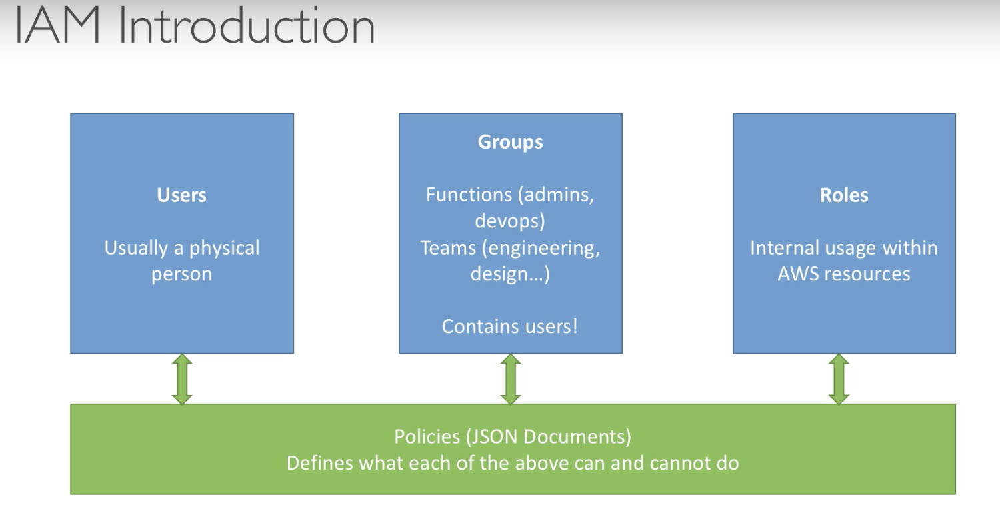

# AWS Regions and IAM

## AWS Regions

- AWS has regions all around the world, each of them is a cluster of data center
- Data is not relicated in different regions, or it only exist in your current region.
- Each regions have many avaiability zones (usually 3, min is 2, max is 6) from a, b, c, d, ...
- Each AZ is one or more discrete data centers with redundant power, networking and connectivity. They're separate from each other, so that they're isolated from disasters. They are connected with high bandwidth, ultra-low latency networking.

## IAM Introduction

- IAM is global service, it mean that setting in IAM will be applied to all regions
- IAM (Identity and Access management)
- Your whole AWS security is there.
  - Users
  - Groups: can be deliver by functions (admin, devop), team (engineer, design)
  - Roles: Internal usage within AWS resources
  


- Root account should never be used (and shared)```
- Users must be created with proper permissions
- IAM is at the center of AWS
- Policies are written in JSON
- It is best to give users the minimal amount of permissions they need to perform their job.

Important note:

- One IAM user per person
- One IAM Role per application
- Never write IAM credentials in code. EVER
- Never use ROOT account
- Never use ROOT IAM credential
  
## EC2

- It mainly consists in the capability of:
  - Renting virtual machines (EC2)
  - Storing data on virtual drives (EBS)
  - Distributing load accross machines (ELB)
  - Scaling the services using an auto-scaling group (ASG)

 How to ssh into EC2 instance:
> chmod 400 key.pem
> ssh -i key.pem ec2-user@<public_ip>

Note:

- `chmod 400` meaning to protect a file again accidental overwritting, also to protect pem file, without this permission AWS will not allowed access to EC2 instances.
