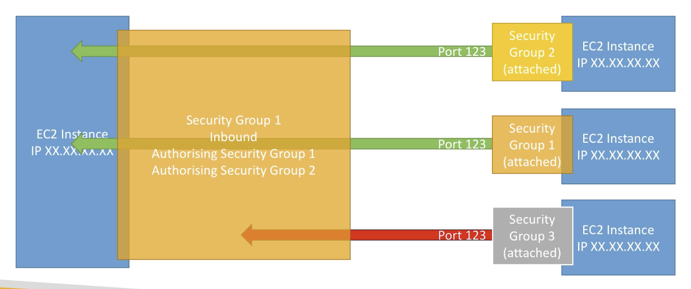
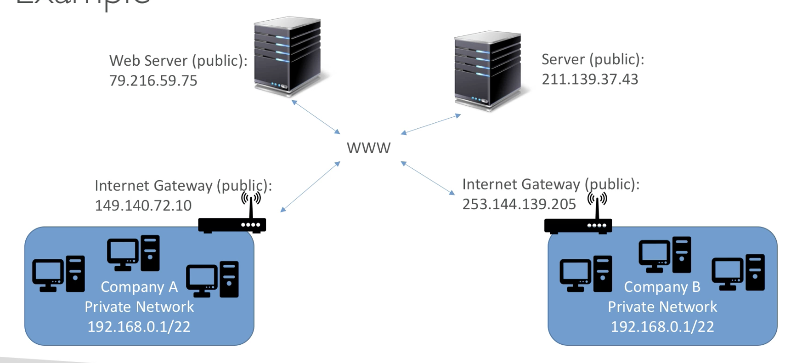
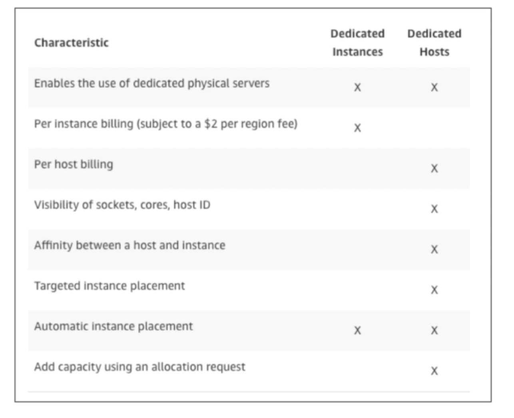
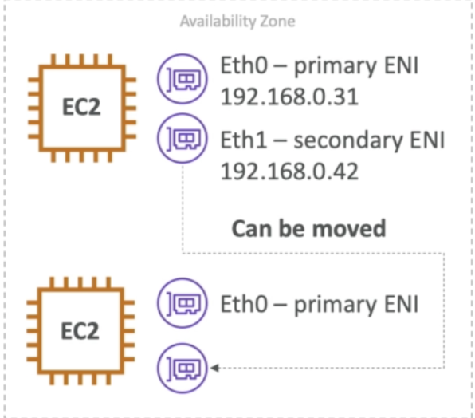

# AWS Regions and IAM

## 1. AWS Regions

- AWS has regions all around the world, each of them is a cluster of data center
- Data is not relicated in different regions, or it only exist in your current region.
- Each regions have many avaiability zones (usually 3, min is 2, max is 6) from a, b, c, d, ...
- Each AZ is one or more discrete data centers with redundant power, networking and connectivity. They're separate from each other, so that they're isolated from disasters. They are connected with high bandwidth, ultra-low latency networking.

## 2. IAM Introduction

- IAM is global service, it mean that setting in IAM will be applied to all regions
- IAM (Identity and Access management)
- Your whole AWS security is there.
  - Users
  - Groups: can be deliver by functions (admin, devop), team (engineer, design)
  - Roles: Internal usage within AWS resources
  


- Root account should never be used (and shared)```
- Users must be created with proper permissions
- IAM is at the center of AWS
- Policies are written in JSON
- It is best to give users the minimal amount of permissions they need to perform their job.

Important note:

- One IAM user per person
- One IAM Role per application
- Never write IAM credentials in code. EVER
- Never use ROOT account
- Never use ROOT IAM credential
  
## 3. EC2

- It mainly consists in the capability of:
  - Renting virtual machines (EC2)
  - Storing data on virtual drives (EBS)
  - Distributing load accross machines (ELB)
  - Scaling the services using an auto-scaling group (ASG)

 How to ssh into EC2 instance:
> chmod 400 key.pem
> ssh -i key.pem ec2-user@<public_ip>

Note:

- `chmod 400` meaning to protect a file again accidental overwritting, also to protect pem file, without this permission AWS will not allowed access to EC2 instances.

## 4. Security group

- SG are the fundamental of network security in AWS
- They control how traffic is allowed into or out of EC2 machines, acting as "firewall" on EC2 instances
- They regulate:
  - Access to ports
  - Authorised IP range IPv4 and IPv6
  - Control of inbound network (from other to the instance)
  - Control of outbound network (from instance to other)

Good to know about SG:
  
- Can be attached to mulitple istances
- Locked down to a region / VPC combination
- Live outside of EC2
- It is good to maintain one separate SG for SSH access
- If time out => SG issue
- If connection refused => Application error or it's not launched.
- All inbound traffic is blocked by default
- All outbound traffic is authorised by default



## 5. Private vs Public IP (IPv4)



Public IP:

- the machine can be indentified on the internet
- Must be unique accross the whole web
- Can be geo-located easily

Private IP:

- the machine can be identified on a private network only
- the IP must be unique accross the network
- BUT two different Private network can have same IPs
- Machine connect to WWW using a NAT + an internet gateway (a proxy)
- Only a specified range of IPs can be used as private IP

Elastic IP:

- When you stop and the start an EC2 instance, it can change its public IP
- If you need to have a fixed pubic IP for your instance, you need an elastic IP
- An elastic IP is a public IPv4 you own as long as you don't delete it.
- You can attach it to one instance at a time.
- [~.~] With an elastic IP address, you can mask the failure of an instance or software by rapidly remapping the address to another instance in your account.
- You can only have 5 elastic IP in your account
- Overall, try to avoid elastic IP:
  - They offen reflect poor architectural decisions
  - Instead, use a random public IP and register a DNS name to it
- How to associate elastic IP to EC2 instance ? Create new and then associate. ==> Networking/Disassociate IP address if needed.

## 6. Install an Apache Server on EC2

```code
- sudo su
- yum update -y // update machine package and -y is yes for all
- yum install -y httpd.x86_64 // install httpd
- systemctl start httpd.service
- systemctl enable httpd.service

- curl localhost:80 // But on web browser, it is still not accessable due to the lack of security group -> update inbound 
- echo "Hello world" > /var/www/html/index.html
- echo "Hello world from $(hostname -f)" > /var/www/html/index.html
```

## 7. EC2 User Data

- It is possible to bootstrap our instances using an EC User data script (lauching commands when a machine starts.)
- For instance:
  - Install updates
  - Install software
  - Downloading common files form the internet
- EC2 User data script run with root user

Hand-on target:

- We want to make sure that EC2 instance has an Apche HTTP server installed on it
- Here is the details:
  - Step 3: Confirgure Instance detail /  Advanced details
  - As text 
  
```code
#!/bin/bash      || Very important
yum update -y // update machine package and -y is yes for all
yum install -y httpd.x86_64 // install httpd
systemctl start httpd.service
systemctl enable httpd.service
echo "Hello world" > /var/www/html/index.html
```

## 8. EC2 Instance Launch Types

- On Demand Instances: short workload, predictable pricing
- Reserved: *(MINIMUM 1 year)*
  - Reserved instances: long workloads
  - Convertible Reserved Instances: long workloads with flexible instances
  - Scheduled Reserved Instances: example - every Thursday between 3 and 6 pm
- Spot Instances: short workloads, for cheap, can lose instances (less reliable)
- Dedicated Instances: no other customers will share your hardware (the underlying hardware on AWS)
- Dedicated Hosts: book an entire physical server, control instance placement

### 8.1 EC2 On Demand

- Pay for what you use (billing per second, after the first minute)
- Has the highest const but no upfront payment
- No long tern commitment
- Recommended for short-term and un-interrupted workloads, where you can't predict how the application will behave.

### 8.2 EC2 Reserved Instances

- Up to 75% discount compared to On-Demand
- Pay upfront for what you use with long term commitment
- Reservation period can be 1 or 3 years
- Reserve a specific instance type
- Recommended for steady state usage applications (think database)
  
### 8.3 Convertile Reserved Instances

- can change instance type
- upto 54 % discount

### 8.4 Scheduled Reserved Instances

- launch within time window you reserve
- when you required a fraction of day/week/month

### 8.5 EC2 Spot Instances

- Can get a discount update to 90% compared to On-demand
- Instances that you can "lose" at any point of time if your max price is less than the current spot price (max price -  how much you want to pay for this instance). If current spot instance price is greater than the max price, then you will lose your spot instance
- The msost cost-efficient instances in AWS
- Useful for workloads that are resilient to failure
  - Batch jobs
  - Data analysis
  - Image processing
  - ... anything that you can retry and short time
- Not great fro critical jobs or databases
- Great commbo: Reserved Instances for baseline + On-demand & spot for peaks

### 8.6 EC2 Dedicated hosts

- Physical dedicated EC2 server for your use
- Full control of EC2 Instance placement
- Visibility into the underlying sockets / physical cores of the hardware (great for licencing)
- Allocated for your account for a 3 year period reservation
- More expensive

- Useful for software that have complicated licensing model (BYOL - Bring Your Own License) 
- Or for company that have strong regulatory or compliance needs (many rule)
- ~ same price with on demand price

### 8.7 EC2 Dedicated Instances

- Instances running on hardware that's dedicated to you
- May share hardware with other instances in same account
- No control over instance placement (can move hardware after stop/start)




## 9. Elastic Network Interfaces (ENI)

- Logical component in a VPC that represents a virtual network card
- The ENI can have the following attributes:
  - Primary private IPv4, one or more secondary IPv4
  - One Elastic IP (IPv4) per private IPv4
  - One Public IPv4
  - One or more security groups
  - A MAC address

- You can create ENI independently and attach them on the fly (move them) on EC2 instances for failover (backup)
- Bound to a specific AZ
- Instance always have one primary ENI and it can not be detached



## 10. Best practive about EC2

### 10.1 AMI - an image to use to create our own instance

Advantage of AMI:

- Pre-installed packages needed
- Faster boot time 
- Machine comes configured with monitoring/enterprise software
- Security concerns - control over the machines in the network
- Control of maintenance and updates of AMIS over time
- Active directory integration out of the box
- Installing your app ahead of time (for faster deploys when auto-scaling)
- Using someone else's AMI that is optimised for running an app, DB, ..
  

- AMI are built for a specific AWS region (! )
- t2, t3 are bustable instances which mean OK CPU, but it can be very good when needed
- If the machine bursts, it utilizes "burst credits"
- If all the credits are gone, the CPU becomes BAD
- If the machine stops bursting, credits are accumulate back over time

## EC2 checklist

- Know how to SSH into EC2 (change .pem file permissions)
- Security group
- private vs public vs elastic IP
- how to use user data to customize your instance at boot time
- you can build custom AMI to to enhance your OS.

