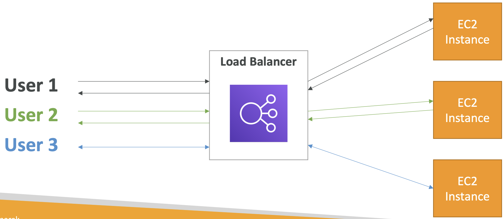
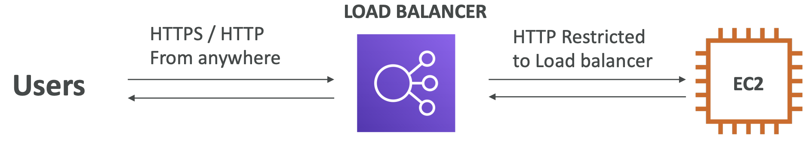
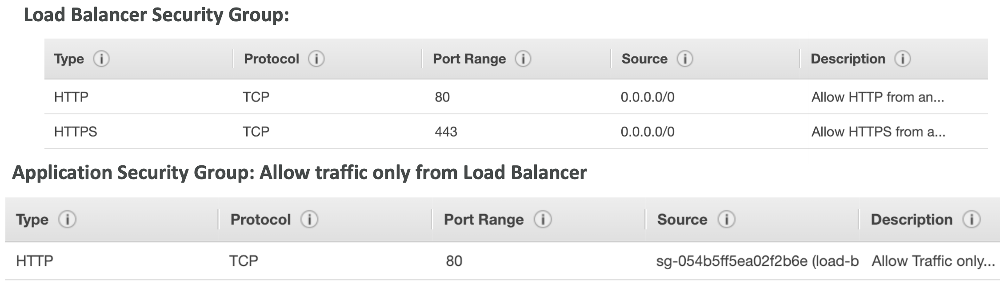

# AWS Fundamentals - Part II

## Scalability & High Availability

• Scalability means that an application / system can handle greater loads by adapting.
• There are two kinds of scalability:

- Vertical Scalability
- Horizontal Scalability (= elasticity)

• Scalability is linked but different to High Availability

### Vertical Scalability

• Vertically scalability means increasing the size of the instance
• For example, your application runs on a t2.micro
• Scaling that application vertically means running it on a t2.large
• Vertical scalability is very common for **non distributed systems**, such as a database.
• **RDS, ElastiCache** are services that can scale vertically.
• There’s usually a limit to how much you can vertically scale (hardware limit)

### Horizontal Scalability

• Horizontal Scalability means increasing the number of instances / systems for your application
• Horizontal scaling implies **distributed systems**.
• This is very common for web applications modern applications
• It’s easy to horizontally scale thanks the cloud offerings such as Amazon EC2

### High availability

High Availability usually goes hand in hand with **horizontal scaling**
• High availability means running your application / system in at least 2 data centers (== Availability Zones)
• The goal of high availability is to survive a data center loss
• The high availability can be passive (for RDS Multi AZ for example)
• The high availability can be active (for horizontal scaling)

### High Availability & Scalability For EC2

• Vertical Scaling: Increase instance size (= scale up / down)
    - From: t2.nano - 0.5G of RAM, 1 vCPU
    - To: u-12tb1.metal – 12.3 TB of RAM, 448 vCPUs
• Horizontal Scaling: Increase number of instances (= scale out / in)
• Auto Scaling Group
• Load Balancer
• High Availability: Run instances for the same application across multi AZ
• Auto Scaling Group multi AZ
• Load Balancer multi AZ

## Elastic Load Balancing (ELB)

### What is load balancing

Load balancers are servers that forward internet traffic to multiple servers (EC2 Instances) downstream.

### Why use a load balancer

• Spread load across multiple downstream instances
• Expose a single point of access (DNS) to your application
• Seamlessly handle failures of downstream instances
• Do regular health checks to your instances
• Provide SSL termination (HTTPS) for your websites
• Enforce stickiness with cookies • High availability across zones
• Separate public traffic from private traffic

### Why use an EC2 Load Balancer (ELB)

• An ELB (EC2 Load Balancer) is a **managed load balancer**

- AWS guarantees that it will be working
- AWS takes care of upgrades, maintenance, high availability
- AWS provides only a few configuration knobs

• It costs less to setup your own load balancer but it will be a lot more effort on your end.
• It is integrated with many AWS offerings / services

### Health Checks

• Health Checks are crucial for Load Balancers
• They enable the load balancer to know if instances it forwards traffic to are available to reply to requests
• The health check is done on a port and a route (/health is common)
• If the response is not 200 (OK), then the instance is unhealthy
• They happen every 5 seconds (default), and we can configure it if needed.

### [!] Types of load balancer on AWS

AWS has 3 kinds of **managed Load Balancers**:

- **Classic Load Balancer** (v1 - old generation) – 2009
• HTTP, HTTPS, TCP
- **Application Load Balancer** (v2 - new generation) – 2016
• HTTP, HTTPS, WebSocket
- **Network Load Balancer** (v2 - new generation) – 2017
• TCP, TLS (secure TCP) & UDP

Overall, it is recommended to use the newer / v2 generation load balancers as they
provide more features.

You can setup **internal** (private, cannot access from public web) or **external** (public) ELBs

### Load Balancer Security Groups

- The LB has a security group, EC2 have too. But, EC2 Policy group reference to LB's security group
- LBs **can scale but not instantaneously** - contact AWS for a "warm-up"
- Troubleshooting
• 4xx errors are client induced errors
• 5xx errors are application induced errors
• Load Balancer Errors 503 means at capacity or no registered target
• If the LB can’t connect to your application, check your security groups!
- Monitoring
• ELB access logs will log all access requests (so you can debug per request)
• CloudWatch Metrics will give you aggregate statistics (ex: connections count)

